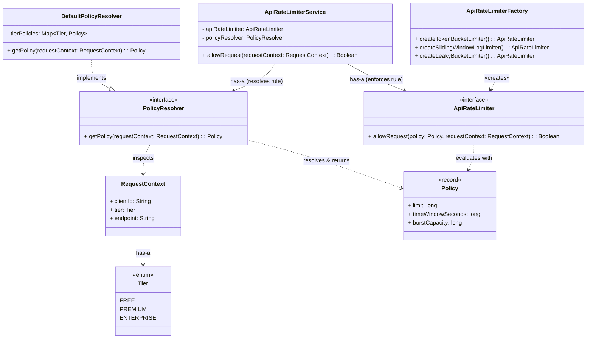
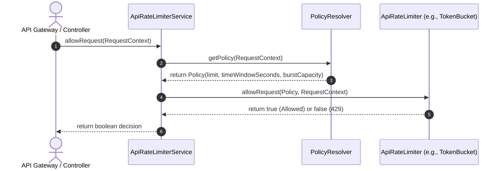
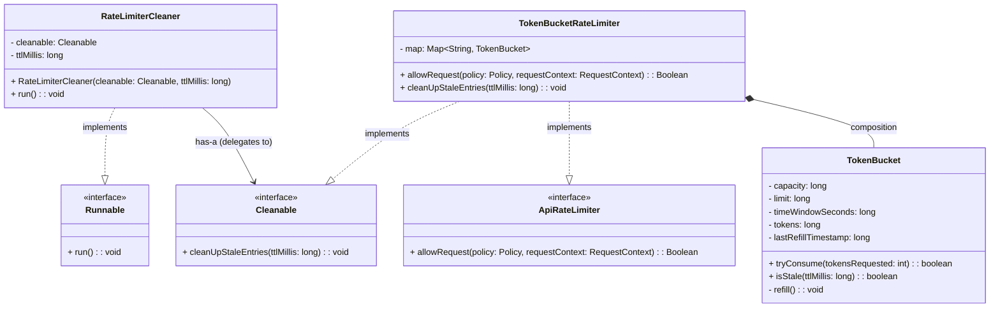
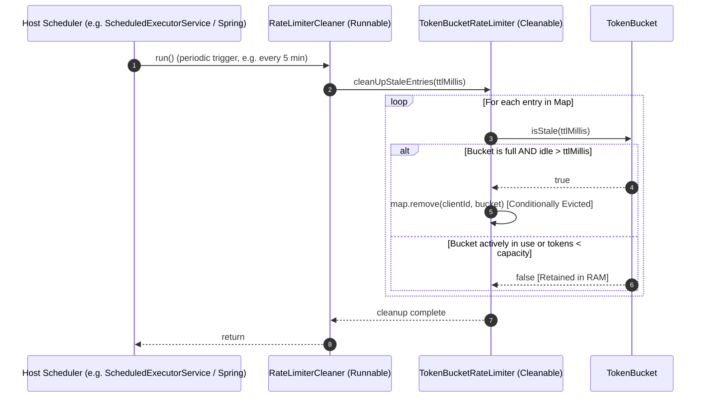
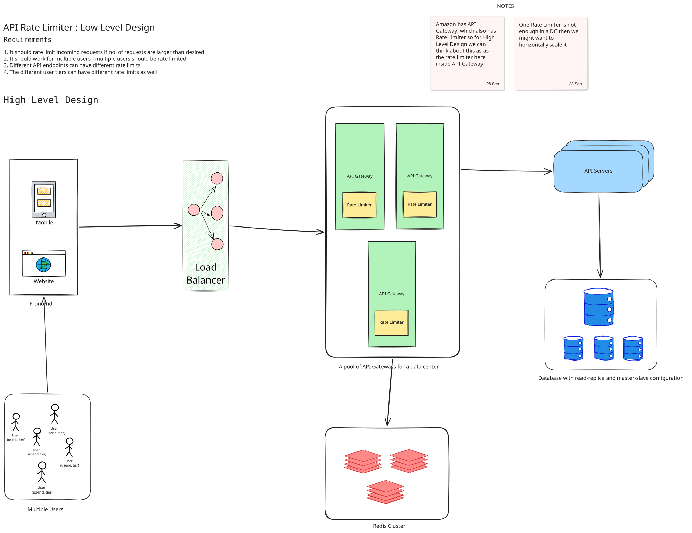
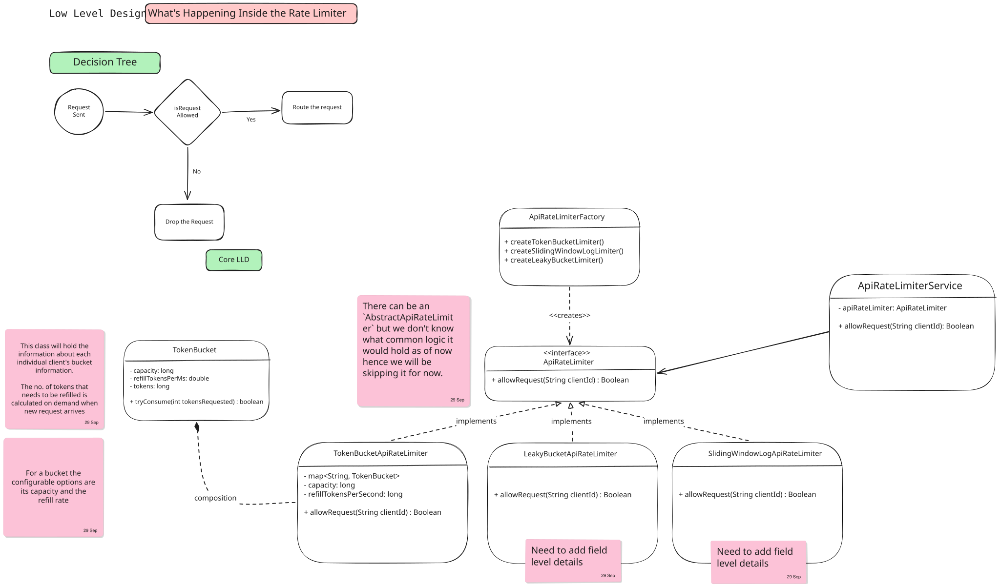
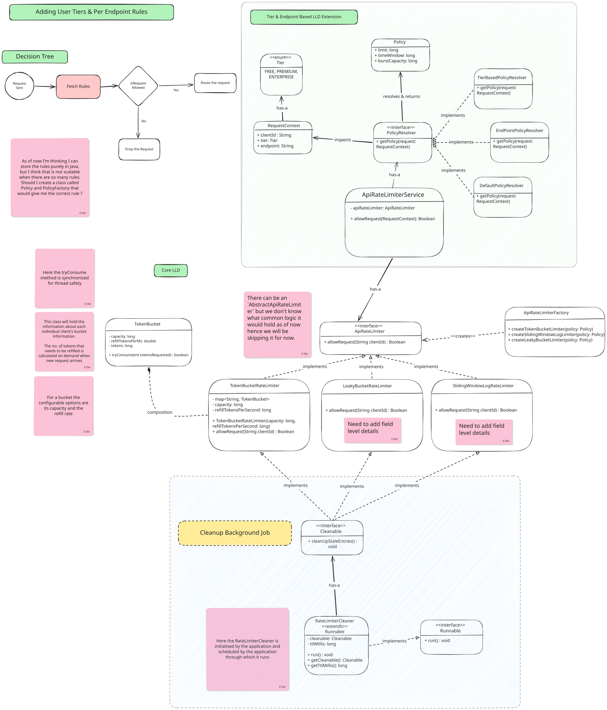

<!-- hub-metadata
type: lld
title: API Rate Limiter Engine
description: Low-Level Design for a high-performance, thread-safe API rate limiter in Java supporting multiple algorithms.
tag: Low-Level Design
tagColor: #f59e0b
-->

# API Rate Limiter — Low-Level Design

## 1. Problem Statement

Modern web applications, APIs, and microservice architectures are vulnerable to a wide variety of traffic anomalies:
1. **Denial-of-Service (DoS) & Brute Force Attacks:** Malicious actors bombarding login or checkout endpoints with automated scripts.
2. **Resource Starvation:** Aggressive web scrapers or poorly configured internal microservices monopolizing shared CPU, database connections, or downstream third-party quotas.
3. **Cascading Service Failures:** Uncontrolled traffic spikes causing downstream database connection pools to exhaust, triggering cascading outages across dependent services.

Building a production-grade **API Rate Limiter** requires solving four core low-level engineering challenges:
1. **Ultra-Low Latency Overhead (< 1ms):** Rate limiting sits directly on the critical request path. Every millisecond spent calculating limits directly adds latency to user requests.
2. **Deterministic & Fair Enforcement:** Rate limits must strictly adhere to configured quotas without dropping valid bursts or leaking extra quota across window boundaries.
3. **Thread Safety & High Concurrency:** Under tens of thousands of concurrent requests, counter updates must be atomic without causing global lock contention.
4. **Clean, Extensible Object-Oriented Architecture:** The engine must support multiple rate-limiting algorithms (Token Bucket, Leaky Bucket, Sliding Window Log) and allow interchangeable storage engines without rewriting business logic.

This document outlines the evolutionary engineering design—beginning with the **in-memory MVP foundation (Token Bucket)**, detailing its class relationships and mathematical subtleties, and establishing a roadmap for scaling into policy rules and distributed clusters.

---

## 2. Product Requirements

### 2.1 Core MVP Requirements

* **PR-1 (Request Interception & Decision):** When a request reaches the API gateway or controller, the rate limiter decides synchronously whether to allow the request through or reject it with an HTTP `429 Too Many Requests`.
* **PR-2 (Multi-Algorithm Support):** The design must support multiple rate-limiting strategies:
  * **Token Bucket:** Accommodates bursty traffic while enforcing an average sustained rate.
  * **Leaky Bucket:** Enforces smooth, constant-rate processing.
  * **Sliding Window Log:** Provides strictly accurate temporal limits without window-boundary anomalies.
* **PR-3 (Client Identification):** Requests are isolated by a unique `clientId` (such as an API Key, User ID, or IP address). A rate-limited client must never degrade or block traffic for other clients.

### 2.2 Extended Requirements (Future Scaling)

* **PR-4 (Tier-Based Rate Limiting):** The system should be able to enforce differentiated quotas based on user subscription tiers (e.g., Free vs. Pro vs. Enterprise tiers with distinct capacity and refill rates).
* **PR-5 (Endpoint-Specific Rate Limiting):** The rate limiter should be able to enforce custom rate limits per API endpoint or route (e.g., strict quotas for resource-heavy or sensitive paths like `POST /api/v1/auth/login`, contrasted with higher allowances for read-heavy routes like `GET /api/v1/products`).

---

## 3. Functional Requirements

### FR-1: Core Contract

```java
public interface ApiRateLimiter {
    boolean allowRequest(Policy policy, RequestContext requestContext);
}
```

* **Contract Simplicity:** Returns a primitive `boolean` (`true` if allowed, `false` if rejected).
* **Context & Policy Driven:** Decouples caller identity (`RequestContext`) and dynamic rate quotas (`Policy`) from algorithm execution.
* **Zero Allocation on Hot Path:** Avoids wrapping results in wrapper objects or `Optional` to eliminate JVM garbage collection overhead on high-throughput paths.

---

### FR-2: Algorithm Parameters (Token Bucket & Policy)

* **Burst Capacity ($C$):** The maximum number of tokens a bucket can hold at any instant. This defines the **maximum allowable burst**.
* **Limit ($L$):** The number of tokens replenished within a defined time frame.
* **Time Window ($W$):** The duration (in seconds) over which the limit is earned. Together, $\frac{L}{W}$ defines the **sustained throughput limit**.

---

### FR-3: Scope Boundaries (MVP)

* **In-Memory Operation:** The initial MVP operates in-memory within a single JVM process.
* **Cold Start Guarantee:** A newly observed client starts with a full bucket (`tokens = capacity`), allowing legitimate initial bursts without false rejections.
* **Client Isolation:** Each client possesses their own isolated bucket state.

---

## 4. Step 1: The Baseline Foundation (MVP Design)

The MVP focuses on an elegant, extensible object-oriented structure implementing the **Token Bucket** algorithm, while preparing extension points for Leaky Bucket and Sliding Window Log.

### 4.1 The Core MVP Entities

```
[ Client / Application ]
           │
           ▼
[ ApiRateLimiterService ] ──(has-a)──► [ ApiRateLimiter ]
                                              ▲
                                              │ (creates)
                                  [ ApiRateLimiterFactory ]
                                              │
                    ┌─────────────────────────┼─────────────────────────┐
                    │ (implements)            │ (implements)            │ (implements)
                    ▼                         ▼                         ▼
      [ TokenBucketRateLimiter ]   [ LeakyBucketRateLimiter ]  [ SlidingWindowLogRateLimiter ]
                    │
                    ▼ (composition)
              [ TokenBucket ]
```

1. **`ApiRateLimiterService` (Gateway Facade):** The single entry point for applications. Holds references to an `ApiRateLimiter` and a `PolicyResolver`, coordinating request admission checks.
2. **`ApiRateLimiter` (Strategy Interface):** The core contract defining `allowRequest(Policy policy, RequestContext requestContext)`. Adheres to the **Open/Closed Principle**, enabling transparent strategy switching.
3. **`ApiRateLimiterFactory` (Creational Factory):** Encapsulates the instantiation of concrete rate limiters (`createTokenBucketLimiter()`, `createSlidingWindowLogLimiter()`, `createLeakyBucketLimiter()`), shielding callers from constructor complexity.
4. **`TokenBucketRateLimiter` (Algorithm Coordinator):** Manages a thread-safe registry of client buckets (`Map<String, TokenBucket>`), lazily instantiating buckets based on incoming policies.
5. **`TokenBucket` (Client State Engine):** Represents an individual client's bucket. Holds current tokens and timestamps, and evaluates lazy replenishment math atomically upon each request.
6. **`LeakyBucketRateLimiter` & `SlidingWindowLogRateLimiter`:** Concrete implementation placeholders ready for upcoming milestones.

---

### 4.2 Class Diagram

```mermaid
classDiagram
    direction TB

    class ApiRateLimiterService {
        - apiRateLimiter: ApiRateLimiter
        - policyResolver: PolicyResolver
        + ApiRateLimiterService(apiRateLimiter: ApiRateLimiter, policyResolver: PolicyResolver)
        + allowRequest(requestContext: RequestContext): Boolean
    }

    class ApiRateLimiter {
        <<interface>>
        + allowRequest(policy: Policy, requestContext: RequestContext): Boolean
    }

    class ApiRateLimiterFactory {
        + createTokenBucketLimiter(): ApiRateLimiter
        + createSlidingWindowLogLimiter(): ApiRateLimiter
        + createLeakyBucketLimiter(): ApiRateLimiter
    }

    class TokenBucketRateLimiter {
        - map: Map~String, TokenBucket~
        + allowRequest(policy: Policy, requestContext: RequestContext): Boolean
    }

    class LeakyBucketRateLimiter {
        + allowRequest(policy: Policy, requestContext: RequestContext): Boolean
    }

    class SlidingWindowLogRateLimiter {
        + allowRequest(policy: Policy, requestContext: RequestContext): Boolean
    }

    class TokenBucket {
        - capacity: long
        - limit: long
        - timeWindowSeconds: long
        - tokens: long
        - lastRefillTimestamp: long
        + tryConsume(tokensRequested: int): boolean
        - refill(): void
    }

    ApiRateLimiterService --> ApiRateLimiter : has-a
    ApiRateLimiterFactory ..> ApiRateLimiter : «creates»
    TokenBucketRateLimiter ..|> ApiRateLimiter : implements
    LeakyBucketRateLimiter ..|> ApiRateLimiter : implements
    SlidingWindowLogRateLimiter ..|> ApiRateLimiter : implements
    TokenBucketRateLimiter *-- TokenBucket : composition
```



> **Design Decision: Why skip `AbstractApiRateLimiter` for the MVP?**  
> While an abstract class could theoretically sit between the interface and implementations, different rate-limiting algorithms have vastly distinct internal states (Token Bucket uses counters and timestamps, Leaky Bucket uses queues or leak intervals, Sliding Window Log uses sorted timestamp collections). In accordance with **YAGNI (You Aren't Gonna Need It)**, we avoid premature inheritance until clear common logic emerges across multiple algorithms.

---

### 4.3 The Core Algorithm: "Lazy Refill" Token Bucket

A common anti-pattern in naive rate limiters is running a background daemon timer (e.g. `ScheduledExecutorService`) that ticks every second to add tokens to all client buckets:
* **The Background Timer Flaw:** If a service has 500,000 unique client buckets in memory, the background worker must iterate through 500,000 objects every second—burning CPU cycles and causing lock contention, even for clients that have been idle for days.

#### The Lazy Refill Solution
Instead of proactively pushing tokens, we calculate replenished tokens **on-demand** when a client request arrives:

$$
\begin{aligned}
\Delta t &= t_{\text{now}} - t_{\text{lastRefill}} \\
W_{\text{ms}} &= \text{timeWindowSeconds} \times 1000 \\
\text{newTokens} &= \frac{\Delta t \times \text{limit}}{W_{\text{ms}}} \\
\text{tokens} &= \min(\text{capacity}, \text{tokens} + \text{newTokens})
\end{aligned}
$$

---

### 4.4 The Integer Remainder Retention Trick 🧮

When calculating token replenishment using integer math, standard division drops remainders:
* Suppose `limit = 5` per `timeWindowSeconds = 1` (1 token every 200 ms).
* If requests arrive every 100 ms:
  * `tokensToAdd = (100 * 5) / 1000 = 0`.
  * If `lastRefillTimestamp` is unconditionally updated to $t_{\text{now}}$, those 100 ms are **discarded forever**. The client would never receive tokens despite waiting patiently!

#### Preserving Sub-Token Time
To achieve 100% precision using pure `long` integers without floating-point drift, we only advance `lastRefillTimestamp` by the time **actually converted into whole tokens**:

```java
private void refill() {
    long now = System.currentTimeMillis();
    long elapsedMs = now - lastRefillTimestamp;

    if (elapsedMs <= 0) {
        return;
    }

    long timeWindowMs = timeWindowSeconds * 1000;

    // Calculate whole tokens earned in elapsed time
    long tokensToAdd = (elapsedMs * limit) / timeWindowMs;

    if (tokensToAdd > 0) {
        long newTokens = tokens + tokensToAdd;
        if (newTokens >= capacity) {
            tokens = capacity;
            lastRefillTimestamp = now; // Bucket full; discard overflow time
        } else {
            tokens = newTokens;
            long timeUsedMs = (tokensToAdd * timeWindowMs) / limit;
            lastRefillTimestamp += timeUsedMs; // Preserve unused fractional time!
        }
    }
}
```

#### Numerical Trace Example
* **Configuration:** `capacity = 10`, `limit = 5`, `timeWindowSeconds = 1` (1 token per 200 ms).

| Time ($T$) | Event | Elapsed ($\Delta t$) | `tokensToAdd` | Action | Resulting `tokens` | `lastRefillTimestamp` |
| :--- | :--- | :--- | :--- | :--- | :--- | :--- |
| **0 ms** | Bucket created & Req #1 arrives | 0 ms | 0 | Consume 1 token | 9 | 0 ms |
| **100 ms** | Req #2 arrives | 100 ms | $(100 \times 5) / 1000 = 0$ | No tokens added; timestamp **not moved** | 8 (consumed) | 0 ms (preserved!) |
| **200 ms** | Req #3 arrives | 200 - 0 = 200 ms | $(200 \times 5) / 1000 = 1$ | 1 token added; timestamp moves by 200 ms | 8 ($8 + 1 - 1$) | 200 ms |
| **100,000 ms** | User returns after long idle | 99,800 ms | $(99,800 \times 5) / 1000 = 499$ | Tokens cap at 10; timestamp resets to $t_{\text{now}}$ | 9 (consumed) | 100,000 ms |

---

### 4.5 Concurrency & Thread-Safety Model

High-throughput systems require strict concurrency guarantees without coarse-grained bottlenecks:

1. **Bucket Registry (`ConcurrentHashMap`):**
   * Buckets are indexed by `clientId`.
   * Newly seen clients instantiate their bucket via `computeIfAbsent()`:
     ```java
     TokenBucket bucket = map.computeIfAbsent(
         requestContext.clientId(), 
         k -> new TokenBucket(
             policy.burstCapacity(),
             policy.limit(),
             policy.timeWindowSeconds(),
             System.currentTimeMillis()
         )
     );
     ```
2. **Fine-Grained Bucket Locking (`synchronized` on Bucket):**
   * Thread synchronization is isolated strictly to the individual `TokenBucket` instance:
     ```java
     public synchronized boolean tryConsume(int tokensRequested) { ... }
     ```
   * **Why this scales:** 10,000 concurrent threads making requests for different clients execute in parallel without waiting on each other. Only concurrent requests for the **same client** serialize momentarily for a few CPU instructions.

---

## 5. Step 2: Policy & Request Context Layer (Tiers & Endpoint Routing)

To support **PR-4 (Tier-Based Limits)** and **PR-5 (Endpoint-Specific Limits)**, we decouple **policy resolution** (business rules) from **rate enforcement** (algorithm execution).

### 5.1 Architecture & Class Connections



### 5.2 How the Components Connect

1. **`RequestContext` &rarr; `Tier` (Association):**
   * Encapsulates caller identity (`clientId`), subscription plan (`tier`), and target path (`endpoint`).
   * Created at the gateway/filter level before rate limiting is evaluated.

2. **`ApiRateLimiterService` &rarr; `PolicyResolver` (Association):**
   * The service holds a reference to a `PolicyResolver`.
   * When `allowRequest(requestContext)` is invoked, the service asks the resolver: *"What is the quota for this user tier and endpoint?"*

3. **`PolicyResolver` &#8674; `Policy` (Dependency):**
   * Inspects `RequestContext` and returns an immutable `Policy` containing `(limit, timeWindowSeconds, burstCapacity)`.
   * Encapsulates precedence rules (e.g., endpoint-specific rules taking priority over global tier rules via `DefaultPolicyResolver`).

4. **`ApiRateLimiterService` &rarr; `ApiRateLimiter` (Association):**
   * The service holds the algorithm engine (injected at startup).
   * It delegates enforcement passing both the resolved policy and context:
     ```java
     Policy policy = policyResolver.getPolicy(requestContext);
     return apiRateLimiter.allowRequest(policy, requestContext);
     ```

5. **`ApiRateLimiterFactory` &#8674; `ApiRateLimiter` (Creational Dependency):**
   * Encapsulates algorithm instantiation (`createTokenBucketLimiter()`), shielding `ApiRateLimiterService` from concrete constructor details.

---

### 5.3 Request Execution Flow



---

## 6. Step 3: Memory Hygiene & Eviction Layer (Background Sweeper)

In an in-memory rate limiter, every unique `clientId` (such as one-off mobile sessions or bot IP scans) instantiates an entry in the bucket registry (`Map<String, TokenBucket>`). Over months of uptime with millions of transient clients, an unbounded `ConcurrentHashMap` guarantees an eventual `OutOfMemoryError: Java heap space`.

To prevent memory leaks, we introduce a decoupled **Background Sweeper** that safely evicts idle buckets.

### 6.1 Safe Eviction Criteria & Race Condition Prevention

> **When is a bucket safe to evict?**  
> A bucket is safe to delete if and only if:
> 1. It has **refilled to full `capacity`** (`tokens == capacity`).
> 2. It has remained **idle past its TTL** (`(now - lastRefillTimestamp) > ttlMillis`).
>
> *Why?* If the client returns in the future, the rate limiter instantiates a brand-new bucket that starts full anyway. Deleting an idle, full bucket has **zero side effects** on quota enforcement.

#### Preventing the Eviction Race Condition
If the cleaner decides to remove a client while that exact client simultaneously sends a request:
1. **Synchronized Inspection:** `TokenBucket.isStale(ttlMillis)` is evaluated under the bucket's monitor lock (`synchronized`). If a request is actively consuming a token, the cleaner waits.
2. **Conditional Atomic Removal:** The cleaner uses `map.remove(clientId, bucket)`, ensuring the entry is deleted only if the map's current value is still that exact, unmodified `bucket` instance.

---

### 6.2 Architecture & Class Connections

Following the **Interface Segregation Principle (ISP)** and the **Command Pattern**, we decouple the eviction contract (`Cleanable`) from both the rate-limiting contract (`ApiRateLimiter`) and the execution mechanism:

1. **`Cleanable` (Interface):** Implemented by any in-memory rate limiter that maintains ephemeral state. It declares `cleanUpStaleEntries(long ttlMillis)`. Distributed limiters (e.g. Redis) do not implement `Cleanable` because they rely on native key expiration (`EXPIRE`).
2. **`RateLimiterCleaner` (`implements Runnable`):** A lightweight Command object whose sole responsibility is to trigger `cleanable.cleanUpStaleEntries(ttlMillis)` when executed. It eliminates boilerplate thread lifecycles, executor pools, and manual `start()`/`close()` management from the domain layer.
3. **Execution Environment (Host Application / Schedulers):** The cleaner is a plain `Runnable`, allowing the host application total freedom to execute it via standard `ScheduledExecutorService`, Spring `@Scheduled`, or Quartz jobs.



### 6.3 How the Eviction Components Connect

1. **`Cleanable` (Interface):** Defines the single responsibility of purging expired entries:
   ```java
   public interface Cleanable {
       void cleanUpStaleEntries(long ttlMillis);
   }
   ```
2. **`RateLimiterCleaner` (Command / Runnable Task):**
   * Implements standard Java `java.lang.Runnable`.
   * Accepts any `Cleanable` implementation and a `ttlMillis` threshold:
   ```java
   public class RateLimiterCleaner implements Runnable {
       private final Cleanable cleanable;
       private final long ttlMillis;

       public RateLimiterCleaner(Cleanable cleanable, long ttlMillis) {
           this.cleanable = cleanable;
           this.ttlMillis = ttlMillis;
       }

       @Override
       public void run() {
           cleanable.cleanUpStaleEntries(ttlMillis);
       }
   }
   ```
   * Adheres strictly to the Single Responsibility Principle (SRP): it encapsulates the eviction command without coupling to thread pool lifecycle management.
3. **`TokenBucket.isStale(ttlMillis)`:** Inspects internal state atomically under the bucket's monitor lock:
   ```java
   public synchronized boolean isStale(long ttlMillis) {
       refill();
       long now = System.currentTimeMillis();
       return tokens == capacity && (now - lastRefillTimestamp) > ttlMillis;
   }
   ```
4. **Conditional Map Eviction:** In `TokenBucketRateLimiter`, removal uses `map.remove(clientId, bucket)` to prevent race conditions with incoming client requests:
   ```java
   @Override
   public void cleanUpStaleEntries(long ttlMillis) {
       for (Map.Entry<String, TokenBucket> entry : map.entrySet()) {
           if (entry.getValue().isStale(ttlMillis)) {
               map.remove(entry.getKey(), entry.getValue());
           }
       }
   }
   ```
5. **Wiring & Scheduling (Host Application):**
   The host application executes `RateLimiterCleaner` periodically using whatever scheduler fits its runtime:
   * **Standard Java (`ScheduledExecutorService`):**
     ```java
     ScheduledExecutorService scheduler = Executors.newSingleThreadScheduledExecutor(r -> {
         Thread t = new Thread(r, "rate-limiter-cleaner");
         t.setDaemon(true); // Daemon thread ensures JVM shutdown is never blocked
         return t;
     });
     
     RateLimiterCleaner cleaner = new RateLimiterCleaner(limiter, Duration.ofMinutes(10).toMillis());
     scheduler.scheduleWithFixedDelay(cleaner, 0, 5, TimeUnit.MINUTES);
     ```
   * **Spring Framework:**
     ```java
     @Scheduled(fixedDelay = 300_000)
     public void cleanRateLimiter() {
         cleaner.run();
     }
     ```

---

### 6.4 Eviction Execution Flow



---

## 7. Evolutionary Roadmap (Scaling Beyond)

The following milestones outline the evolutionary path from the single-process engine to an enterprise-grade distributed system:

```
Step 1: MVP (Token Bucket + In-Memory Map)
    │
    ▼
Step 2: Policy & Request Context Layer (User Tiers & Endpoint Routing)
    │
    ▼
Step 3: Memory Hygiene & Eviction Layer (Background Sweeper)
    │
    ▼
Step 4: Alternative Algorithm Engines (Leaky Bucket, Sliding Window Log, Sliding Window Counter)
    │
    ▼
Step 5: Distributed Multi-Node Enforcement (Redis Cluster, Consistent Hash Ring, Atomic Lua Scripts)
```

1. **Milestone 4 (Alternative Algorithms):** Implement `LeakyBucketRateLimiter` (FIFO queue for smooth egress) and `SlidingWindowLogRateLimiter` (rolling timestamp log).
2. **Milestone 5 (Distributed Architecture):** Migrate bucket counters to a distributed cache (Redis) using atomic Lua scripts or consistent hashing across multi-node API gateways.

---

## 8. Visual Architecture & Design Diagrams (Excalidraw)

### 8.1 High-Level Design Architecture

<picture>
  <source media="(prefers-color-scheme: dark)" srcset="./assets/high-level-design-dark.svg">
  <source media="(prefers-color-scheme: light)" srcset="./assets/high-level-design-light.svg">
  
</picture>

### 8.2 Core Low-Level Design (Decision Tree & MVP Engine)

<picture>
  <source media="(prefers-color-scheme: dark)" srcset="./assets/core-lld-dark.svg">
  <source media="(prefers-color-scheme: light)" srcset="./assets/core-lld-light.svg">
  
</picture>

### 8.3 Full Low-Level Design (User Tiers, Policy Resolution & Rules)

<picture>
  <source media="(prefers-color-scheme: dark)" srcset="./assets/full-lld-dark.svg">
  <source media="(prefers-color-scheme: light)" srcset="./assets/full-lld-light.svg">
  
</picture>

