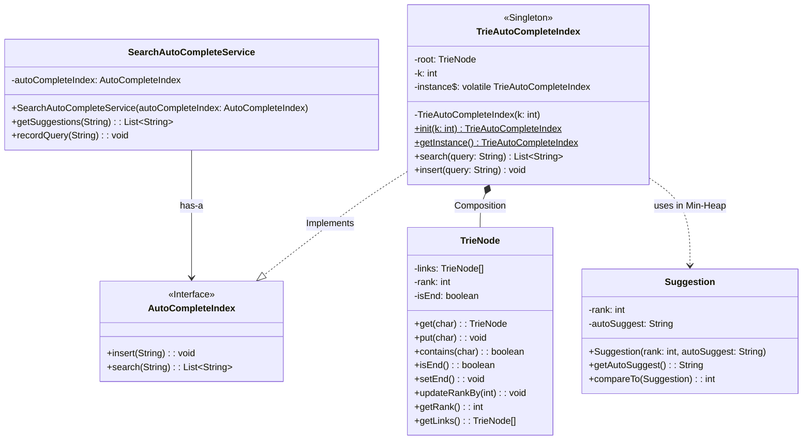
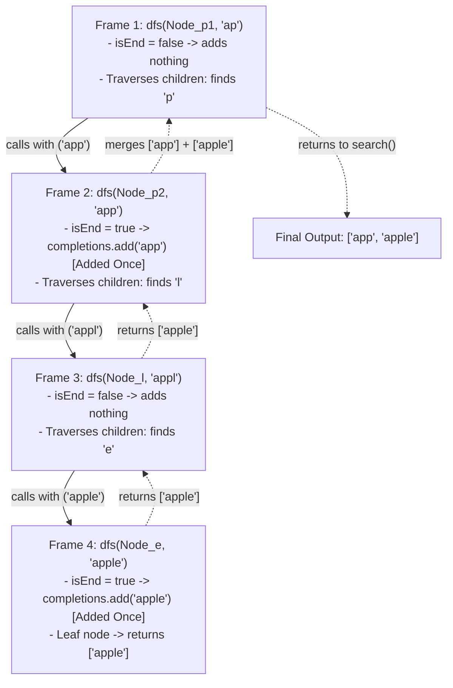
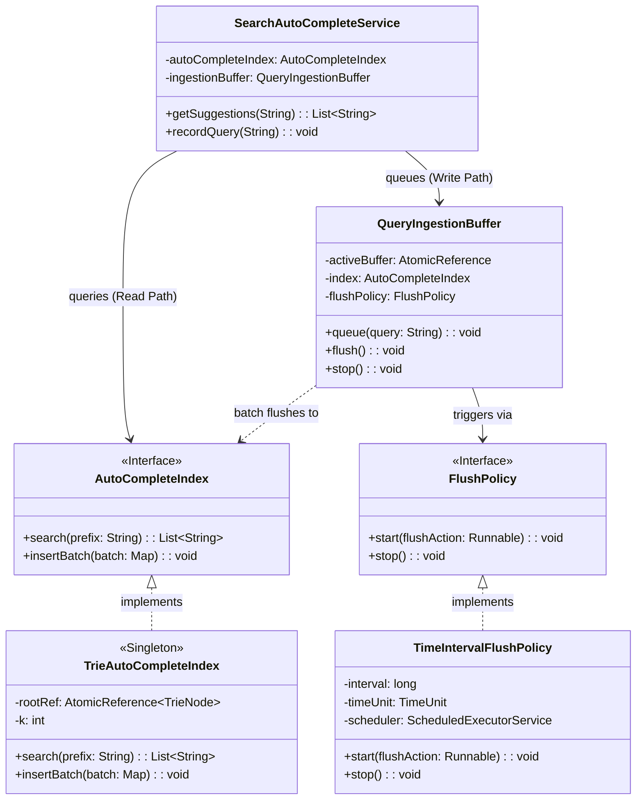
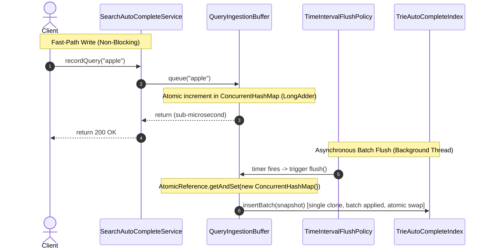
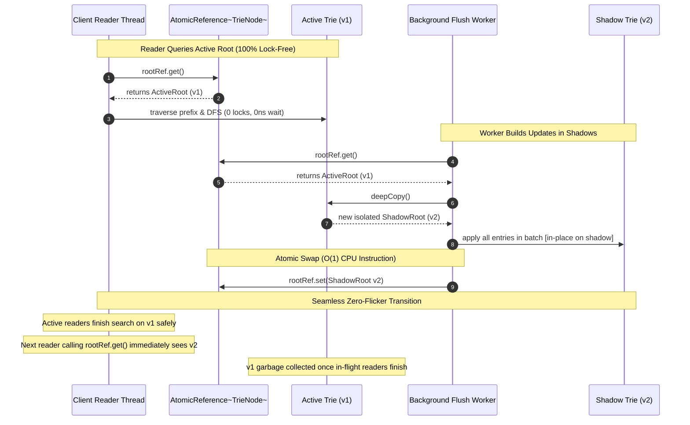
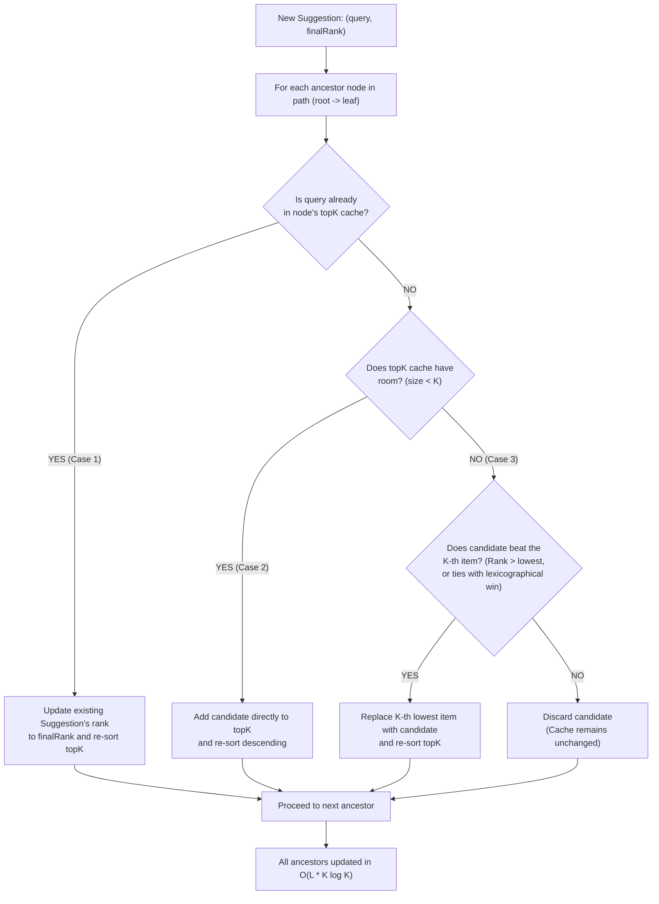

# Search Autocomplete Engine — Low-Level Design

## Problem Statement

Design and implement a highly scalable, low-latency, in-memory **Search Autocomplete (Typeahead) Engine** in Java. The system must provide instant, relevant query suggestions as a user types into a search bar, adapting dynamically to user search habits while maintaining thread safety, high read throughput, and minimal memory overhead.

## Product Requirements

* **PR-1 (Prefix Suggestions):** As a user types into the search input on any client (web, mobile, console), the system suggests the top-$K$ most relevant completions matching the typed prefix based on historical search patterns.
* **PR-2 (Feedback Ingestion on Search):** When a user explicitly executes a search (e.g., presses `Enter` or taps `Search`), the system records that completed query. If its frequency or relevance qualifies, it will surface in future top-$K$ suggestions for matching prefixes.
  * *Clarification:* Intermediate keystrokes are read-only lookups; only committed searches trigger ingestion into the engine.

## Functional Requirements

### FR-1: Core Engine APIs
* **Prefix Suggestions Retrieval:**
  ```text
  getSuggestions(String prefix) -> List<String>
  ```
  Returns an ordered list of up to top-$K$ completions matching the given prefix.
  > **Design Decision: Why `List<String>` over `Optional<List<String>>`?**
  > Collections already have a first-class concept of "no results" (an empty list). Returning `Optional<List<String>>` introduces an awkward dual-empty state (`Optional.empty()` vs `Optional.of(emptyList)`), forces heap allocation on every high-throughput keystroke, and burdens client callers with `.orElse()` ceremony. We guarantee a non-null return contract (`List.of()` or `Collections.emptyList()`), allowing clients to safely iterate immediately.

* **Search Query Ingestion:**
  ```text
  recordQuery(String query) -> void
  ```
  Records a completed query submitted by the user, incrementing its frequency score so subsequent lookups reflect the updated popularity.

---

### FR-2: Character Set & Input Constraints
* **Alphabet & Character Space:** We strictly support lowercase English characters (`a-z`) and single space (`' '`) to allow multi-word phrases (effective alphabet size = 27). Numbers and special characters are excluded for the MVP.
* **Prefix Length Limits:**
  * **Minimum:** 1 character (suggestions appear right from the first keystroke).
  * **Maximum:** 20 characters (caps Trie depth to prevent unbounded memory growth).
  * Inputs violating these constraints (e.g., `null`, empty string, or strings $> 20$ chars) cleanly return an empty list without throwing runtime exceptions.

---

### FR-3: Ranking & Deterministic Ordering
* **Ranking Strategy (MVP):** Ranked primarily by search frequency (highest frequency surfaces first). The architecture should decouple the ranking logic so we can later plug in Recency-based or ML-based strategies.
* **Deterministic Tie-Breaking:** If two completions have the exact same frequency score, break the tie **lexicographically** (`"apple"` before `"apply"`).
* **Configurable $K$:** $K$ (e.g., 5 or 10) is injected at engine instantiation/server level. The client API does not allow callers to request arbitrary $K$ values.

---

### FR-4: System Lifecycle & Scope Boundaries
* **Cold Start:** The MVP initializes in an empty state and organically builds up query frequencies via `recordQuery`. (Pre-loading seed dictionaries is planned for future iterations).
* **Matching Strategy:** Strict prefix matching for the MVP, isolated behind an interface to allow fuzzy matching implementations in the future.
* **Concurrency Boundary:** The core algorithmic logic will first be specified synchronously; asynchronous event queuing and double buffering are captured under Non-Functional Requirements (NFRs).

---

## Models & Entities

### `SearchAutoCompleteService` 
* This is will be the class that talks to  the client (mobile/web/console/another class). It should have 2 main functionalties : 
(1) `getSuggestions()` (2) `recordQuery()`. 
* Get suggestions will take the string, call a Trie which would have been preloaded with different previous searches already. 
* This trie would be a singleton instance in the application process and will be responsible for managing the data structure. 
* The search auto-complete right now uses trie. We could in future use fuzzy as well so we should keep the trie as a contract for the service so that we could later swap out the trie with something else. 
* We don't want to update the frequencies immediately upon search of prefixes. This is due to the fact that, getSuggestions will be called on each character or couple of characters, but that doesn't mean that query is being used or that query was the intention of the user. They could simply delete some characters out of it as well. So, we will only record query as fired if `recordQuery(String)` is fired. 
* `recordQuery(String)` should be fired after any query is selected by the user and is intented for the search. 
* It should be such that, when the user let's say makes a completely new query then also it should be fired along with if an existing query is fired then also it should be fired. 

### `interface` AutoCompleteIndex
* Let's say tomorrow we want to replace the Trie with fuzzy search then we should be able to do it without a single line of code changes. To achieve that we create this interface so that we can later swap out Trie with something else. 

### `singletone` TrieAutoCompleteIndex
* This is the primary Trie data structure that will store the prefixes
* It will be a singleton class. Its responsibility would be to store the manage the prefixes

### TrieNode
* This class represents an individual character node in the 27-way Trie (26 letters + space).
* Holds references to child nodes (`links`), terminal query flag (`isEnd`), and frequency score (`rank`).
* Exposes core mutation and navigation APIs:
  * `get(char): TrieNode`
  * `put(char): void`
  * `contains(char): boolean`
  * `isEnd(): boolean`
  * `setEnd(): void`
  * `updateRankBy(int): void`
  * `getRank(): int`
  * `getLinks(): TrieNode[]`

### `Suggestion`
* A value object implementing `Comparable<Suggestion>`.
* Encapsulates candidate completions (`autoSuggest: String`) along with their popularity score (`rank: int`).
* Implements the Min-Heap eviction comparator: lower rank is prioritized for eviction, with ties broken by evicting lexicographically larger queries (`o.autoSuggest.compareTo(this.autoSuggest)`).

## 5. Low-Level Design : MVP



### 5.1 Trie Traversal & DFS Execution Trace (Zero-Duplicate Guarantee)

During prefix search, the engine traverses down to the prefix's ending node, then initiates a DFS traversal to collect all completions in that subtree.

Each node in the Trie represents a unique character prefix, ensuring that every completed word is visited and added **exactly once**:



* **Why duplicates can never occur:**
  1. `completions.add(autoSuggest)` only captures the word terminating at the **current** node.
  2. The recursive child calls only discover words that extend further down the branch (which have longer, distinct character sequences).
  3. Every Trie node has a single, unique path from the root.

---

## 6. Asynchronous & Periodic Batch Updates (Ingestion Pipeline)

To achieve high concurrency and protect the read path from write latency spikes, query recording is completely decoupled from the in-memory Trie using an **In-Memory Combiner Buffer** and a pluggable **Flush Policy Strategy**:

* **Non-Blocking Write Path:** Client threads calling `recordQuery()` simply increment a counter inside a `ConcurrentHashMap<String, LongAdder>` via an `AtomicReference`. This runs in sub-microsecond time with zero lock contention.
* **Map-Reduce Ingestion Combiner:** Thousands of identical search spikes (e.g., 50,000 queries for `"iphone"`) collapse into a single map entry before touching the Trie, eliminating redundant tree traversals.
* **Pluggable Flush Strategy:** The `FlushPolicy` interface governs *when* to drain the buffer (e.g. periodically every $N$ seconds, on batch size, or manually during tests) without coupling scheduling logic to data structures.

---

### 6.1 Architectural Design Decisions & Trade-Offs (ADR)

| Decision | Selected Choice | Rejected Alternative | Core Rationale |
| :--- | :--- | :--- | :--- |
| **Consistency Model** | **Eventual Consistency & Statistical Loss Tolerance** | Strong / Immediate ACID Consistency | Autocomplete is not a banking transaction. Search frequencies are aggregate statistical signals. Prioritizing sub-microsecond non-blocking writes heavily outweighs immediate consistency. If a rare process termination drops a few buffered queries, the Top-K rankings and business analytics remain statistically unaffected. |
| **Worker Thread Type** | **Daemon Thread (`setDaemon(true)`)** | Non-Daemon User Thread | Default non-daemon threads prevent the JVM from shutting down, leaving zombie background threads hanging on exit. Daemon threads execute background maintenance and allow clean JVM termination when foreground work finishes. |
| **Ingestion Topology** | **In-Memory Combiner (`ConcurrentHashMap`)** | Raw Queue (`ConcurrentLinkedQueue`) | Raw queues store $N$ distinct events, requiring $N$ separate Trie traversals on flush. A combiner pre-aggregates duplicates in $O(1)$ memory, collapsing 50,000 identical searches into a single entry. |
| **Thread-Safe Draining** | **Double Buffering (`AtomicReference.getAndSet`)** | `map.clear()` or `synchronized(map)` | Draining with `clear()` creates a race condition where writes between iteration and clear are lost forever. Locking blocks client write threads. `AtomicReference.getAndSet(new ConcurrentHashMap<>())` performs a hardware-level atomic bucket swap in $O(1)$ time with zero locks. |
| **Counter Primitive** | **`LongAdder`** | `AtomicInteger` / `AtomicLong` | Under high concurrent write spikes (e.g., thousands of threads querying `"apple"`), `AtomicInteger` causes intense CPU cache line bouncing from CAS spinning. `LongAdder` dynamically stripes counts across thread-local cells, maximizing throughput. |
| **Flush Architecture** | **Strategy Pattern (`FlushPolicy` Interface)** | Hardcoded `Timer` inside Buffer | Decoupling the flush trigger from buffer storage allows swapping between time-based intervals, batch sizes, or manual execution in unit tests without changing buffer logic. |
| **Lifecycle Management** | **Composition Root (Single Instance in `App.java`)** | Hard Class Singleton (`getInstance()`) | Hard singletons destroy test velocity (forcing tests to sleep 30 seconds) and prevent multi-tenancy. Instantiable classes injected at the composition root give single-instance production behavior with fast test isolation. |
| **Scheduler Cadence** | **`scheduleWithFixedDelay`** | `scheduleAtFixedRate` | `scheduleAtFixedRate` calculates from start times; if a flush is delayed by GC pauses, it triggers "catch-up bursts" back-to-back. `scheduleWithFixedDelay` guarantees a fixed breathing pause after each flush completes. |
| **Scheduler Fault Tolerance** | **`try-catch(Throwable)` Exception Shield** | Naked `Runnable` | In Java `ScheduledExecutorService`, any unhandled `RuntimeException` or `Error` permanently and silently suppresses all future periodic ticks. Catching `Throwable` guarantees scheduler survival. |
| **Trie Ingestion** | **Single-Pass Batched Updates (`insert(query, count)`)** | Loop calling `insert(query)` $N$ times | Traversing a 20-character Trie 5,000 times for a query wastes CPU. Overloading `insert(query, count)` traverses the branch once and increments `rank` by the aggregated count. |
| **Data Loss Prevention** | **Graceful Shutdown Hook** | Unguarded process termination | Registering a JVM shutdown hook (`Runtime.getRuntime().addShutdownHook`) ensures that `buffer.stop()` stops the scheduler and executes one final synchronous flush of all remaining buffered queries. |

#### Why Eventual Consistency & Statistical Loss Tolerance?

In a high-scale Search Autocomplete engine serving tens of thousands of concurrent users:
* **Availability & Latency Trump Immediate Consistency:** Autocomplete is not a financial ledger. Forcing synchronous disk writes or distributed consensus on keystroke hot paths would introduce unacceptable latency jitter.
* **Statistical Invariance:** Search rankings are driven by aggregate query volume. If 50,000 users search for `"iphone"` over an hour, dropping a tiny fraction of queries during an unexpected process crash will not change the relative frequencies or alter Top-$K$ ranking reports.
* **Bounded Staggered Updates:** Accepting a 5-second eventual consistency window enables asynchronous batching, map-reduce combiner deduplication, and 100% lock-free reads.

---

### 6.2 Class Diagram



### 6.3 Asynchronous Ingestion & Flush Lifecycle



---

## 7. Lock-Free Concurrent Reads via Double-Buffered Trie (Snapshot Isolation)

While multiple readers never conflict with one another (each allocates its own local `PriorityQueue` on its own call stack), executing concurrent reads while a background thread updates the Trie introduces severe concurrency hazards.

### 7.1 Hazards of In-Place Concurrent Mutations
1. **Unsafe Publication & `NullPointerException`:** Array elements in `TrieNode[] links` are not volatile in Java. Without memory barriers, instruction reordering can publish a child node's address before its own internal `links` array is initialized, causing reader threads to crash with `NullPointerException`.
2. **Partial Word & Intermediate State Visibility:** During a multi-character insertion (e.g. `"application"`), a reader executing DFS could traverse half-created nodes where `isEnd` is still `false` or before `updateRankBy()` is applied, returning corrupted completions.
3. **CPU Cache Lag / Stale Ranks:** Primitive rank updates on one CPU core's L1/L2 cache remain invisible to reader threads on other cores without a synchronization barrier.

### 7.2 Why Copy-On-Write Beats `ReentrantReadWriteLock`
* **`ReentrantReadWriteLock` (Rejected):** While read locks allow unlimited concurrent readers, whenever the background flush worker acquires the exclusive write lock, **all readers are paused**. In high-throughput autocomplete serving thousands of queries per second, this creates severe **tail latency (p99) spikes**.
* **Double-Buffered Trie with `AtomicReference<TrieNode>` (Selected):** Readers execute **100% lock-free** with zero synchronization, zero thread contention, and zero blocking. Readers simply read from `rootRef.get()`.

### 7.3 Trie Double-Buffering & Memory Lifecycle



### 7.4 Architectural Invariants & Guarantees

1. **Zero Lock Contention for Readers:** Readers execute in pure read-only memory space. No locks or CAS loops exist on the read path.
2. **Strict Single Clone per Batch:** Regardless of whether the batch contains 1 query or 10,000 queries, the Trie is cloned **exactly once** per flush interval.
3. **Zero Intermediate Map Allocations:** Because `AutoCompleteIndex.insertBatch` accepts `Map<String, ? extends Number>`, `QueryIngestionBuffer` passes its internal `snapshot` directly to the index without allocating temporary conversion maps.
4. **Architectural Guardrail (Decommissioned `insert`):** Unbatched single `insert()` methods are removed from the public index interface, making unbatched mutations physically impossible at compile time.

---

## 8. Per-Node Top-K Prefix Caching (Sub-Microsecond Reads)

In the initial MVP, prefix search required walking down to the prefix node and then executing a full subtree Depth-First Search (DFS) with a Min-Heap. While correct, hot single-character prefixes (like `"a"`) forced the engine to traverse thousands of child nodes on every keystroke.

By **denormalizing and pre-computing the Top-$K$ completions directly inside each `TrieNode`**, the read hot path drops from $O(L + N \log K)$ down to strictly **$O(L)$** ($L \le 20$), eliminating DFS entirely.

### 8.1 Path Tracing & Invariant Guarantee

When a query (e.g. `"apple"` with count 5) is inserted into the shadow tree during a background batch flush:
1. The engine walks the query character-by-character from the root:
   $$\text{root} \longrightarrow \text{node}_1 (\text{'a'}) \longrightarrow \text{node}_2 (\text{'p'}) \longrightarrow \text{node}_3 (\text{'p'}) \longrightarrow \text{node}_4 (\text{'l'}) \longrightarrow \text{node}_5 (\text{'e'})$$
2. All traversed nodes are recorded in a sequential `path` list: `[root, node_1, node_2, node_3, node_4, node_5]`.
3. **The Invariant Guarantee:** By definition of a Trie, **every node along this path is a prefix of `"apple"`**. Therefore, `"apple"` is guaranteed to be a valid completion candidate for every ancestor in that list. No lateral branch exploration is ever required.

---

### 8.2 The 3-Case Cache Update Decision Flow

Once the terminal leaf node's cumulative rank is updated, the engine iterates through each ancestor in `path` and updates its internal `topK: List<Suggestion>` cache:



---

### 8.3 Cache Decision Rules at Each Ancestor

* **Case 1 (Existing Entry):** If the query is already cached in the node, its rank has increased. We update its rank and re-sort the list.
* **Case 2 (Capacity Available):** If the cache contains fewer than $K$ items (`size < K`), the candidate qualifies automatically. It is appended and the list is re-sorted.
* **Case 3 (Full Cache Competition & Eviction):** When the cache is full (`size == K`), the candidate competes strictly against the $K$-th (worst) item:
  - If `candidate.rank > lowest.rank`, or if ranks are equal and `candidate` comes first lexicographically (`a-z`), the lowest item is evicted and the candidate takes its place.
  - Otherwise, the candidate is discarded for this ancestor.

---

### 8.4 The Resulting Read Path: Zero DFS

With pre-computed caches, `search(prefix)` transforms into a simple pointer walk followed by an $O(1)$ list retrieval:

```java
@Override
public List<String> search(String prefix) {
    validateQuery(prefix);

    TrieNode node = rootRef.get();
    for (char k : prefix.toCharArray()) {
        if (!node.contains(k)) {
            return Collections.emptyList();
        }
        node = node.get(k);
    }

    // O(1) Instantaneous Return — Zero DFS, Zero PriorityQueue, Zero Locks!
    return node.getTopK();
}
```

* **Read Complexity:** $O(L)$ where $L \le 20$.
* **Heap Allocations on Read:** Zero. Returns the pre-computed list directly.
* **Cache Integrity:** Because of Double-Buffering (`AtomicReference`), readers only ever observe complete, fully-sorted caches from the active tree.

---

## 9. Future Scope (Prioritized Roadmap)

While these items were deliberately staged to keep the engine modular and robust, the completed foundational layers (P1 and P3) enable advanced features without refactoring the core:

1. **[COMPLETED] P1 — Concurrent Clients & Thread Safety:**
   * Fully implemented via lock-free `AtomicReference<TrieNode>` Double-Buffered Trie (Snapshot Isolation) and non-blocking ConcurrentHashMap counters.
2. **[COMPLETED] P3 — Asynchronous & Periodic Batch Updates:**
   * Fully implemented via `QueryIngestionBuffer` with atomic swap pre-aggregation and pluggable `TimeIntervalFlushPolicy`.
3. **P2 — Pluggable Ranking Strategies (`rank` Abstraction):**
   * While the MVP computes `rank` purely via raw frequency, the design will treat this as a generic `rank` score. Future iterations will introduce the Strategy Pattern and a Context Object to dynamically swap between Recency-based decay, Personalization, and ML-based ranking.
4. **P4 — Character Set Expansion & Memory Optimization:**
   * Expand beyond the 27-character lowercase alphabet to full alphanumeric and Unicode support, evaluating memory trade-offs (e.g., migrating from fixed-size arrays to HashMaps or Radix/Patricia Tries) to manage heap growth.
5. **P5 — Alternative Search Algorithms (Fuzzy & Typo Tolerance):**
   * Keep the retrieval interface decoupled so alternative search matchers (such as fuzzy search using Levenshtein distance, BK-Trees, or n-grams) can be plugged in seamlessly.
