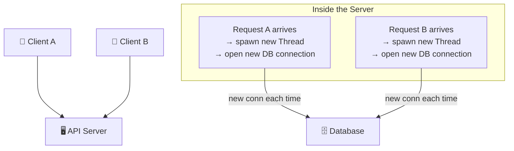
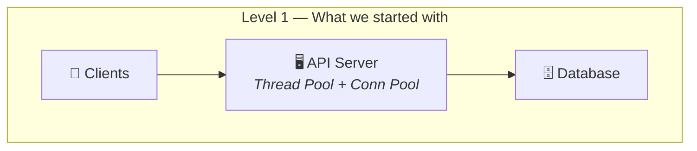
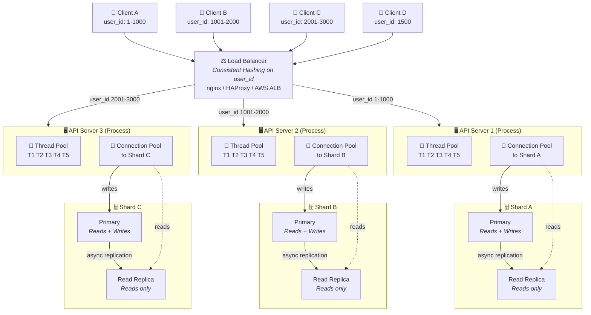
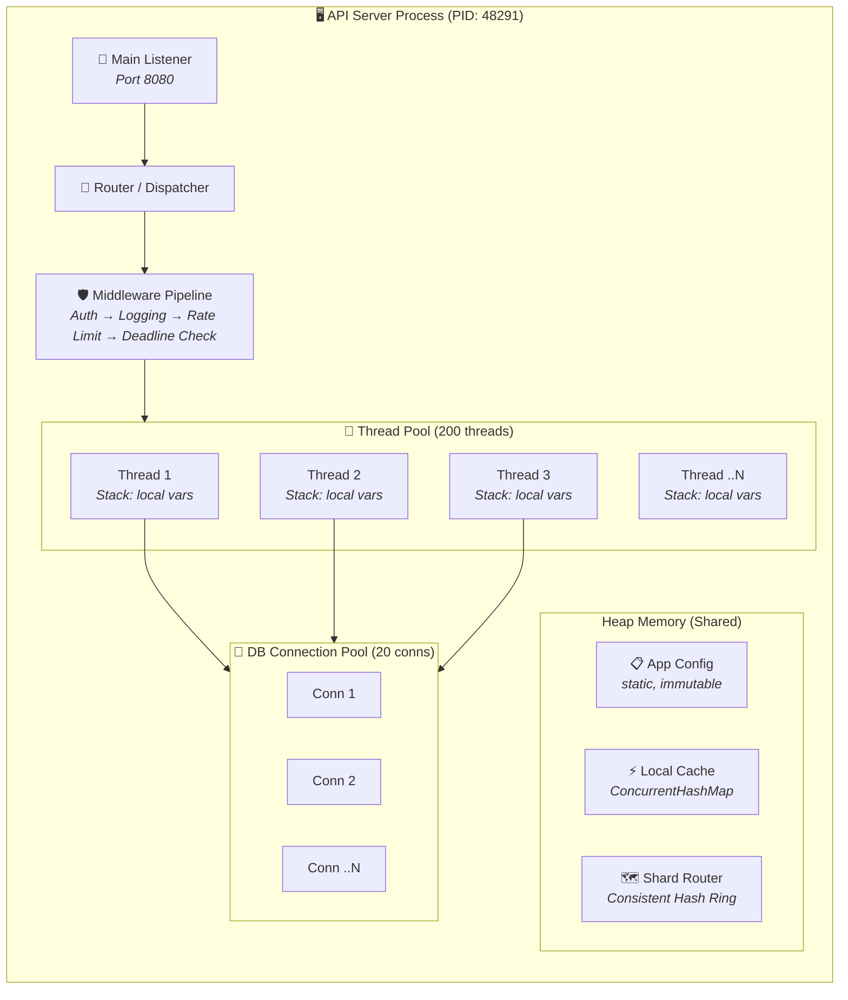
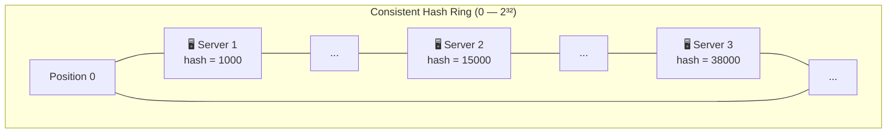
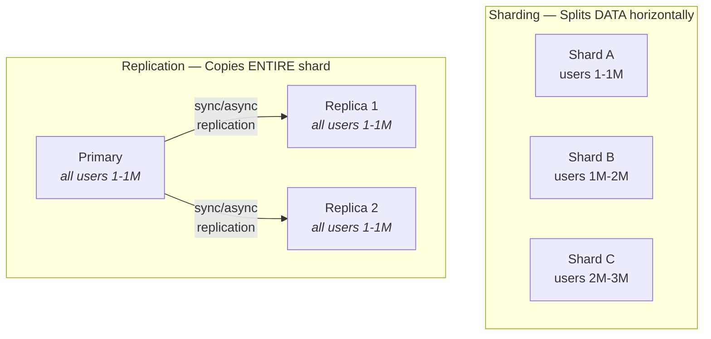
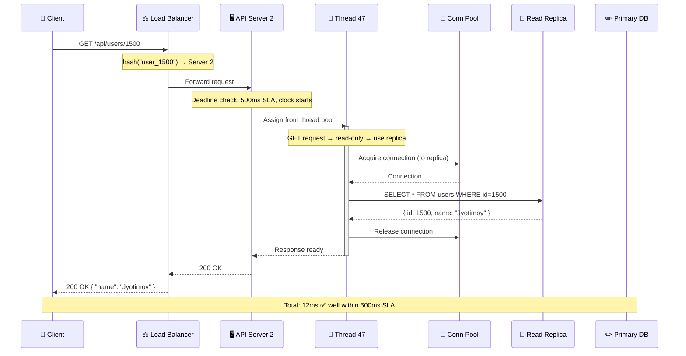

# API Servers at Scale — The Full Picture

## Level 0: The Naive Setup — No Pools At All

The simplest possible server. Every request spawns a **new thread** and opens a **new DB connection**. No reuse, no pooling.



**What goes wrong at scale:**

| Problem | Why it hurts |
|---|---|
| **Thread creation overhead** | Spawning a thread costs ~1ms + ~1MB stack memory. At 1000 req/sec, that's 1000 threads and ~1GB RAM just for stacks |
| **DB connection overhead** | Opening a connection takes ~20-50ms (TCP handshake + auth). That's added to *every* request |
| **No upper bound** | Traffic spike → unlimited threads → OS runs out of memory → crash |
| **Connection exhaustion** | Most databases cap connections (e.g., PostgreSQL default: 100). 101st request gets rejected |

This is fine for a hobby project doing 10 req/sec. It falls apart the moment you get real traffic.

---

## Level 1 → Level 2: From Pooled Server to Fleet

**Level 1** fixes Level 0 by introducing **thread pools** and **connection pools** — reuse instead of recreate. This is the standard single-server setup.



**Level 2** scales out by cloning that pair and putting a load balancer in front 👇

## The Full Scaled Architecture



## Inside a Single API Server Process

Each box labeled "API Server" above is a **single OS process**. Here's what's inside:



> [!NOTE]
> Each thread gets its own **stack** (local variables, function call chain) but they all share the **heap** (config, cache, shard map, connection pool). This is why static mutable state is dangerous — exactly what we discussed earlier.

## Consistent Hashing — How the Load Balancer Routes

Instead of simple round-robin (which would send any user to any server), **consistent hashing** maps each user to a specific server deterministically:



```
hash("user_42")   = 3500   → lands between Server 1 (1000) and Server 2 (15000)
                            → routes to Server 2 (next server clockwise)

hash("user_99")   = 40000  → lands between Server 3 (38000) and Server 1 (1000)  
                            → routes to Server 1 (wraps around)

hash("user_1337") = 12000  → lands between Server 1 (1000) and Server 2 (15000)
                            → routes to Server 2
```

### Why consistent hashing over simple modulo?

| | Modulo (`user_id % N`) | Consistent Hashing |
|---|---|---|
| **Add a server** | Almost ALL users get remapped to different servers | Only ~1/N users get remapped |
| **Remove a server** | Same — mass remapping | Only the dead server's users move to the next one |
| **Cache locality** | Destroyed on scaling events | Mostly preserved |

This is critical because if you're doing **sticky sessions** or **local caching**, a mass remapping means every cache goes cold simultaneously — instant load spike on your databases.

## Sharding vs Read Replicas — They Solve Different Problems

You're right that with sharding you don't *necessarily* need replicas, but in practice most systems use both:



| | Sharding | Read Replicas |
|---|---|---|
| **Problem solved** | Dataset too large for one machine | Too many reads for one machine |
| **Data on each node** | Partial (subset of rows) | Full copy (all rows) |
| **Writes go to** | The correct shard only | Primary only |
| **Reads go to** | The correct shard only | Any replica |
| **Failure impact** | Lose access to that shard's data | Promote replica to primary, no data loss |

### When you combine both

Each **shard** gets its own **primary + replicas**:

- **Writes** → routed by consistent hash to the correct shard's **primary**
- **Reads** → routed to that shard's **replica** (offloading the primary)
- **Failover** → if a primary dies, its replica gets promoted

This is what you see at scale — **sharding for horizontal data distribution**, **replicas for read scaling and fault tolerance**. They're complementary, not alternatives.

## Complete Request Flow at Scale



## The Recursive Insight

Your observation is exactly right:

```
At scale, the system is just:

    ┌──────────────────────────────────────────────┐
    │           Load Balancer + Routing             │
    └──────┬──────────┬──────────────┬──────────────┘
           │          │              │
    ┌──────▼───┐ ┌────▼─────┐ ┌─────▼────┐
    │ Server 1 │ │ Server 2 │ │ Server 3 │    ← Each one is the
    │ + Shard A│ │ + Shard B│ │ + Shard C│      SAME simple setup
    └──────────┘ └──────────┘ └──────────┘      we started with
```

Each pair is independently the **thread pool + connection pool + single database** model from our first diagram. The load balancer + consistent hashing is just the layer that **distributes traffic** so each pair only handles its slice.

**That's the beauty of good system design — it's fractal. Zoom in on any piece and it looks like the whole.**
