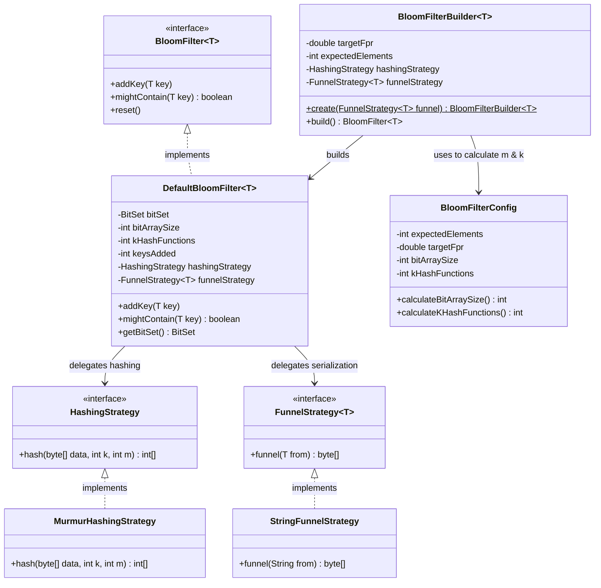
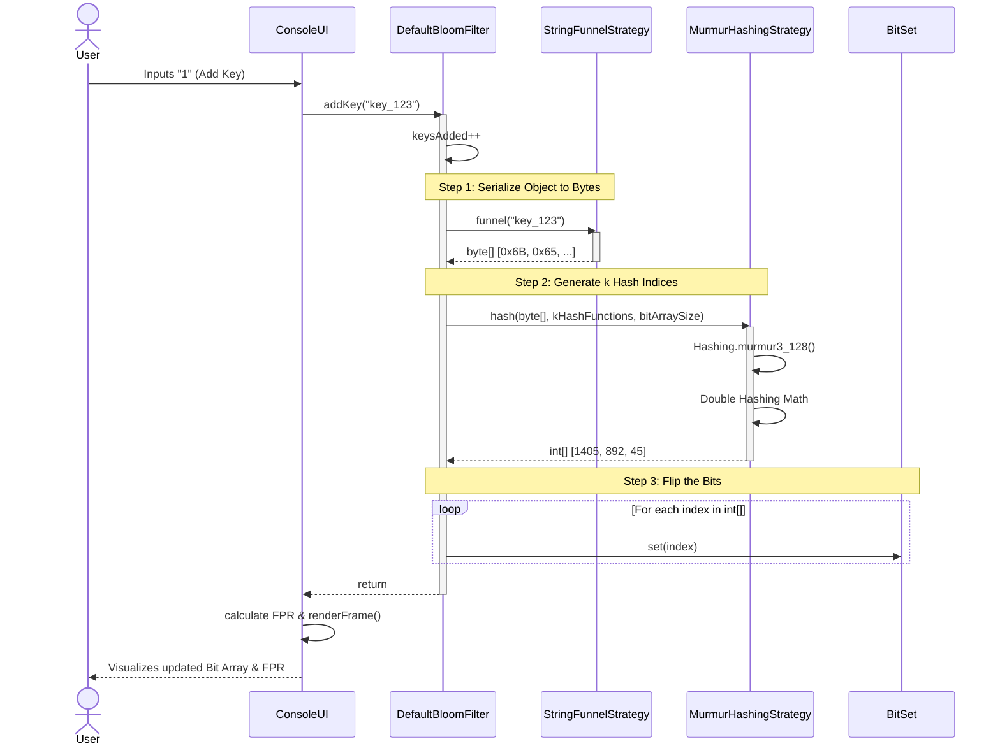

# Bloom Filter Terminal Visualizer

A fully functional, terminal-based Bloom Filter implementation in Java. This project serves as a Low-Level Design (LLD) exercise showcasing advanced Object-Oriented principles, core data structure manipulation, and mathematical hashing strategies.

## Features

- **Interactive Terminal UI:** A flicker-free, double-buffered terminal dashboard that visualizes the bit array and the theoretically calculated False Positive Rate (FPR) as elements are added.
- **Mathematical Accuracy:** Automatically calculates the optimal bit array size ($m$) and the optimal number of hash functions ($k$) based on your expected dataset size ($n$) and target FPR ($p$).
- **"Double Hashing" Strategy:** Uses a single 128-bit MurmurHash3 algorithm (via Google Guava) separated into two 64-bit numbers to simulate $k$ independent hash functions without bias or severe CPU overhead.
- **100% Generic & Type-Safe:** Implements a `FunnelStrategy` pattern (inspired by Google Guava) allowing the Bloom Filter to store `String`, `Integer`, or any complex custom Object without relying on Java's inadequate `Object.hashCode()`.

## Architecture & LLD Highlights

This project avoids monolithic anti-patterns by strictly adhering to the Single Responsibility Principle:

*   **`BloomFilter<T>`:** The core interface hiding implementation details from the outside world.
*   **`DefaultBloomFilter<T>`:** The state manager backing the interface with a `java.util.BitSet`.
*   **`BloomFilterBuilder`:** Enforces compile-time type safety for generics via Dependency Injection of the Funnel Strategy.
*   **`HashingStrategy` & `FunnelStrategy`:** Interfaces that completely decouple the hashing algorithm (Murmur3) and data-to-byte conversion (UTF-8) from the data structure itself.
*   **`BloomFilterConfig`:** Isolates the mathematical formulas for $m$ and $k$.

## Mathematical Formulas Used

**Bit Array Size ($m$):**
$$m = \lceil \frac{-n \ln p}{(\ln 2)^2} \rceil$$

**Number of Hash Functions ($k$):**
$$k = \lfloor \frac{m}{n} \ln 2 \rceil$$

## How to Run

This project uses Gradle. You do not need Gradle installed globally to run this project; the Gradle wrapper is included.

1. Navigate to the project directory:
   ```bash
   cd bloom-filter-lld
   ```
2. Build the project:
   ```bash
   ./gradlew build
   ```
3. Run the interactive terminal visualizer:
   ```bash
   ./gradlew run -q --console=plain
   ```
   *(Note: The `-q --console=plain` flags ensure Gradle's build output doesn't disrupt the ANSI escape codes used to draw the UI).*

## System Design Diagrams

### Structural Class Diagram


### Runtime Sequence Diagram

