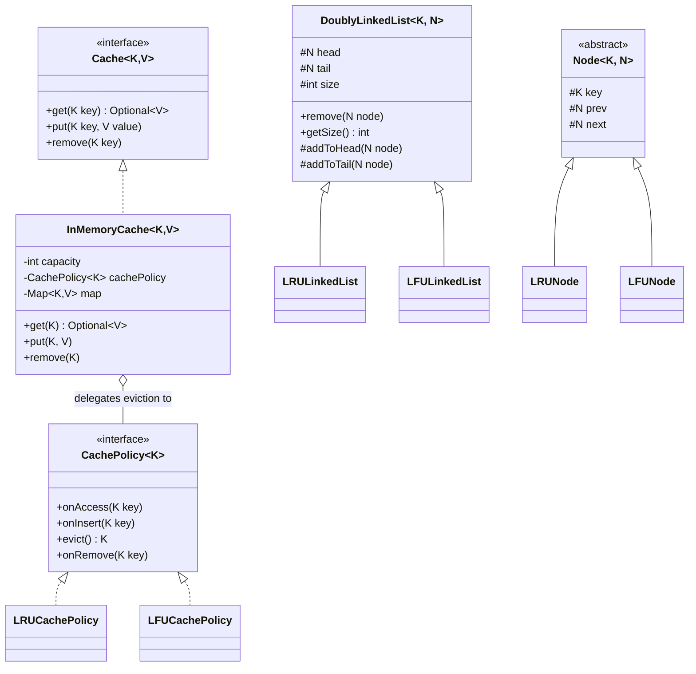
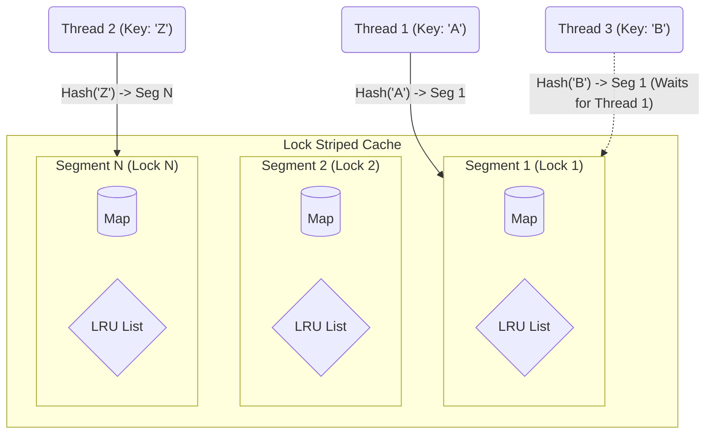
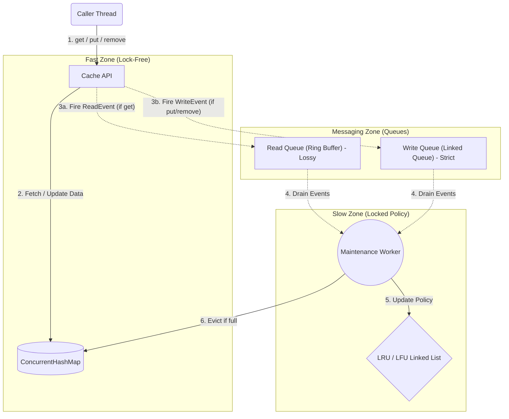

# Engineering an Extensible In-Memory Cache in Java: From Interview Problem to Pluggable Framework

Have you ever faced the classic LFU or LRU Cache problem in a system design or coding interview? What often starts as a quick hack using a HashMap and a Doubly Linked List can evolve into something much more powerful when proper software engineering principles are applied. 

In this project, we explore how to build a high-performance, strongly-typed, and generic caching library in Java. We'll walk through the journey of taking a rigid, single-purpose cache and refactoring it into a fully extensible framework using the **Strategy Pattern**.

## The Problem with Traditional Implementations

Most standard implementations of an LRU (Least Recently Used) or LFU (Least Frequently Used) cache tightly couple two distinct responsibilities:
1. **Data Storage:** Storing the actual key-value pairs (usually in a `HashMap`).
2. **Eviction Tracking:** Maintaining the order or frequency of accesses (usually via a `DoublyLinkedList`).

When these two concerns are tangled together in a single class, adding a new eviction policy (like FIFO or MRU) requires modifying the core cache logic, violating the **Open/Closed Principle**.

## A Better Architecture: Decoupling Storage and Eviction

To build a truly extensible cache, we must separate the *"What to store"* from the *"Who to evict"*. 

By introducing a `CachePolicy<K>` interface, we can delegate all eviction-related decisions to a dedicated policy engine. The core `InMemoryCache` simply holds the data and notifies the policy whenever an item is accessed, inserted, or removed.

### The Class Blueprint

Here is a look at how we decouple these components:



## Designing for Type Safety and Readability

When building a library for other developers, the API must be intuitive and safe. 

### 1. Generic Types (`<K, V>`)
Our cache uses Java Generics to allow any object type for keys and values, ensuring compile-time type safety. 

### 2. The Builder Pattern
Constructing a cache often requires multiple configuration parameters (capacity, eviction policy, concurrency level). The **Builder Pattern** provides a clean, readable way to instantiate the cache:

```java
import com.jyotimoykashyap.Cache;
import com.jyotimoykashyap.cache.InMemoryCache;
import com.jyotimoykashyap.cachepolicy.lfu.LFUCachePolicy;

public class Main {
    public static void main(String[] args) {
        Cache<String, Integer> cache = new InMemoryCache.Builder<String, Integer>()
                .setCapacity(100)
                .setCachePolicy(new LFUCachePolicy<>())
                .build();
    }
}
```

### 3. Idiomatic Miss Handling
Instead of returning `null` (which leads to the dreaded `NullPointerException`) or throwing exceptions when a key is not found, our `get` method returns an `Optional<V>`. This forces the caller to explicitly handle cache misses safely:

```java
cache.get("User:123").ifPresent(val -> {
    System.out.println("Found value: " + val);
});
```

## Exploring Eviction Policies

Because of our modular design, implementing new policies is a breeze. The library currently supports two O(1) time complexity algorithms out-of-the-box:

### LRU (Least Recently Used)
Tracks recency. When the cache hits capacity, the item that hasn't been accessed for the longest time is evicted. It relies internally on a single `HashMap` and an `LRULinkedList`.

### LFU (Least Frequently Used) with LRU Tie-Breaker
Tracks the frequency of access. It evicts the item with the lowest access count. If multiple items share the same lowest frequency, it elegantly falls back to an **LRU tie-breaker**. This is achieved using a `HashMap` for fast node lookup and another `HashMap` mapping frequencies to individual `LFULinkedList` buckets.

## The Concurrency Challenge: Thread Safety vs. High Performance

In a multi-threaded environment, caching becomes exponentially more complex. 

Our current implementation guarantees thread safety using a coarse-grained `ReentrantLock` at the `InMemoryCache` level. This ensures that operations on the underlying `HashMap` and the `CachePolicy`'s internal linked lists remain perfectly synchronized and atomic.

### Scaling Up: How the Giants Do It
While coarse-grained locking is reliable, it creates a bottleneck under massive concurrency. High-performance caches like **Guava Cache** and **Caffeine** use advanced strategies to eliminate this bottleneck:

### 1. Lock Striping (Data Sharding - Guava Style)

Rather than having a single lock for the entire cache (which causes massive contention as every thread waits in line for the same lock), **Lock Striping** partitions the cache into multiple independent segments (or shards). 

This is the core concurrency mechanism behind Java's original `ConcurrentHashMap` and caching libraries like **Guava Cache**.

#### How it works:
1. **Segmentation:** The cache is divided into a fixed number of segments (e.g., 16, 32, or 64). Each segment acts as a mini-cache with its own `HashMap`, its own Doubly Linked List for eviction, and most importantly, **its own lock**.
2. **Key Hashing:** When a `put()` or `get()` occurs, the cache computes the hash of the key to determine which segment the key belongs to.
3. **Targeted Locking:** The thread only acquires the lock for that specific segment.

#### The Architecture


#### Pros and Cons:
- **Pros:** Drastically improves throughput. If you have 16 segments, up to 16 threads can write to the cache simultaneously without ever blocking each other (assuming they hash to different segments).
- **Cons:** It still requires locks. If multiple threads frequently access keys that hash to the same segment (a "hot spot"), they will still experience contention. Furthermore, maintaining global metrics (like global cache size) becomes expensive, as it requires aggregating data across all segments.
### 2. Asynchronous Ring Buffers (Event Sourcing - Caffeine Style)

To eliminate read-locks entirely, the cache uses a `ConcurrentHashMap`. When a `get()` occurs, an event is fired into a highly-concurrent, *lossy* Read Queue (Ring Buffer). A background process consumes these events to asynchronously update the Doubly Linked Lists, making reads practically lock-free.

Here is a deep dive into how this asynchronous architecture works:

This document outlines the conceptual design of an asynchronous, high-concurrency cache (similar to the architecture used by Caffeine). 

Unlike a traditional cache that uses a coarse-grained lock to synchronize map inserts with doubly-linked list updates, this architecture separates the "Fast Zone" (data access) from the "Slow Zone" (eviction policy maintenance) using asynchronous queues.

#### 1. The Components (The Architecture)

The system is split into three distinct zones:



#### 2. The `get()` Flow (Lightning Fast)

When a user thread calls `get(key)`:
1. **Read Data:** The thread retrieves the value directly from the `ConcurrentHashMap`. Because it relies on internal concurrent structures, no locks are acquired.
2. **Fire Event:** The thread tosses a `ReadEvent(key)` message into the **Read Queue**.
3. **Drop if Full (Lossy):** If the Read Queue is full due to massive traffic, the thread simply drops the message. Losing an occasional recency update does not noticeably impact the accuracy of LRU/LFU, and ensures reads are never blocked.
4. **Return:** The thread returns the data to the user immediately.

*Result: The caller thread is never blocked waiting for the eviction linked list to update.*

#### 3. The `put()` and `remove()` Flow (Strict)

When a user thread calls `put(key, value)` or `remove(key)`:
1. **Write Data:** The thread inserts or deletes the data directly in the `ConcurrentHashMap`. It is instantly available (or removed) for other reading threads.
2. **Fire Event:** The thread tosses a `WriteEvent` (Insert or Delete) into the **Write Queue**.
3. **Never Drop (Lossless):** Because this is a strict queue, if it is full, the thread must wait. Dropping a write event would result in a memory leak, as the item would exist in the map but the eviction policy would be unaware of it (or vice versa, the policy would track an item that was already deleted).
4. **Trigger Worker:** The thread signals the Background Worker that the cache size has changed and eviction or cleanup might be necessary.

#### 4. The Maintenance Worker (The Magic)

The Maintenance Worker is a background process (either a dedicated thread, or an opportunistic task run by caller threads via a `tryLock`). Its sole responsibility is to clean up the event queues and maintain the eviction policy.

When it runs, it executes this sequence:
1. **Drain Reads:** It empties the Read Queue. For every key it processes, it notifies the `CachePolicy` to update its recency/frequency (e.g., moving the node to the head of the LRU Linked List).
2. **Drain Writes:** It empties the Write Queue, notifying the `CachePolicy` to add new nodes or remove deleted ones.
3. **Enforce Capacity:** It checks: *Is the Map size > Capacity?*
    * If yes, it calls `policy.evict()` to determine which key to remove.
    * It deletes that evicted key from the `ConcurrentHashMap`.

##### Why this is brilliant
By utilizing this architecture, the **Eviction Policy (Doubly Linked List)** is completely isolated in the "Slow Zone" and is only ever modified sequentially by the Maintenance Worker. Because it is only touched by one process at a time, the complex Linked List structures do not need to be thread-safe. All concurrent load is effortlessly absorbed by the `ConcurrentHashMap` and the event queues.

## Looking Forward: How to Extend This Library

The beauty of the Strategy Pattern is its extensibility. Want to add a Random eviction policy or a FIFO (First In, First Out) queue? 

1. Create a new Node class extending `Node<K, YourNode<K>>`.
2. Create a new List class extending `DoublyLinkedList<K, YourNode<K>>` (if ordering is required).
3. Create a class implementing `CachePolicy<K>` and pass it into the `InMemoryCache.Builder`.

You can do all of this without touching a single line of the core `InMemoryCache` data layer!

---
*Feel free to explore the source code, run the test suites, and try adding your own custom eviction policy.*
