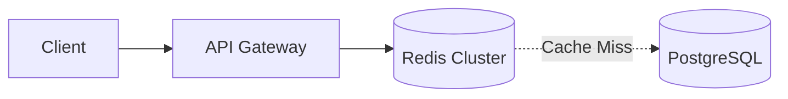

# Architecture & Implementation Plan: Unified Platform for JyotimoyKashyap.me

A comprehensive blueprint to evolve this repository into a unified personal website (**`jyotimoykashyap.me`**) incorporating a personal portfolio, high-level system design blogs, low-level design (LLD) case studies, and interactive distributed systems visualizers. The architecture targets an ultra-low-cost AWS serverless model (\$0.00/mo infrastructure) managed via Cloudflare DNS and automated GitOps CI/CD.

---

## User Decisions & Scope Finalized

* **Frontend Framework:** **Astro** (Fast static generation, zero JS by default, native MDX, and React islands for interactive visualizers).
* **Route Structure:** Dedicated full-page routes:
  * `/` — Portfolio (About, Experience, Highlights, Resume, Tech Stack)
  * `/blogs/[slug]` — High-level system design and architectural deep dives
  * `/lld/[slug]` — Object-oriented low-level design case studies
  * `/labs/[slug]` — Fullscreen dedicated interactive visualizers
* **Authoring Workflow:** Pure **GitOps via Markdown/MDX** in the code editor. No third-party CMS bloat.
* **DNS & Hosting:** **Cloudflare DNS** (Free DNS-only mode + CNAME flattening) pointing to **AWS CloudFront + S3**.

---

## The New Git Developer Experience (Zero Manual Scripts)

Here is how creating and publishing content will work after the migration:

### 1. Publishing a New Blog Post or LLD Case Study

To publish a new write-up, you only create **one** file:

```text
apps/web/src/content/blogs/distributed-caching-deep-dive.mdx
  (or apps/web/src/content/lld/lru-cache-design.mdx)
```

Inside the file, you write standard Markdown with type-checked frontmatter:

```markdown
---
title: "Distributed Caching: Invalidation, Thundering Herds & Consistent Hashing"
description: "How production systems avoid cache stampedes using lease tokens and probabilistic early expiration."
publishedAt: "2026-09-15"
category: "Distributed Systems"
tags: ["Caching", "Redis", "High Availability"]
featured: true
---

# Introduction

Cache invalidation is notoriously difficult...



## The Thundering Herd Problem

When a popular key expires, thousands of concurrent requests can overwhelm the database...
```

**To Publish:**
```bash
git add .
git commit -m "feat(blog): add distributed caching deep dive"
git push origin main
```
* **What happens automatically:** GitHub Actions validates your frontmatter schema with Zod, compiles the static HTML, syncs to S3, and invalidates CloudFront.
* **Result:** Live in ~45 seconds at `jyotimoykashyap.me/blogs/distributed-caching-deep-dive` and automatically listed on the `/blogs` directory with search and tags.

---

### 2. Publishing a New Interactive Lab (Visualizer)

Each lab lives as a clean, modular React component within the web app:

#### Step 1: Create your interactive component
Add your interactive React logic and state in:
```text
apps/web/src/components/labs/DistributedLockVisualizer/index.tsx
```

#### Step 2: Register the Lab metadata
Create the entry in `apps/web/src/content/labs/distributed-lock.json`:
```json
{
  "title": "Distributed Lock Visualizer (Redlock)",
  "slug": "distributed-lock",
  "description": "Simulate network partitions, clock drifts, and quorum acquisition across Redis nodes.",
  "category": "Consensus & State",
  "tagColor": "#ef4444"
}
```

#### Step 3: Link component to route
In the lab dynamic page (`apps/web/src/pages/labs/[slug].astro`), the visualizer is automatically mounted full-screen:
```astro
---
// apps/web/src/pages/labs/[slug].astro
import BaseLayout from '@/layouts/BaseLayout.astro';
import { getLabComponent } from '@/components/labs/registry';

const { slug } = Astro.params;
const LabComponent = getLabComponent(slug);
---

<BaseLayout title={lab.title} fullscreen>
  <LabComponent client:load />
</BaseLayout>
```

**To Publish:**
```bash
git add .
git commit -m "feat(lab): add Redlock visualizer"
git push origin main
```
* **Result:** Live at `jyotimoykashyap.me/labs/distributed-lock` and automatically listed in the `/labs` gallery.

---

## Architecture Blueprint

```
                      [ Client Browser ]
                              │
                              ▼
                 [ Cloudflare Authoritative DNS ]
                 (Free DNS-only mode, CNAME flattening)
                              │
                              ▼
            [ AWS CloudFront CDN (Global Edge + Free ACM SSL) ]
                              │
             ┌────────────────┴────────────────────────┐
             │ Default Path: /*                        │ Path: /api/* (Phase 4)
             ▼                                         ▼
   [ S3 Static Hosting Bucket ]             [ API Gateway (HTTP API) ]
   ├── / (Portfolio)                                   │
   ├── /blogs (Macro System Design)                    ▼
   ├── /lld (Low-Level Design)               [ AWS Lambda Handlers ]
   ├── /labs (Interactive Visualizers)                 │
   └── /assets (CSS/JS/Images)                         ▼
                                             [ DynamoDB (On-Demand) ]
                                             (Views, likes, contact messages)
```

---

## Proposed Phases & Execution Steps

### Phase 1: DNS & AWS Cloud Infrastructure Setup
* [ ] **Domain & Cloudflare DNS:**
  * Point domain nameservers to Cloudflare.
  * Set CNAME records for `@` and `www` to CloudFront distribution (DNS-Only / Grey Cloud).
* [ ] **AWS Certificate Manager (ACM):**
  * Issue public wildcard SSL cert for `jyotimoykashyap.me` and `*.jyotimoykashyap.me` in `us-east-1`.
  * Validate ownership via Cloudflare CNAME record.
* [ ] **AWS S3 & CloudFront:**
  * Provision private S3 bucket (`jyotimoykashyap-me-web`).
  * Attach CloudFront with Origin Access Control (OAC) and ACM SSL cert.

### Phase 2: Project Scaffolding & Migration to Astro
* [ ] Initialize Astro project inside `apps/web` with Tailwind CSS & React support.
* [ ] Define Astro Content Collections schemas with Zod:
  * `blogs`: title, description, publishedAt, category, tags, coverImage.
  * `lld`: title, description, publishedAt, designPatterns, language, githubRepo.
  * `labs`: title, description, category, tagColor, interactiveFeatures.
* [ ] Migrate existing blogs from `blogs/` and `cache-lld/`, `task-management-system/`.
* [ ] Migrate existing React visualizers (Consistent Hashing, Bloom Filter, RabbitMQ, Kafka, Rate Limiter, Raft Election) into `components/labs/`.
* [ ] Build dedicated page layouts:
  * `/` — Brutalist portfolio landing page.
  * `/blogs` and `/blogs/[slug]` — High-speed readable reader with syntax highlighting & Mermaid.
  * `/lld` and `/lld/[slug]` — Structured design patterns & code walkthrough layout.
  * `/labs` and `/labs/[slug]` — Dedicated full-page interactive sandbox.

### Phase 3: Automated CI/CD (Eliminating Legacy Scripts & Docker)
* [ ] Create `.github/workflows/deploy.yml`:
  * Build Astro static output (`npm run build`).
  * Assume AWS IAM Role via GitHub OIDC.
  * Sync `dist/` directly to S3 (`aws s3 sync dist/ s3://jyotimoykashyap-me-web/ --delete`).
  * Invalidate CloudFront edge cache (`aws cloudfront create-invalidation`).
* [ ] Remove obsolete files:
  * `scripts/build-docs.mjs`
  * `deploy-hub/`
  * Legacy root `Dockerfile`

### Phase 4 (Subsequent): Serverless Dynamic Endpoints
* [ ] API Gateway + Lambda + DynamoDB for post views, reactions, and contact inquiries.

---

## Verification Plan

### Automated Verification
- **Astro Typecheck & Build:** `npm run build` verifies all MDX frontmatter schemas and compiles static pages.
- **Lighthouse Scores:** Ensure 95+ performance across mobile and desktop.
- **GitHub Actions Deployment:** Automated verify-on-commit without manual intervention.

### Manual Verification
- **DNS & SSL Resolution:** Confirm `https://jyotimoykashyap.me` opens seamlessly via Cloudflare DNS + CloudFront.
- **Interactive Labs:** Validate all 6 ported visualizers function smoothly (state management, animations, event loop).
- **Navigation & Responsiveness:** Test responsive layout on mobile and desktop.
