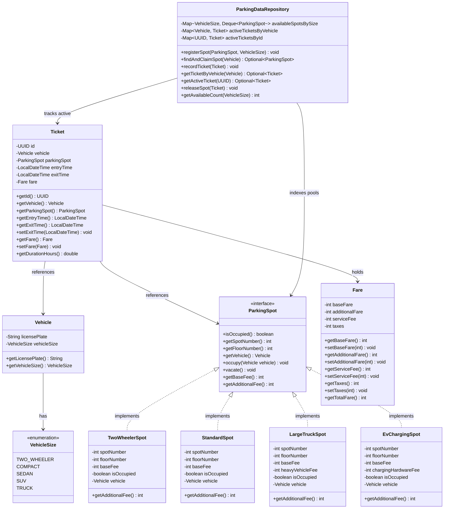
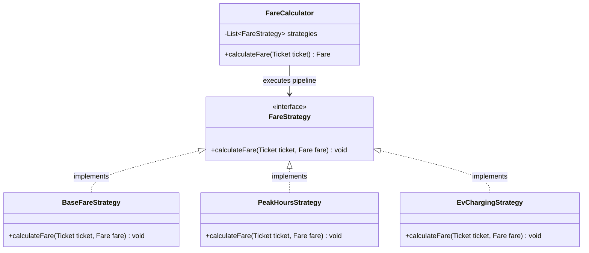
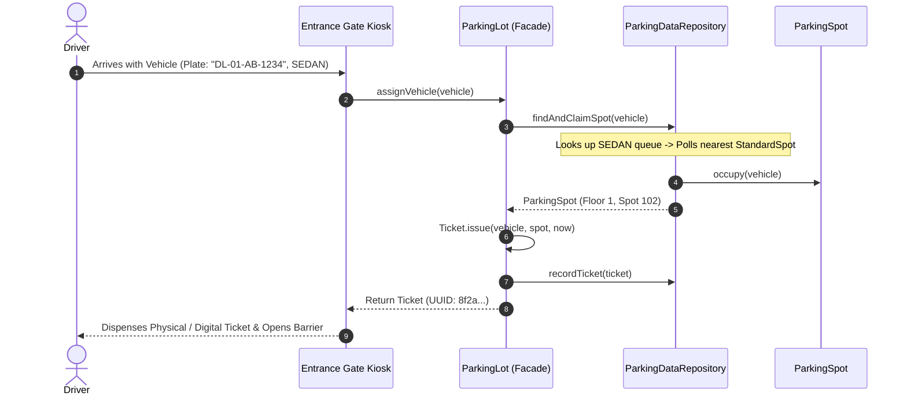
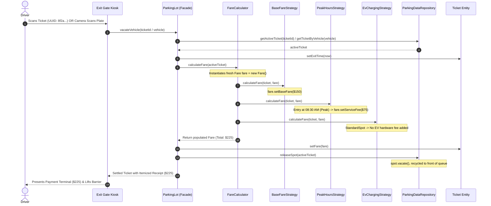

<!-- hub-metadata
type: lld
title: "Parking Lot Low-Level Design"
description: "A comprehensive low-level design of a multi-floor parking lot system in Java 21, exploring domain modeling, best-fit spot allocation, dynamic Strategy-based pricing, and multi-gate concurrency."
tag: "Low-Level Design"
tagColor: "#3b82f6"
difficulty: "Medium"
publishedAt: "2026-10-03"
language: "Java 21"
designPatterns: ["Strategy Pattern", "Repository Pattern", "Facade Pattern", "Object-Oriented Design"]
-->

# Parking Lot System — Low-Level Design (LLD)

## 1. Problem Statement & Real-World Context

Imagine pulling up to a modern, multi-storey parking facility in a busy metropolitan center. At the entrance gate, an automated kiosk scans your vehicle, issues a ticket with an assigned spot number, and opens the barrier. You navigate up the ramps to your designated floor, park in a bay sized appropriately for your car, and go about your day. Hours later, you drive down to the exit kiosk, scan your ticket, pay a system-calculated fee based on duration and real-time pricing rules, and exit as the barrier lifts and the system marks your spot available for the next driver.

Behind this everyday experience lies a classic software engineering challenge: **designing a robust, scalable, and extensible Low-Level Design (LLD) for a parking lot management system**.

```
       [ Entrance Gate ]                               [ Exit Gate ]
              │                                              │
              ▼                                              ▼
    ┌───────────────────┐                         ┌───────────────────┐
    │  Vehicle Arrives  │                         │  Ticket Presented │
    │ ───────────────── │                         │ ───────────────── │
    │ • Size Detection  │                         │ • Duration Audit  │
    │ • Best-Fit Match  │                         │ • Strategy Pricing│
    │ • Atomic Reserve  │                         │ • Atomic Release  │
    │ • Issue Ticket    │                         │ • Payment & Exit  │
    └───────────────────┘                         └───────────────────┘
```

At first glance, a parking lot may seem like a trivial collection of lists and counters. However, in production, it poses critical architectural questions:
1. **Polymorphic Spot Modeling:** How do we accommodate vastly different vehicle footprints—from agile two-wheelers and compact hatchbacks to luxury SUVs, electric vehicles requiring charging docks, and heavy multi-axle freight trucks?
2. **Space Efficiency & Allocation Logic:** How do we match vehicles to spots so that small cars don't consume oversized spots, while respecting physical building constraints (such as ramp weight ratings and ground-floor ceilings)?
3. **Dynamic, Pluggable Pricing:** How do we compute parking fees influenced by hourly rates, spot-specific utilities (e.g. EV electricity draw), peak-hour traffic spikes, and weekend surge premiums without cluttering our domain models with conditional spaghetti code?
4. **High-Throughput Concurrency:** In a garage with multiple entry and exit gates operating simultaneously during rush hour, how do we guarantee that two gates never assign the exact same spot to two arriving cars at the exact same millisecond?

This guide walks through the complete evolutionary design of a **Parking Lot System** in **Java 21**, progressing step-by-step from fundamental domain modeling to atomic state management, strategy-driven pricing, and distributed cloud readiness.

---

## 2. Requirements & Scope Boundaries

### 2.1 Functional Requirements (FR)

* **FR-1 (Vehicle & Spot Taxonomy):** The system must accommodate multiple vehicle sizes (`TWO_WHEELER`, `COMPACT`, `SEDAN`, `SUV`, `TRUCK`) and map them to appropriate spot categories (`TwoWheelerSpot`, `StandardSpot`, `LargeTruckSpot`, `EvChargingSpot`).
* **FR-2 (Best-Fit Spot Allocation):** Upon vehicle arrival, the system must search across floors and assign the nearest and smallest compatible spot capable of fitting the vehicle.
* **FR-3 (Atomic Ticket Issuance):** When a spot is assigned, the system must issue an immutable `Ticket` containing a unique ID, vehicle metadata, spot coordinate (floor and spot index), and entry timestamp.
* **FR-4 (Dynamic Itemized Fare Calculation):** When a vehicle departs, the system must compute a granular fee breakdown (`baseFare`, `additionalFare`, `serviceFee`, `taxes`, `totalFare`) using pluggable pricing strategies based on duration, spot amenities, and surge windows.
* **FR-5 (Spot Deallocation & Session Release):** Upon successful payment, the spot must be released atomically, updating real-time floor availability indicators.

---

### 2.2 Non-Functional Requirements (NFR)

* **NFR-1 (Extensibility / Open-Closed Principle):** Adding new spot types (e.g., `ValetSpot`, `HandicappedSpot`, `SolarCoveredSpot`) or new pricing policies (e.g., corporate subsidies, weekend surge) must require **zero modifications** to the core parking allocation engine.
* **NFR-2 (Thread Safety & Zero Double-Booking):** The system must remain strictly thread-safe under concurrent multi-gate entries and exits. No spot can ever be assigned to more than one active vehicle.
* **NFR-3 (Separation of Concerns):** Domain models (`Vehicle`, `ParkingSpot`) must remain decoupled from data indexing structures (`ParkingDataRepository`) and pricing algorithms (`FareCalculator`).
* **NFR-4 (Sub-Millisecond Gate Latency):** Gate entry and exit checks must execute in sub-millisecond in-memory time to avoid vehicular congestion at the physical barriers.

---

## 3. Requirement Clarifications & Architectural Decisions

During system design interviews, jumping straight to writing classes before clarifying requirements leads to flawed abstractions. Below are the key engineering decisions established before modeling:

### Clarification 1: Why Vehicle Size Does Not Equal Parking Spot Type

> **The Naive Assumption:** "If a vehicle is a `Car`, put it in a `CarSpot`. If a vehicle is a `Bike`, put it in a `BikeSpot`."
>
> **The Engineering Reality:** In the physical world, "Car" is not a uniform size. A compact hatchback (e.g., Mini Cooper) occupies significantly less footprint than a full-size executive sedan, which in turn occupies less space than an extended 7-seater SUV. 
> Furthermore, an Electric SUV requires an `EvChargingSpot` equipped with high-voltage AC/DC charging cables, which a diesel SUV does not need.
>
> **The Decision:** Decouple vehicle dimensions (`VehicleSize`) from spot categories (`ParkingSpot`). An allocation engine maps the vehicle's spatial requirements and amenity needs to the smallest available spot that satisfies them.

```
┌─────────────────────────────────┐           ┌─────────────────────────────────┐
│           VehicleSize           │           │         ParkingSpot Tier        │
├─────────────────────────────────┼───────────┼─────────────────────────────────┤
│ TWO_WHEELER (Bikes, Scooters)   │ ───────►  │ TwoWheelerSpot (Lightweight)    │
│ COMPACT (Hatchbacks, Coupes)    │ ───────►  │ StandardSpot (Compact / Regular)│
│ SEDAN (Mid-size / Full-size)    │ ───────►  │ StandardSpot (Regular)          │
│ SUV (Large 4x4s, Minivans)      │ ───────►  │ LargeTruckSpot / Oversized Spot │
│ TRUCK (Freight / Multi-axle)    │ ───────►  │ LargeTruckSpot (Heavy duty)     │
│ Any Size + Electric Drivetrain  │ ───────►  │ EvChargingSpot (With Charger)   │
└─────────────────────────────────┘           └─────────────────────────────────┘
```

---

### Clarification 2: Multi-Floor Topology & Structural Constraints

A realistic parking facility is rarely a single flat lot; it spans multiple floors ($0, 1, 2, \dots, N-1$). 
Crucially, physical buildings enforce **structural constraints**:
1. **Height & Weight Limits:** Ground clearance and structural floor load ratings often prohibit heavy freight trucks or oversized commercial vehicles from climbing ramps to upper floors. Therefore, `LargeTruckSpot`s are physically restricted to Floor 0 (Ground Level).
2. **Two-Wheeler Access:** Facilities often cluster motorcycle parking on the ground floor or a dedicated mezzanine to keep high-risk lightweight traffic separated from ramp traffic.
3. **Nearest-to-Entrance Optimization:** Drivers expect spots on lower floors first before being routed to higher floors.

---

### Clarification 3: Dynamic Multi-Factor Pricing

Parking fees in commercial establishments are never flat. They vary according to:
* **Time Spent:** Hourly increments, with minimum grace periods (e.g., first 15 minutes free) and daily caps.
* **Spot Amenity Surcharges:** An `EvChargingSpot` incurs an electricity consumption fee or connector service fee on top of the space rental.
* **Demand Surges (Time of Day / Day of Week):** Peak office arrival hours (8 AM - 10 AM) or weekend shopping rushes often carry a 1.25x - 1.5x surge multiplier.

To keep pricing flexible, we must avoid hardcoding dollar figures inside our spot classes.

---

## 4. Step 1: The Core Domain Models (Defining the Foundations)

Let us begin by modeling the domain entities and articulating the **logical reasoning** behind their structure.



---

### 4.1 Vehicle & VehicleSize

Why is `Vehicle` a class rather than a simple string or enum?

* A vehicle entering a lot possesses an **identity** (its unique registration number / license plate) and **physical characteristics** (`VehicleSize`).
* In future iterations, a vehicle may carry additional attributes such as an RFID toll tag, electric vehicle indicator (`isElectric`), or handicap sticker. Encapsulating this in a `Vehicle` model protects our contracts from breaking when new attributes are introduced.

```java
package com.jyotimoykashyap.model;

public enum VehicleSize {
    TWO_WHEELER,
    COMPACT,
    SEDAN,
    SUV,
    TRUCK
}
```

```java
package com.jyotimoykashyap.model;

import java.util.Objects;

public class Vehicle {
    private final String licensePlate;
    private final VehicleSize vehicleSize;

    public Vehicle(String licensePlate, VehicleSize vehicleSize) {
        this.licensePlate = Objects.requireNonNull(licensePlate, "License plate cannot be null").trim();
        this.vehicleSize = Objects.requireNonNull(vehicleSize, "Vehicle size cannot be null");
    }

    public String getLicensePlate() {
        return licensePlate;
    }

    public VehicleSize getVehicleSize() {
        return vehicleSize;
    }

    @Override
    public boolean equals(Object o) {
        if (this == o) return true;
        if (!(o instanceof Vehicle vehicle)) return false;
        return licensePlate.equalsIgnoreCase(vehicle.licensePlate);
    }

    @Override
    public int hashCode() {
        return licensePlate.toLowerCase().hashCode();
    }

    @Override
    public String toString() {
        return "Vehicle{" + licensePlate + " [" + vehicleSize + "]}";
    }
}
```

> **Design Decision: License Plate Case-Insensitive Equality**  
> Notice that `equals()` and `hashCode()` are overridden based on `licensePlate.equalsIgnoreCase()`. In real life, camera scanners or keyboard operators might input `"ABC-123"` or `"abc-123"`. Treating license plates as case-insensitive business keys prevents duplicate registrations for the same physical vehicle.

---

### 4.2 The `ParkingSpot` Contract & Why We Omit `AbstractParkingSpot`

A common question in object-oriented design is:  
> *"Why do we need an `AbstractParkingSpot`? Can we simply omit it and let concrete classes implement `ParkingSpot` directly while passing the base fee upon creation?"*

The answer is **yes, absolutely—and doing so is significantly cleaner and more flexible!**

#### Why Omitting `AbstractParkingSpot` is a Superior Architectural Choice:

1. **Avoids Premature Inheritance Coupling:** Inheritance is the tightest coupling in object-oriented programming. Introducing an `AbstractParkingSpot` creates a rigid class hierarchy that forces all future spot implementations to inherit the same internal representation. 
2. **Configurable Base Fees at Construction Time:** In a real-world parking lot, base fees are rarely fixed per class. Spots on Floor 1 (VIP / Near Elevator) often command a higher base fee than spots on Floor 4, even if both are `StandardSpot`s! By accepting `baseFee` directly in the constructor of concrete spot classes (e.g. `new StandardSpot(101, 1, 60)` vs `new StandardSpot(401, 4, 40)`), base rates become dynamically configurable per spot rather than hardcoded in a class hierarchy.
3. **Simpler Mental Model:** The design directly matches our high-level architecture: `ParkingSpot` defines the contract, and concrete classes implement that contract cleanly without intermediate boilerplate layers.

```java
package com.jyotimoykashyap.model;

public interface ParkingSpot {
    int getSpotNumber();
    int getFloorNumber();
    boolean isOccupied();
    Vehicle getVehicle();
    void occupy(Vehicle vehicle);
    void vacate();
    int getBaseFee();
    int getAdditionalFee();
}
```

---

#### Concrete Spot Implementations

Each concrete spot encapsulates its location, its configurable `baseFee`, its occupancy state, and any spot-specific amenities.

```java
package com.jyotimoykashyap.model;

import java.util.Objects;

// Standard spot for compact cars and sedans
public class StandardSpot implements ParkingSpot {
    private final int spotNumber;
    private final int floorNumber;
    private final int baseFee;
    private boolean isOccupied;
    private Vehicle vehicle;

    public StandardSpot(int spotNumber, int floorNumber, int baseFee) {
        this.spotNumber = spotNumber;
        this.floorNumber = floorNumber;
        this.baseFee = baseFee;
        this.isOccupied = false;
        this.vehicle = null;
    }

    @Override public int getSpotNumber() { return spotNumber; }
    @Override public int getFloorNumber() { return floorNumber; }
    @Override public int getBaseFee() { return baseFee; }
    @Override public synchronized boolean isOccupied() { return isOccupied; }
    @Override public synchronized Vehicle getVehicle() { return vehicle; }

    @Override
    public synchronized void occupy(Vehicle vehicle) {
        if (this.isOccupied) {
            throw new IllegalStateException("Spot " + spotNumber + " is already occupied!");
        }
        this.vehicle = Objects.requireNonNull(vehicle, "Vehicle cannot be null");
        this.isOccupied = true;
    }

    @Override
    public synchronized void vacate() {
        if (!this.isOccupied) {
            throw new IllegalStateException("Spot " + spotNumber + " is already vacant!");
        }
        this.vehicle = null;
        this.isOccupied = false;
    }

    @Override
    public int getAdditionalFee() {
        return 0; // Standard parking has no extra surcharge
    }
}
```

```java
package com.jyotimoykashyap.model;

import java.util.Objects;

// Dedicated spot for bikes and scooters
public class TwoWheelerSpot implements ParkingSpot {
    private final int spotNumber;
    private final int floorNumber;
    private final int baseFee;
    private boolean isOccupied;
    private Vehicle vehicle;

    public TwoWheelerSpot(int spotNumber, int floorNumber, int baseFee) {
        this.spotNumber = spotNumber;
        this.floorNumber = floorNumber;
        this.baseFee = baseFee;
    }

    @Override public int getSpotNumber() { return spotNumber; }
    @Override public int getFloorNumber() { return floorNumber; }
    @Override public int getBaseFee() { return baseFee; }
    @Override public synchronized boolean isOccupied() { return isOccupied; }
    @Override public synchronized Vehicle getVehicle() { return vehicle; }

    @Override
    public synchronized void occupy(Vehicle vehicle) {
        if (this.isOccupied) throw new IllegalStateException("Spot " + spotNumber + " already occupied!");
        this.vehicle = Objects.requireNonNull(vehicle);
        this.isOccupied = true;
    }

    @Override
    public synchronized void vacate() {
        if (!this.isOccupied) throw new IllegalStateException("Spot " + spotNumber + " already vacant!");
        this.vehicle = null;
        this.isOccupied = false;
    }

    @Override
    public int getAdditionalFee() {
        return 0;
    }
}
```

```java
package com.jyotimoykashyap.model;

import java.util.Objects;

// Heavy-duty spot for trucks and large freight vehicles
public class LargeTruckSpot implements ParkingSpot {
    private final int spotNumber;
    private final int floorNumber;
    private final int baseFee;
    private final int heavyVehicleFee;
    private boolean isOccupied;
    private Vehicle vehicle;

    public LargeTruckSpot(int spotNumber, int floorNumber, int baseFee, int heavyVehicleFee) {
        this.spotNumber = spotNumber;
        this.floorNumber = floorNumber;
        this.baseFee = baseFee;
        this.heavyVehicleFee = heavyVehicleFee;
    }

    @Override public int getSpotNumber() { return spotNumber; }
    @Override public int getFloorNumber() { return floorNumber; }
    @Override public int getBaseFee() { return baseFee; }
    @Override public synchronized boolean isOccupied() { return isOccupied; }
    @Override public synchronized Vehicle getVehicle() { return vehicle; }

    @Override
    public synchronized void occupy(Vehicle vehicle) {
        if (this.isOccupied) throw new IllegalStateException("Spot " + spotNumber + " already occupied!");
        this.vehicle = Objects.requireNonNull(vehicle);
        this.isOccupied = true;
    }

    @Override
    public synchronized void vacate() {
        if (!this.isOccupied) throw new IllegalStateException("Spot " + spotNumber + " already vacant!");
        this.vehicle = null;
        this.isOccupied = false;
    }

    @Override
    public int getAdditionalFee() {
        return heavyVehicleFee; // Heavy axle wear surcharge
    }
}
```

```java
package com.jyotimoykashyap.model;

import java.util.Objects;

// Spot equipped with electric vehicle charging hardware
public class EvChargingSpot implements ParkingSpot {
    private final int spotNumber;
    private final int floorNumber;
    private final int baseFee;
    private final int chargingHardwareFee;
    private boolean isOccupied;
    private Vehicle vehicle;

    public EvChargingSpot(int spotNumber, int floorNumber, int baseFee, int chargingHardwareFee) {
        this.spotNumber = spotNumber;
        this.floorNumber = floorNumber;
        this.baseFee = baseFee;
        this.chargingHardwareFee = chargingHardwareFee;
    }

    @Override public int getSpotNumber() { return spotNumber; }
    @Override public int getFloorNumber() { return floorNumber; }
    @Override public int getBaseFee() { return baseFee; }
    @Override public synchronized boolean isOccupied() { return isOccupied; }
    @Override public synchronized Vehicle getVehicle() { return vehicle; }

    @Override
    public synchronized void occupy(Vehicle vehicle) {
        if (this.isOccupied) throw new IllegalStateException("Spot " + spotNumber + " already occupied!");
        this.vehicle = Objects.requireNonNull(vehicle);
        this.isOccupied = true;
    }

    @Override
    public synchronized void vacate() {
        if (!this.isOccupied) throw new IllegalStateException("Spot " + spotNumber + " already vacant!");
        this.vehicle = null;
        this.isOccupied = false;
    }

    @Override
    public int getAdditionalFee() {
        return chargingHardwareFee; // Dedicated charging hardware fee
    }
}
```

---

### 4.3 Why `Fare` Should Be a Mutable Class (The Accumulator Pattern)

In our initial exploration, one might consider making `Fare` an immutable record. However, examining how pricing actually works reveals a critical design flaw:

> **The Problem with an Immutable `Fare` Record in a Strategy Pipeline:**  
> If `Fare` is an immutable record, every pricing strategy must unpack all 5 fields (`baseFare`, `additionalFare`, `serviceFee`, `taxes`), create a brand new copy of the record with one modified field, and return it. This forces every single strategy to know about every other strategy's fields, causing awkward boilerplate and unnecessary object churn.

#### The Elegant Alternative: `Fare` as a Mutable Calculation Context

By designing `Fare` as a standard **Class**, it acts as a clean **Accumulator / Context Object**:
1. When exit calculation begins, we instantiate a single `Fare fare = new Fare();`.
2. We pass `fare` through our pipeline of strategies: `strategy.calculateFare(ticket, fare)`.
3. Each strategy updates **only the field it is responsible for** (`baseFare`, `additionalFare`, `serviceFee`).
4. At the end, `fare.getTotalFare()` computes the consolidated total on demand.

This simplifies the code, preserves strict **Single Responsibility**, and matches our exact Excalidraw method signature: `calculateFare(Ticket, Fare)`.

```java
package com.jyotimoykashyap.model;

public class Fare {
    private int baseFare;
    private int additionalFare;
    private int serviceFee;
    private int taxes;

    public Fare() {
        this.baseFare = 0;
        this.additionalFare = 0;
        this.serviceFee = 0;
        this.taxes = 0;
    }

    public int getBaseFare() { return baseFare; }
    public void setBaseFare(int baseFare) { this.baseFare = baseFare; }

    public int getAdditionalFare() { return additionalFare; }
    public void setAdditionalFare(int additionalFare) { this.additionalFare = additionalFare; }

    public int getServiceFee() { return serviceFee; }
    public void setServiceFee(int serviceFee) { this.serviceFee = serviceFee; }

    public int getTaxes() { return taxes; }
    public void setTaxes(int taxes) { this.taxes = taxes; }

    public int getTotalFare() {
        return baseFare + additionalFare + serviceFee + taxes;
    }

    @Override
    public String toString() {
        return String.format("Fare[base=$%d, add=$%d, svc=$%d, tax=$%d, total=$%d]",
            baseFare, additionalFare, serviceFee, taxes, getTotalFare());
    }
}
```

---

### 4.4 The `Ticket` Entity — Why a Class Rather Than a Record

While value objects with no lifecycle (like spatial coordinates) benefit from Java records, a parking `Ticket` is a **stateful domain entity** with a clear operational lifecycle:
1. **At Vehicle Entry:** The ticket is created with its identity (`id: UUID`), the arriving `vehicle`, the assigned `parkingSpot`, and `entryTime`. At this moment, `exitTime` and `fare` are unassigned (`null`).
2. **At Vehicle Exit:** When the driver presents the ticket or the exit camera scans the car, the exact same ticket entity is retrieved and updated with `exitTime` and the settled `fare`.

#### The Problem with Making `Ticket` an Immutable Record:
If `Ticket` is an immutable record, closing a ticket forces creating a clone (`new Ticket(old.id, old.vehicle, ..., exitTime, fare)`) with a duplicate copy of the UUID, vehicle, spot, and entry time. In an enterprise system where the ticket object represents a single physical session held in memory or mapped to a persistence entity, mutating the existing object in-place preserves **object identity** and avoids unnecessary allocations.

```java
package com.jyotimoykashyap.models;

import com.jyotimoykashyap.models.parkingspot.ParkingSpot;

import java.time.Duration;
import java.time.LocalDateTime;
import java.util.Objects;
import java.util.UUID;

public class Ticket {
    private final UUID id;
    private final Vehicle vehicle;
    private final ParkingSpot parkingSpot;
    private final LocalDateTime entryTime;
    private LocalDateTime exitTime;
    private Fare fare;

    public Ticket(Vehicle vehicle, ParkingSpot parkingSpot, LocalDateTime entryTime) {
        this(UUID.randomUUID(), vehicle, parkingSpot, entryTime, null, null);
    }

    public Ticket(UUID id, Vehicle vehicle, ParkingSpot parkingSpot, LocalDateTime entryTime, LocalDateTime exitTime, Fare fare) {
        this.id = Objects.requireNonNull(id, "Ticket ID cannot be null");
        this.vehicle = Objects.requireNonNull(vehicle, "Vehicle cannot be null");
        this.parkingSpot = Objects.requireNonNull(parkingSpot, "Parking spot cannot be null");
        this.entryTime = Objects.requireNonNull(entryTime, "Entry time cannot be null");
        this.exitTime = exitTime;
        this.fare = fare;
    }

    public static Ticket issue(Vehicle vehicle, ParkingSpot parkingSpot, LocalDateTime entryTime) {
        return new Ticket(vehicle, parkingSpot, entryTime);
    }

    public UUID getId() {
        return id;
    }

    public Vehicle getVehicle() {
        return vehicle;
    }

    public ParkingSpot getParkingSpot() {
        return parkingSpot;
    }

    public LocalDateTime getEntryTime() {
        return entryTime;
    }

    public LocalDateTime getExitTime() {
        return exitTime;
    }

    public void setExitTime(LocalDateTime exitTime) {
        this.exitTime = exitTime;
    }

    public Fare getFare() {
        return fare;
    }

    public void setFare(Fare fare) {
        this.fare = fare;
    }

    public double getDurationHours() {
        if (exitTime == null) return 0.0;
        long minutes = Math.max(1, Duration.between(entryTime, exitTime).toMinutes());
        return Math.ceil(minutes / 60.0); // Ceil to next full hour
    }

    @Override
    public boolean equals(Object o) {
        if (this == o) return true;
        if (!(o instanceof Ticket ticket)) return false;
        return id.equals(ticket.id);
    }

    @Override
    public int hashCode() {
        return id.hashCode();
    }
}
```

---

## 5. Step 2: The Core Orchestrator & State Management

Now that domain models are defined, how do we track spot availability across multiple floors and coordinate the vehicle entry and exit lifecycle?

```
[ Entrance / Exit Kiosks ]
           │
           ▼
   [ ParkingLot Facade ]
     ├── Coordinates business workflows
     ├── Invokes FareCalculator
     └── Talks to ParkingDataRepository
           │
           ▼
[ ParkingDataRepository ]
     ├── In-Memory Indexes (ConcurrentHashMap)
     ├── Available spots by VehicleSize (ConcurrentLinkedDeque)
     ├── Active tickets by Vehicle (Map<Vehicle, Ticket>) [Fast ANPR lookup & anti-duplicate entry]
     └── Active tickets by UUID (Map<UUID, Ticket>) [Kiosk barcode scan]
```

---

### 5.1 Why Separate `ParkingDataRepository` from `ParkingLot`?

A common mistake in beginner LLD submissions is placing all `List<ParkingSpot>`, `Map<Vehicle, Spot>`, and search loops directly inside the `ParkingLot` class.

**Why this breaks down:**
1. **Violation of Single Responsibility Principle (SRP):** `ParkingLot` should focus on **business orchestration** (verifying tickets, applying pricing, triggering gates). It should not manage map lookups, hash collision strategies, or list iteration.
2. **Testability & Swappability (Repository Pattern):** By isolating state behind `ParkingDataRepository`, we can easily swap our in-memory data structures with an actual relational database (PostgreSQL / JPA) or distributed cache (Redis) without changing a single line of business logic in `ParkingLot`.

---

### 5.2 Implementation of `ParkingDataRepository`

The repository maintains thread-safe lookup structures:
* `availableSpotsBySize`: A mapping from each `VehicleSize` to a `Deque<ParkingSpot>` containing free spots ordered by proximity (lower floors first).
* `activeTicketsByVehicle`: A map from `Vehicle` to its active `Ticket`. This enables $O(1)$ lookup when cameras scan license plates at exit gates and immediately prevents duplicate-entry anomalies (a car trying to enter while already parked).
* `activeTicketsById`: A map from `UUID` ticket ID to the active `Ticket` for kiosk ticket scanning.

> **Why `Map<Vehicle, Ticket>` eliminates redundant spot tracking:**  
> Because `Ticket` already encapsulates `ticket.getParkingSpot()`, storing `Map<Vehicle, Ticket>` completely replaces the need for a separate `Map<Vehicle, ParkingSpot>`. One cohesive lookup gives both the active session and the occupied spot.

```java
package com.jyotimoykashyap.repository;

import com.jyotimoykashyap.models.*;
import com.jyotimoykashyap.models.parkingspot.ParkingSpot;

import java.util.*;
import java.util.concurrent.ConcurrentHashMap;
import java.util.concurrent.ConcurrentLinkedDeque;

public class ParkingDataRepository {
    // Fast lookup for available spots categorized by compatible vehicle size
    private final Map<VehicleSize, Deque<ParkingSpot>> availableSpotsBySize = new ConcurrentHashMap<>();
    
    // Active issued tickets indexed by Vehicle: Vehicle -> Ticket (for ANPR & duplicate-entry checks)
    private final Map<Vehicle, Ticket> activeTicketsByVehicle = new ConcurrentHashMap<>();
    
    // Active issued tickets indexed by Ticket UUID: TicketId -> Ticket (for kiosk scanning)
    private final Map<UUID, Ticket> activeTicketsById = new ConcurrentHashMap<>();

    public ParkingDataRepository() {
        for (VehicleSize size : VehicleSize.values()) {
            availableSpotsBySize.put(size, new ConcurrentLinkedDeque<>());
        }
    }

    /**
     * Registers a new parking spot into the repository during system setup.
     * Spots are ordered such that lower floor numbers appear first in the queue.
     */
    public void registerSpot(ParkingSpot spot, VehicleSize supportedSize) {
        Deque<ParkingSpot> queue = availableSpotsBySize.get(supportedSize);
        queue.addLast(spot);
    }

    /**
     * Finds and claims the nearest available spot for the given vehicle size atomically.
     * Rejects vehicles that are already parked inside the facility.
     */
    public synchronized Optional<ParkingSpot> findAndClaimSpot(Vehicle vehicle) {
        if (activeTicketsByVehicle.containsKey(vehicle)) {
            throw new IllegalStateException("Vehicle " + vehicle.getLicensePlate() + " is already parked inside!");
        }

        Deque<ParkingSpot> queue = availableSpotsBySize.get(vehicle.getVehicleSize());
        if (queue == null || queue.isEmpty()) {
            return Optional.empty();
        }

        ParkingSpot spot = queue.pollFirst(); // Retrieve nearest spot (FIFO on lowest floors)
        if (spot != null) {
            spot.occupy(vehicle);
            return Optional.of(spot);
        }
        return Optional.empty();
    }

    public synchronized void recordTicket(Ticket ticket) {
        activeTicketsByVehicle.put(ticket.getVehicle(), ticket);
        activeTicketsById.put(ticket.getId(), ticket);
    }

    public Optional<Ticket> getActiveTicket(UUID ticketId) {
        return Optional.ofNullable(activeTicketsById.get(ticketId));
    }

    public Optional<Ticket> getTicketByVehicle(Vehicle vehicle) {
        return Optional.ofNullable(activeTicketsByVehicle.get(vehicle));
    }

    /**
     * Releases an occupied spot back into the available pool upon exit.
     */
    public synchronized void releaseSpot(Ticket ticket) {
        ParkingSpot spot = ticket.getParkingSpot();
        Vehicle vehicle = ticket.getVehicle();

        spot.vacate();
        activeTicketsByVehicle.remove(vehicle);
        activeTicketsById.remove(ticket.getId());

        // Return spot to the available queue for its vehicle category
        Deque<ParkingSpot> queue = availableSpotsBySize.get(vehicle.getVehicleSize());
        if (queue != null) {
            queue.addFirst(spot); // Recycled spot returned to front
        }
    }

    public int getAvailableCount(VehicleSize size) {
        Deque<ParkingSpot> queue = availableSpotsBySize.get(size);
        return queue == null ? 0 : queue.size();
    }
}
```

---

## 6. Step 3: Dynamic Pricing Engine (The Strategy Pattern)

### 6.1 The Architectural Trap: Why Not Calculate Fare in `ParkingSpot`?

A naive approach is putting a `calculateFare(Duration duration)` method directly inside `ParkingSpot`.

> [!WARNING] Why Hardcoding Pricing in Spots Fails
> * If marketing introduces a **"Weekend Holiday Discount"**, you would have to edit `TwoWheelerSpot`, `StandardSpot`, `LargeTruckSpot`, and `EvChargingSpot`.
> * If the city introduces an **"EV Clean Energy Green Subsidy"**, you would modify classes handling core physics/dimensions.
> * This directly violates the **Single Responsibility Principle** (spots manage spatial occupancy, not fiscal accounting) and the **Open-Closed Principle**.

---

### 6.2 The Solution: The Strategy Pattern Pipeline

We define a clean `FareStrategy` contract. Each pricing rule is encapsulated in an isolated strategy that mutates the provided `Fare` accumulator. A `FareCalculator` coordinates the pipeline, running each strategy sequentially.



---

### 6.3 Implementation of Pricing Strategies

```java
package com.jyotimoykashyap.pricing;

import com.jyotimoykashyap.model.Fare;
import com.jyotimoykashyap.model.Ticket;

@FunctionalInterface
public interface FareStrategy {
    void calculateFare(Ticket ticket, Fare fare);
}
```

#### 1. `BaseFareStrategy` (Duration $\times$ Spot Base Rate)

Computes the core hourly cost: $\text{hours} \times \text{spot.getBaseFee()}$ and sets `fare.setBaseFare(...)`.

```java
package com.jyotimoykashyap.pricing;

import com.jyotimoykashyap.model.Fare;
import com.jyotimoykashyap.model.Ticket;

public class BaseFareStrategy implements FareStrategy {
    @Override
    public void calculateFare(Ticket ticket, Fare fare) {
        double hours = ticket.getDurationHours();
        int hourlyRate = ticket.parkingSpot().getBaseFee();
        int baseAmount = (int) Math.round(hours * hourlyRate);

        fare.setBaseFare(baseAmount);
    }
}
```

#### 2. `PeakHoursStrategy` (Surge Multiplier)

Applies a $1.5\times$ surge multiplier if entry occurs during peak congestion hours (e.g. 08:00–10:00 or 17:00–19:00), adding to `fare.setServiceFee(...)`.

```java
package com.jyotimoykashyap.pricing;

import com.jyotimoykashyap.model.Fare;
import com.jyotimoykashyap.model.Ticket;

import java.time.LocalTime;

public class PeakHoursStrategy implements FareStrategy {
    private static final LocalTime MORNING_PEAK_START = LocalTime.of(8, 0);
    private static final LocalTime MORNING_PEAK_END = LocalTime.of(10, 0);
    private static final LocalTime EVENING_PEAK_START = LocalTime.of(17, 0);
    private static final LocalTime EVENING_PEAK_END = LocalTime.of(19, 0);

    @Override
    public void calculateFare(Ticket ticket, Fare fare) {
        LocalTime entry = ticket.entryTime().toLocalTime();
        boolean isPeak = (entry.isAfter(MORNING_PEAK_START) && entry.isBefore(MORNING_PEAK_END)) ||
                         (entry.isAfter(EVENING_PEAK_START) && entry.isBefore(EVENING_PEAK_END));

        if (!isPeak) {
            return; // No surge during normal hours
        }

        // Add 50% of the base fare as a congestion service surcharge
        int surgeFee = (int) Math.round(fare.getBaseFare() * 0.50);
        fare.setServiceFee(fare.getServiceFee() + surgeFee);
    }
}
```

#### 3. `EvChargingStrategy` (Spot Amenity Fee)

Inspects the spot. If it is an `EvChargingSpot` or has hardware fees, it enriches `fare.setAdditionalFare(...)`.

```java
package com.jyotimoykashyap.pricing;

import com.jyotimoykashyap.model.EvChargingSpot;
import com.jyotimoykashyap.model.Fare;
import com.jyotimoykashyap.model.Ticket;

public class EvChargingStrategy implements FareStrategy {
    @Override
    public void calculateFare(Ticket ticket, Fare fare) {
        if (!(ticket.parkingSpot() instanceof EvChargingSpot)) {
            return;
        }

        int hardwareFee = ticket.parkingSpot().getAdditionalFee();
        fare.setAdditionalFare(fare.getAdditionalFare() + hardwareFee);
    }
}
```

---

### 6.4 The `FareCalculator` Compositor

Notice how remarkably simple `FareCalculator` becomes:

```java
package com.jyotimoykashyap.pricing;

import com.jyotimoykashyap.model.Fare;
import com.jyotimoykashyap.model.Ticket;

import java.util.List;

public class FareCalculator {
    private final List<FareStrategy> strategies;

    public FareCalculator(List<FareStrategy> strategies) {
        this.strategies = List.copyOf(strategies);
    }

    public static FareCalculator defaultPipeline() {
        return new FareCalculator(List.of(
            new BaseFareStrategy(),
            new PeakHoursStrategy(),
            new EvChargingStrategy()
        ));
    }

    public Fare calculateFare(Ticket ticket) {
        Fare fare = new Fare();
        for (FareStrategy strategy : strategies) {
            strategy.calculateFare(ticket, fare);
        }
        return fare;
    }
}
```

---

## 7. Step 4: The `ParkingLot` Facade & Gate Orchestration

The `ParkingLot` class acts as the clean public API (Facade) exposed to entrance and exit gate controllers:

```java
package com.jyotimoykashyap.service;

import com.jyotimoykashyap.model.*;
import com.jyotimoykashyap.pricing.FareCalculator;
import com.jyotimoykashyap.repository.ParkingDataRepository;

import java.time.LocalDateTime;
import java.util.Objects;
import java.util.Optional;
import java.util.UUID;

public class ParkingLot {
    private final String name;
    private final ParkingDataRepository repository;
    private final FareCalculator fareCalculator;

    public ParkingLot(String name, ParkingDataRepository repository, FareCalculator fareCalculator) {
        this.name = Objects.requireNonNull(name);
        this.repository = Objects.requireNonNull(repository);
        this.fareCalculator = Objects.requireNonNull(fareCalculator);
    }

    /**
     * Entry Gate Workflow: Assigns a spot and issues a ticket.
     */
    public synchronized Ticket assignVehicle(Vehicle vehicle) {
        Objects.requireNonNull(vehicle, "Vehicle cannot be null");

        Optional<ParkingSpot> spotOpt = repository.findAndClaimSpot(vehicle);
        if (spotOpt.isEmpty()) {
            throw new IllegalStateException("Parking Full: No compatible spot available for " + vehicle.getVehicleSize());
        }

        ParkingSpot assignedSpot = spotOpt.get();
        Ticket ticket = Ticket.issue(vehicle, assignedSpot, LocalDateTime.now());
        repository.recordTicket(ticket);
        return ticket;
    }

    /**
     * Exit Gate Workflow: Computes fare, releases spot, and closes ticket via ticket ID.
     */
    public synchronized Ticket vacateVehicle(UUID ticketId) {
        Objects.requireNonNull(ticketId, "Ticket ID cannot be null");

        Ticket activeTicket = repository.getActiveTicket(ticketId)
            .orElseThrow(() -> new IllegalArgumentException("Invalid ticket ID: " + ticketId));

        return settleAndReleaseTicket(activeTicket);
    }

    /**
     * Exit Gate Workflow (ANPR Camera Scan): Releases vehicle directly by license plate / vehicle.
     */
    public synchronized Ticket vacateVehicle(Vehicle vehicle) {
        Objects.requireNonNull(vehicle, "Vehicle cannot be null");

        Ticket activeTicket = repository.getTicketByVehicle(vehicle)
            .orElseThrow(() -> new IllegalArgumentException("No active ticket found for vehicle: " + vehicle.getLicensePlate()));

        return settleAndReleaseTicket(activeTicket);
    }

    private Ticket settleAndReleaseTicket(Ticket ticket) {
        LocalDateTime exitTime = LocalDateTime.now();
        ticket.setExitTime(exitTime);

        // Compute dynamic fare across configured strategy pipeline
        Fare finalFare = fareCalculator.calculateFare(ticket);
        ticket.setFare(finalFare);

        // Deallocate spot and update repository
        repository.releaseSpot(ticket);

        return ticket;
    }

    public String getName() {
        return name;
    }

    public int getAvailableSpots(VehicleSize size) {
        return repository.getAvailableCount(size);
    }
}
```

---

## 8. Step 5: End-to-End System Walkthrough (Sequence Flows)

Let us trace the exact path of an execution during vehicle entry and vehicle exit:

### 8.1 Vehicle Entry Sequence



---

### 8.2 Vehicle Exit & Dynamic Fare Settlement Sequence



---

## 9. Architectural Decision Records (ADRs)

| # | Architectural Decision | Chosen Solution | Rejected Alternatives | Core Rationale |
|---|---|---|---|---|
| **1** | **Omission of `AbstractParkingSpot`** | Concrete classes directly implement `ParkingSpot` interface, receiving `baseFee` via constructor | Abstract parent class hierarchy (`AbstractParkingSpot`) | Eliminates rigid inheritance coupling; allows runtime configuration of base fees per spot or per floor. |
| **2** | **`Fare` Object Design** | **Mutable Accumulator Class** passed through strategy pipeline | Immutable Record recreating copies at each step | Eliminates parameter unpacking/copying overhead; each strategy only mutates the field it owns. |
| **3** | **`Ticket` Representation** | **Stateful Domain Entity Class** with in-place lifecycle updates (`setExitTime`, `setFare`) | Immutable Record | Preserves object identity across the parking session; avoids creating duplicate clone objects on exit. |
| **4** | **Active Session Indexing** | **`Map<Vehicle, Ticket>` in Repository** alongside `Map<UUID, Ticket>` | Separate `Map<Vehicle, ParkingSpot>` | Consolidates state (ticket already holds spot reference); enables $O(1)$ ANPR camera exits and prevents double-entry fraud. |
| **5** | **Vehicle-Spot Mapping** | Decoupled `VehicleSize` enum mapped to polymorphic `ParkingSpot` implementations | 1:1 coupling where `VehicleType == SpotType` | Different vehicles share spot types (e.g. sedans and hatchbacks both fit in standard spots). Prevents explosion of redundant spot classes. |
| **6** | **Pricing Model** | **Strategy Pattern Pipeline** (`FareCalculator` + `FareStrategy`) | Hardcoding pricing formulas inside `ParkingSpot.getCost()` | Adheres to Open-Closed Principle. New business policies (peak surge, corporate discount) can be added without modifying spot classes. |
| **7** | **Data Isolation** | **Repository Pattern** (`ParkingDataRepository`) | Storing collections directly inside `ParkingLot` facade | Decouples in-memory indexing from business orchestration. Enables seamless migration to database persistence in the future. |
| **8** | **Spot Selection Strategy** | Floor-ordered FIFO queues (`ConcurrentLinkedDeque`) | Random allocation or full-array search on each entry | Prioritizes lower floors first; minimizes driver search time while running in $O(1)$ retrieval complexity. |

---

## 10. Concurrency & Multi-Gate Thread Safety

In high-traffic installations (airports, shopping malls), multiple entrance and exit kiosks operate simultaneously.

```
       Entrance Gate 1 ────┐                     ┌──── Exit Gate 1
       Entrance Gate 2 ────┼───► ParkingLot ◄───┼──── Exit Gate 2
       Entrance Gate 3 ────┘      (Facade)       └──── Exit Gate 3
```

### 10.1 The Double-Booking Race Condition

If two entrance kiosks concurrently request a spot for two sedans when only one `StandardSpot` remains:
1. Thread 1 inspects the queue and sees Spot #102 is free.
2. Thread 2 simultaneously inspects the queue and sees Spot #102 is free.
3. Both threads assign Spot #102 to their respective drivers, resulting in physical collision and double-booking.

### 10.2 How Our Architecture Guarantees Safety

1. **Atomic Queue Poll (`pollFirst`):** `ConcurrentLinkedDeque` ensures that popping the head of an available queue is atomic at the CPU level.
2. **Synchronized Critical Region in Repository:** `findAndClaimSpot` wraps the lookup, `spot.occupy()`, and map insertion within an atomic boundary.
3. **Synchronized Spot State:** `occupy()` and `vacate()` in each spot implementation are marked `synchronized`, throwing an `IllegalStateException` if an already occupied spot is claimed again.

---

## 11. From LLD to Distributed High-Level Architecture (HLD)

When scaling from a single in-memory JVM to an enterprise multi-facility cloud system (e.g. managing 50 parking garages across a metropolitan area), the LLD components map directly to distributed microservices:

```
                          [ PHYSICAL IOT PERIPHERALS ]
                 (ANPR Cameras, Barrier Gates, Ultrasonic Bay Sensors)
                                    │
                                    ▼
                          [ API Gateway / Envoy ]
                                    │
           ┌────────────────────────┴────────────────────────┐
           ▼                                                 ▼
┌──────────────────────────────┐                  ┌──────────────────────────────┐
│     Gate Entry Service       │                  │      Gate Exit Service       │
│  (Issues tickets via gRPC)   │                  │   (Computes fares & payment) │
└──────────────┬───────────────┘                  └──────────────┬───────────────┘
               │                                                 │
               ▼                                                 ▼
┌────────────────────────────────────────────────────────────────────────────────┐
│                        Distributed State: Redis Cluster                        │
│   • Redis Bitmaps / Sets: Real-Time Floor Occupancy Counters                   │
│   • Redlock / Redis Lua Scripts: Atomic Spot Reservation                       │
└──────────────────────────────────────┬─────────────────────────────────────────┘
                                       │
                                       ▼
┌────────────────────────────────────────────────────────────────────────────────┐
│                             Apache Kafka Topic                                 │
│                     ("parking-events": ENTRY, EXIT, PAID)                      │
└──────────────────────┬──────────────────────────────────┬──────────────────────┘
                       │                                  │
                       ▼                                  ▼
        ┌─────────────────────────────┐    ┌─────────────────────────────┐
        │       Billing Service       │    │     Analytics & Display     │
        │   (PostgreSQL Audit Store)  │    │ (Highway Availability Boards│
        └─────────────────────────────┘    └─────────────────────────────┘
```

1. **Atomic Reservation at Scale (Redis Lua Scripts):** Instead of JVM memory locks, gates execute atomic Redis Lua scripts (`SETNX` or Redis Bitmaps) to claim spot IDs across distributed kiosks.
2. **Event Streaming (Kafka):** Gate entries and exits publish domain events (`VehicleEnteredEvent`, `VehicleExitedEvent`) to Kafka topics, decoupling payment processing and analytics from gate barrier actuation.
3. **Durable Persistence (PostgreSQL):** Completed tickets and itemized receipts are persisted in relational storage with indexing on `license_plate` and `entry_time`.

---

## 12. Verification & Automated Test Suite

A robust system design must be backed by a comprehensive automated test suite. Below is the test specification implemented in **JUnit 5**:

```java
package com.jyotimoykashyap;

import com.jyotimoykashyap.model.*;
import com.jyotimoykashyap.pricing.FareCalculator;
import com.jyotimoykashyap.repository.ParkingDataRepository;
import com.jyotimoykashyap.service.ParkingLot;
import org.junit.jupiter.api.BeforeEach;
import org.junit.jupiter.api.DisplayName;
import org.junit.jupiter.api.Test;

import java.time.LocalDateTime;
import java.util.UUID;

import static org.junit.jupiter.api.Assertions.*;

class ParkingLotTest {
    private ParkingDataRepository repository;
    private ParkingLot parkingLot;

    @BeforeEach
    void setUp() {
        repository = new ParkingDataRepository();
        
        // Register spots: baseFee passed upon creation per spot!
        repository.registerSpot(new LargeTruckSpot(1, 0, 100, 30), VehicleSize.TRUCK);
        repository.registerSpot(new StandardSpot(101, 1, 50), VehicleSize.SEDAN);
        repository.registerSpot(new StandardSpot(102, 1, 50), VehicleSize.SEDAN);
        repository.registerSpot(new TwoWheelerSpot(201, 2, 20), VehicleSize.TWO_WHEELER);

        parkingLot = new ParkingLot("Central City Garage", repository, FareCalculator.defaultPipeline());
    }

    @Test
    @DisplayName("Should successfully assign spot and issue ticket for arriving vehicle")
    void testVehicleEntrySuccess() {
        Vehicle car = new Vehicle("KA-01-MJ-5005", VehicleSize.SEDAN);
        Ticket ticket = parkingLot.assignVehicle(car);

        assertNotNull(ticket);
        assertNotNull(ticket.getId());
        assertEquals("KA-01-MJ-5005", ticket.getVehicle().getLicensePlate());
        assertEquals(101, ticket.getParkingSpot().getSpotNumber());
        assertTrue(ticket.getParkingSpot().isOccupied());
        assertEquals(1, parkingLot.getAvailableSpots(VehicleSize.SEDAN));
    }

    @Test
    @DisplayName("Should reject vehicle if it attempts duplicate entry while already parked")
    void testDuplicateVehicleEntryRejection() {
        Vehicle car = new Vehicle("KA-01-MJ-5005", VehicleSize.SEDAN);
        parkingLot.assignVehicle(car);

        // Attempting to park the same vehicle again must be rejected
        IllegalStateException exception = assertThrows(IllegalStateException.class, () -> {
            parkingLot.assignVehicle(new Vehicle("KA-01-MJ-5005", VehicleSize.SEDAN));
        });

        assertTrue(exception.getMessage().contains("already parked"));
    }

    @Test
    @DisplayName("Should throw exception when parking lot is full for requested vehicle size")
    void testParkingFullException() {
        Vehicle car1 = new Vehicle("KA-01-A-1", VehicleSize.SEDAN);
        Vehicle car2 = new Vehicle("KA-01-A-2", VehicleSize.SEDAN);
        Vehicle car3 = new Vehicle("KA-01-A-3", VehicleSize.SEDAN);

        parkingLot.assignVehicle(car1);
        parkingLot.assignVehicle(car2);

        // Third sedan should fail because only 2 spots were registered
        IllegalStateException exception = assertThrows(IllegalStateException.class, () -> {
            parkingLot.assignVehicle(car3);
        });

        assertTrue(exception.getMessage().contains("Parking Full"));
    }

    @Test
    @DisplayName("Should vacate vehicle, calculate itemized fare, and recycle spot")
    void testVehicleExitAndFareCalculation() {
        Vehicle truck = new Vehicle("NL-01-TRUCK-99", VehicleSize.TRUCK);
        Ticket ticket = parkingLot.assignVehicle(truck);

        assertEquals(0, parkingLot.getAvailableSpots(VehicleSize.TRUCK));

        Ticket closedTicket = parkingLot.vacateVehicle(ticket.getId());

        assertNotNull(closedTicket.getExitTime());
        assertNotNull(closedTicket.getFare());
        assertTrue(closedTicket.getFare().getTotalFare() > 0);
        assertFalse(closedTicket.getParkingSpot().isOccupied());
        
        // Spot should be recycled back to available pool
        assertEquals(1, parkingLot.getAvailableSpots(VehicleSize.TRUCK));
    }

    @Test
    @DisplayName("Should support automatic ANPR exit directly via vehicle object")
    void testAnprExitByVehicle() {
        Vehicle car = new Vehicle("DL-04-XYZ-9090", VehicleSize.SEDAN);
        parkingLot.assignVehicle(car);

        // Exit without ticket UUID (e.g. camera reads license plate)
        Ticket settledTicket = parkingLot.vacateVehicle(car);

        assertNotNull(settledTicket.getExitTime());
        assertNotNull(settledTicket.getFare());
        assertFalse(settledTicket.getParkingSpot().isOccupied());
    }
}
```

---

## 13. How to Build & Run Locally

### Prerequisites
* **Java 21** or later (Eclipse Temurin / OpenJDK)
* **Gradle 8.5+** (or use the bundled `./gradlew` wrapper)

### Build & Run Tests
```bash
# Compile and run test suite
./gradlew test

# Build executable distribution
./gradlew build
```

---

## 14. Summary & Key Takeaways

1. **Avoid Speculative Abstractions:** Omitting `AbstractParkingSpot` avoids unnecessary inheritance coupling, simplifies the class diagram, and allows `baseFee` to be passed dynamically per spot at runtime.
2. **Accumulator Pattern for Strategy Pricing:** Modeling `Fare` as a mutable context object passed to each `FareStrategy` lets each strategy mutate only its relevant slice (`baseFare`, `additionalFare`, `serviceFee`), eliminating object copying churn.
3. **Separate Identity from Dimensions:** Decoupling `Vehicle` (license plate) from `VehicleSize` (spatial footprint) allows diverse vehicles to cleanly share parking spot tiers.
4. **Repository Pattern for State Isolation:** Decoupling in-memory indexing (`ParkingDataRepository`) from business coordination (`ParkingLot`) makes testing trivial and opens a clear path to distributed persistence.
