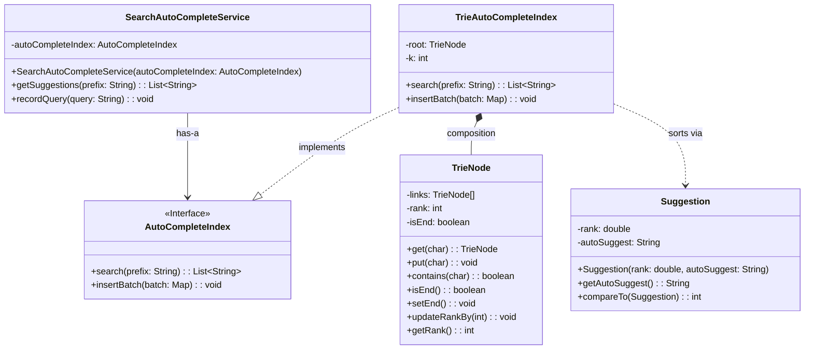
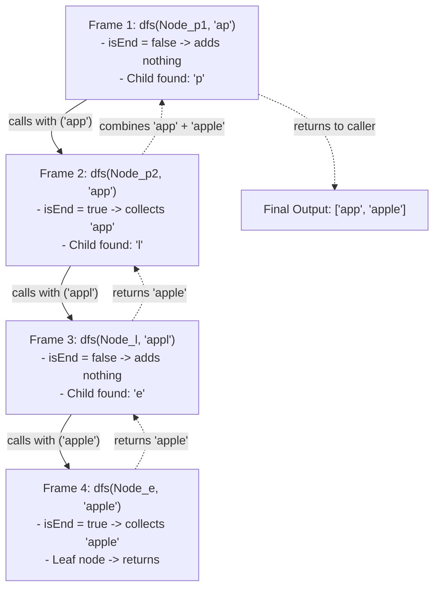
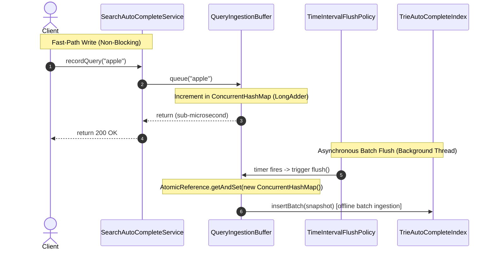
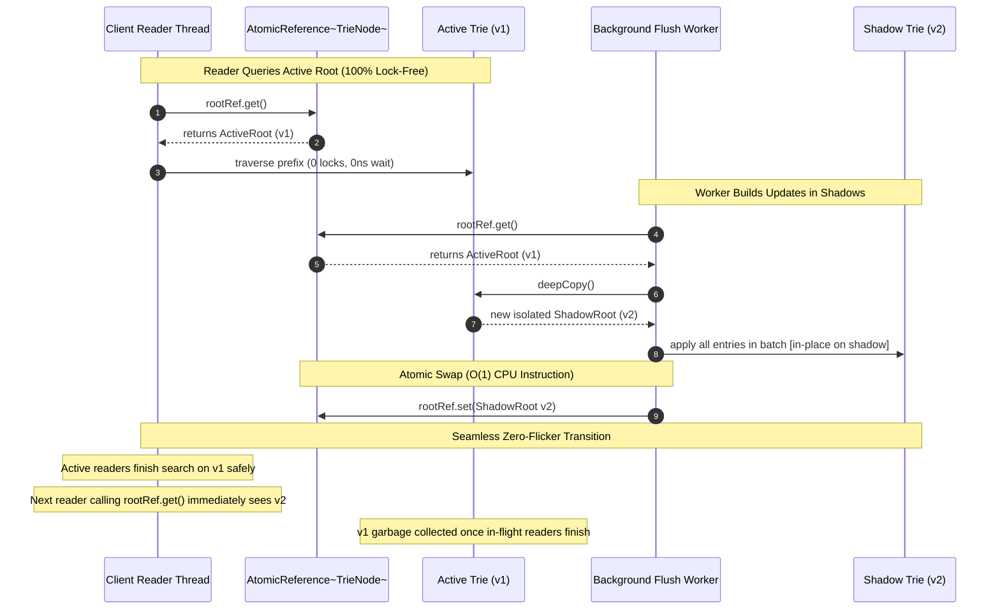
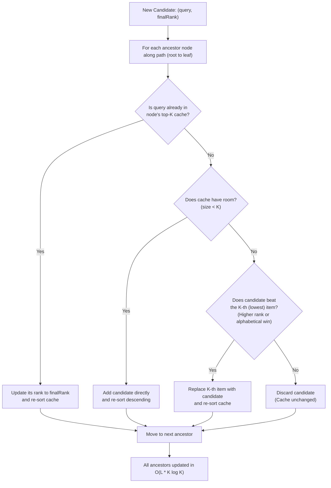
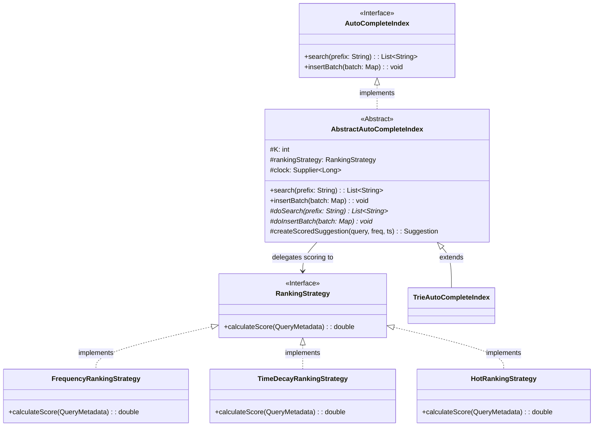

<!-- hub-metadata
type: lld
title: Search Autocomplete Engine
description: Low-Level Design for a highly scalable, real-time search autocomplete engine in Java.
tag: Low-Level Design
tagColor: #3b82f6
-->

# Search Autocomplete Engine — Low-Level Design

## 1. Problem Statement

When you type a query into a search bar on Google, Amazon, or your favorite app, suggestions appear almost instantaneously with every keystroke. 

Building a production-grade **Search Autocomplete (Typeahead) Engine** requires solving four fundamental engineering challenges:
1. **Ultra-Low Latency (< 10ms):** Every keystroke triggers an API request. Any delay or stutter degrades user experience.
2. **High Concurrency:** Thousands of users type at the exact same time (massive read volume), while committed searches continuously update popularity trends (concurrent writes).
3. **Deterministic Ranking:** The most popular queries must surface first. Ties must resolve predictably (alphabetically).
4. **Bounded Memory:** We cannot let millions of unique strings cause runaway memory usage on the JVM heap.

This document walks through the complete evolutionary journey—starting from a simple **baseline in-memory MVP**, progressing through concurrency, batching, caching, and pluggable ranking, and finally scaling into a **cloud-scale distributed architecture**.

---

## 2. Product Requirements

* **PR-1 (Prefix Suggestions):** As a user types into a search input (web, mobile, or console), the engine suggests the top-$K$ most relevant completions matching that prefix, sorted by popularity.
* **PR-2 (Feedback Loop on Search):** When a user commits a search (presses `Enter` or taps `Search`), the engine records that query. Over time, frequently searched queries naturally climb into the top-$K$ suggestions.
  * *Important distinction:* Intermediate keystrokes are read-only lookups. Only committed searches trigger ingestion into the engine.

---

## 3. Functional Requirements

### FR-1: Core APIs

* **Retrieve Suggestions (Read Path):**
  ```java
  List<String> getSuggestions(String prefix);
  ```
  Returns an ordered list of up to top-$K$ completions matching the prefix.

  > **Design Decision: Why `List<String>` instead of `Optional<List<String>>`?**  
  > In Java, collections already have a standard representation for "no results": an empty list (`List.of()` or `Collections.emptyList()`). Using `Optional<List<String>>` creates an awkward dual-empty state (`Optional.empty()` vs `Optional.of(emptyList)`), forces unnecessary object allocation on every keystroke, and adds boilerplate `.orElse()` calls on the client. Our contract guarantees a non-null list so callers can safely iterate immediately.

* **Record Search (Write Path):**
  ```java
  void recordQuery(String query);
  ```
  Submits a completed user search to increase its popularity score.

---

### FR-2: Character Set & Input Constraints

* **Alphabet:** We support lowercase English letters (`a-z`) and a single space (`' '`) to allow multi-word phrases (alphabet size = 27). Numbers and special characters are excluded for the MVP.
* **Prefix Length Limits:**
  * **Minimum:** 1 character (suggestions appear from the first keystroke).
  * **Maximum:** 20 characters (caps Trie depth to prevent unbounded memory growth).
* **Graceful Degradation:** Invalid inputs (`null`, empty strings, or strings longer than 20 characters) cleanly return an empty list without throwing runtime exceptions.

---

### FR-3: Ranking & Tie-Breaking

* **Frequency-First:** Suggestions are ranked primarily by search count (highest frequency first).
* **Deterministic Tie-Breaking:** If two completions have the exact same count, ties break **alphabetically** (`"apple"` before `"apply"`).
* **Server-Configured $K$:** $K$ (e.g., 5) is configured at engine startup. Callers cannot request arbitrary $K$ values.

---

### FR-4: Scope Boundaries

* **Cold Start:** The engine starts empty and builds frequencies organically, or loads an initial seed batch at startup.
* **Strict Prefix Matching:** Matches prefixes strictly from the start of words for the MVP, isolated behind an interface to allow fuzzy matching in the future.

---

## 4. Step 1: The Baseline Foundation (MVP Trie + DFS)

To solve prefix search, the natural foundation is a **Trie (Prefix Tree)**:
* Each node represents a single character.
* Common prefixes share the same path from the root (e.g., `"app"` and `"apple"` share `root -> 'a' -> 'p' -> 'p'`).

### 4.1 The Core MVP Entities

To implement the basic prototype, we need five core components:

```
[ Client / Search Bar ]
       │
       ▼
[ SearchAutoCompleteService ] ──(facade)──► [ AutoCompleteIndex ]
                                                   ▲
                                                   │ (implements)
                                        [ TrieAutoCompleteIndex ]
                                                   │ (manages)
                                                   ▼
                                              [ TrieNode ] ──(sorts via)──► [ Suggestion ]
```

1. **`SearchAutoCompleteService` (Gateway Facade):** The single entry point for clients, routing queries to the index and shielding callers from internal data structures.
2. **`AutoCompleteIndex` (Interface):** The storage contract (`search`, `insertBatch`), keeping the API clean and decoupled from concrete tree implementations.
3. **`TrieAutoCompleteIndex` (Engine Implementation):** Concrete implementation managing the 27-way Trie root and traversing prefixes.
4. **`TrieNode` (Building Block):** Represents an individual character. Holds an array of child links (`links[27]`), the search frequency terminating at this node (`rank`), and a flag (`isEnd`).
5. **`Suggestion` (Value Object):** A pair of `(rank, autoSuggest)` implementing `Comparable` to sort completions by rank descending, breaking ties alphabetically.



---

### 4.2 Baseline Search: Prefix Traversal + Depth-First Search (DFS)

In this baseline MVP, prefix search works in two phases:
1. Walk down the Trie following the characters of the prefix.
2. From that prefix node, perform a **Depth-First Search (DFS)** across the entire subtree to collect every completed word (`isEnd == true`), maintaining a **Min-Heap** of size $K$ to retain the top-$K$ candidates.



* **Zero-Duplicate Guarantee:** Because every node in a Trie has exactly one unique path from the root, DFS is guaranteed to visit each distinct completed word exactly once.

#### Time Complexity Derivation (Without Top-K Cache)

Why is the baseline search complexity expressed as **$O(L + N \log K)$**? Let's break down the exact mathematical derivation across each phase of a search:

* Let $L$ = length of the prefix typed by the user ($L \le 20$).
* Let $N$ = total number of nodes in the prefix's subtree.
* Let $W$ = total number of completed words in that subtree ($W \le N$).
* Let $K$ = maximum suggestions requested (e.g., $K = 5$).

1. **Prefix Traversal Phase ($O(L)$):**  
   The engine walks character-by-character from `root` down to the prefix node (e.g. 3 steps for `"app"`). This takes $O(L)$ steps.
2. **Subtree Exploration Phase ($O(N)$):**  
   From the prefix node, the recursive `dfs()` must visit every child pointer and traverse all $N$ nodes in that entire subtree to discover all matching words.
3. **Min-Heap Ranking Phase ($O(W \log K)$):**  
   Every time DFS encounters a terminal node (`isEnd == true`), it pushes the candidate into a bounded Min-Heap of size $K$. Inserting into a heap of size $K$ costs $O(\log K)$ comparisons. Across all $W$ words in the subtree, this costs $O(W \log K)$.

$$\text{Total Read Time Complexity} = O(L + N + W \log K) \approx \mathbf{O(L + N \log K)}$$

> **Why this breaks down in production:**  
> For long prefixes (like `"application"`), $N$ is small. But for short, hot prefixes (like a single letter `"a"`), $N$ can easily be **$50,000+$ nodes** and $W$ can be **$10,000+$ words**! On every single keystroke, the engine is forced to execute 50,000 recursive function calls and 10,000 heap operations, burning tens of milliseconds of CPU and causing massive server throttling.

---

### 4.3 The 4 Scaling Walls: Why the MVP Breaks in Production

While the MVP is logically correct for a single user, it hits four fatal bottlenecks when deployed to production:

1. **Write Overload (The Write Wall):** Every committed search mutates the Trie immediately. Under 20,000 queries per second, this creates severe lock contention and CPU thrashing.
2. **Concurrency Hazards (The Thread-Safety Wall):** Mutating the tree while readers traverse it can expose half-built words, cause `NullPointerException`, or read stale CPU caches.
3. **Read Latency (The DFS Wall):** For a short prefix like `"a"`, DFS must traverse thousands of child nodes on *every single keystroke*, blowing through our $< 10\text{ms}$ latency budget.
4. **Rigid Ranking (The Ranking Wall):** Ranking is hardcoded to raw count. A query searched 1,000,000 times four years ago permanently blocks fresh, trending queries from surfacing.

Let's address each bottleneck step-by-step.

---

## 5. Step 2: Asynchronous Batch Ingestion (Solving Write Pressure)

### 5.1 The Requirement
We cannot allow thousands of client write threads calling `recordQuery()` to mutate the Trie directly. 

* **The Core Insight:** Autocomplete is not a banking transaction. If 50,000 people search for `"iphone"` over an hour, it does not matter if the suggestions list updates 5 seconds later. **Eventual consistency** is a massive win for throughput.

### 5.2 What We Added
We introduced two new abstractions to decouple writes from the Trie:

1. **`QueryIngestionBuffer` (The In-Memory Combiner):**
   * Instead of mutating the Trie, client threads calling `recordQuery()` simply increment a counter inside a `ConcurrentHashMap<String, LongAdder>`.
   * **Map-Reduce Pre-Aggregation:** 50,000 concurrent searches for `"iphone"` collapse into a single map entry in $O(1)$ memory before ever touching the tree.
   * **Why `LongAdder` over `AtomicInteger`?** Under heavy concurrency, `AtomicInteger` causes severe CPU cache line bouncing from CAS retry loops. `LongAdder` dynamically stripes counts across thread-local cells, maximizing throughput.

2. **`FlushPolicy` & `TimeIntervalFlushPolicy` (The Decoupled Strategy):**
   * Decouples *when* to drain the buffer from *how* the buffer stores counts.
   * Uses a dedicated daemon thread (`query-ingestion-flush-thread`) with `scheduleWithFixedDelay(5, SECONDS)` to periodically trigger flushes.
   * Wrapped in a `try-catch(Throwable)` shield to prevent silent scheduler termination from unhandled exceptions.

```
[ Client Thread ] ──(recordQuery)──► [ QueryIngestionBuffer (ConcurrentHashMap + LongAdder) ]
                                                        │
                                     (Every 5s Flush via TimeIntervalFlushPolicy)
                                                        │
                                                        ▼
                                            [ TrieAutoCompleteIndex ]
```

---

### 5.3 The "Bucket Swap" Pattern 🪣

To drain the buffer without ever blocking incoming writers:
1. **The Active Bucket:** Users continuously drop searches into the active bucket (`ConcurrentHashMap<String, LongAdder>`).
2. **The Atomic Swap ($O(1)$):** Every 5 seconds, the flush worker swaps the active bucket with a fresh, empty bucket in a single CPU instruction (`activeBuffer.getAndSet(new ConcurrentHashMap<>())`).
3. **Offline Ingestion:** Incoming users immediately write to the new bucket with zero delay. Meanwhile, the background thread takes the swapped snapshot, aggregates counts, and updates the Trie offline. Zero locks, zero dropped writes.



---

### 5.4 Architectural Design Decisions (ADR)

| Decision | Selected Choice | Rejected Alternative | Core Rationale |
| :--- | :--- | :--- | :--- |
| **Consistency Model** | **Eventual Consistency** | Immediate ACID Consistency | Autocomplete relies on statistical aggregate counts. Sub-microsecond non-blocking writes heavily outweigh instant consistency. |
| **Worker Thread Type** | **Daemon Thread (`setDaemon(true)`)** | Non-Daemon User Thread | Non-daemon threads prevent the JVM from shutting down cleanly. Daemon threads allow clean JVM termination when foreground work finishes. |
| **Ingestion Buffer** | **Combiner (`ConcurrentHashMap`)** | Raw Queue (`ConcurrentLinkedQueue`) | Raw queues store $N$ duplicate events, requiring $N$ separate Trie traversals. A map combiner collapses duplicates into counts in $O(1)$ space. |
| **Buffer Draining** | **Double Buffering (`AtomicReference.getAndSet`)** | `map.clear()` or locks | Calling `clear()` loses writes that arrive during iteration. Locking blocks writers. `getAndSet()` performs an atomic swap in $O(1)$ with zero locks. |
| **Counter Primitive** | **`LongAdder`** | `AtomicInteger` / `AtomicLong` | Under high concurrent write spikes, `AtomicInteger` causes CPU cache line bouncing from CAS retry loops. `LongAdder` stripes counts across thread-local cells. |
| **Scheduler Cadence** | **`scheduleWithFixedDelay`** | `scheduleAtFixedRate` | `scheduleAtFixedRate` causes back-to-back catch-up bursts if a GC pause delays a run. `scheduleWithFixedDelay` guarantees a fixed breathing pause after each flush. |

---

## 6. Step 3: Lock-Free Concurrent Reads (Solving Concurrency Hazards)

### 6.1 The Requirement
Now that writes happen in the background, readers and the background worker access the Trie simultaneously.

* **Why not `ReentrantReadWriteLock`?**  
  While read locks allow concurrent readers, whenever the background flush worker acquires the exclusive write lock, **all readers are paused**. In high-throughput autocomplete serving thousands of queries per second, this creates severe **tail latency (p99) spikes**.

> [!NOTE] What is Tail Latency & p99 Spikes?
> In distributed systems and high-throughput services, performance is evaluated using percentiles rather than averages:
> * **$p50$ (Median):** $50\%$ of requests complete faster than this duration.
> * **$p95$:** $95\%$ of requests complete faster than this duration.
> * **$p99$ (Tail Latency):** $99\%$ of requests complete faster than this, but the slowest **$1\%$ of requests** take this duration or longer.
>
> **Why do "p99 spikes" matter?**  
> At an ingestion rate of 100,000 queries per minute, a $1\%$ tail represents **1,000 users every minute** experiencing degraded performance.  
> If an engine uses a `ReentrantReadWriteLock`, whenever the background worker acquires the exclusive write lock to update the Trie (which takes 20–50ms), **all incoming readers during that 50ms window are frozen in the operating system's thread wait queue**.  
> While the median latency ($p50$) might look great at $0.5\text{ ms}$, the tail ($p99$) suddenly spikes to $50\text{ ms}+$. Users perceive this as random, jarring typing freezes where suggestions stutter before appearing. This sudden divergence between median speed and worst-case delay is called a **p99 spike**.

---

### 6.2 What We Added: Snapshot Isolation via `AtomicReference<TrieNode>`
We eliminated locking entirely using **Copy-On-Write Double Buffering**:

1. In `TrieAutoCompleteIndex`, we wrapped the root node in an `AtomicReference<TrieNode> rootRef`.
2. In `TrieNode`, we implemented `deepCopy()` to clone subtrees cleanly.
3. Readers simply call `rootRef.get()` and traverse the active tree **100% lock-free** with zero synchronization overhead.

---

### 6.3 The "Restaurant Menu" Analogy 📜

Think of double-buffering like a restaurant updating its daily specials:
* Customers (readers) are holding and reading Menu v1.
* In the kitchen, the chef (background worker) makes a fresh copy (Shadow Tree v2) and writes down all the new specials.
* When ready, the chef replaces the master clipboard by the door in a single motion (`rootRef.set(newRoot)`).
* Customers already looking at Menu v1 finish reading peacefully without interruption. Any new customer walking in immediately sees Menu v2.
* **Nobody is ever told to pause reading, and nobody ever sees half-written specials!**



#### How `AtomicReference` Works at the CPU Level ⚡
1. **Store Barrier (No Half-Built Objects):** When the worker calls `rootRef.set(newRoot)`, the CPU executes a hardware memory fence, ensuring all child links and arrays in the shadow tree are flushed to cache-coherent RAM *before* the pointer is published.
2. **Nanosecond Volatile Loads:** Readers calling `rootRef.get()` execute a single volatile load (~1-2 nanoseconds), guaranteeing they see the latest valid root without locking.

---

## 7. Step 4: Sub-Microsecond Reads (Solving Read Latency)

### 7.1 The Requirement: Eliminating DFS
Even with lock-free double buffering, running a full Depth-First Search on every keystroke takes too much CPU for short prefixes. If millions of words start with `"a"`, typing `"a"` forces the engine to traverse thousands of branches and sort them with a Min-Heap on every single keystroke.

* **The Goal:** Make the read path strictly **$O(L)$** ($L \le 20$), eliminating DFS and heap allocations completely.

---

### 7.2 What We Added: Path Tracing & Per-Node Top-$K$ Caching

Instead of discovering suggestions dynamically at search time, we **pre-compute and cache the Top-$K$ completions directly inside each `TrieNode`** during background batch ingestion.

#### The Core Intuition:
When inserting `"apple"` (with frequency 10), what are all the prefixes that could lead to `"apple"`?
$$\text{root} \longrightarrow \text{'a'} \longrightarrow \text{'p'} \longrightarrow \text{'p'} \longrightarrow \text{'l'} \longrightarrow \text{'e'}$$

Every user typing any of those prefixes could potentially want `"apple"`. So as we insert `"apple"`, we trace the visited nodes in a `path` list and tell each ancestor:
> *"Hey, `"apple"` with score 10 is a candidate completion for you. If you have room, or if score 10 beats one of your current top 5 suggestions, cache `"apple"` in your Top-5 list!"*

---

### 7.3 The 3-Case Cache Decision Flow

Inside `TrieNode`, each node maintains `private List<Suggestion> topK`:



* **Case 1 (Already Cached):** If the query is already in the node's Top-$K$, its score increased. Update its rank and re-sort.
* **Case 2 (Room Available):** If the cache has fewer than $K$ items (`size < K`), add the candidate directly and re-sort.
* **Case 3 (Cache Full — Compete with Lowest):** Compare the candidate against the $K$-th (lowest) item. If the candidate has a higher rank (or equal rank with an alphabetical win), evict the lowest item and insert the candidate. Otherwise, discard it.

---

### 7.4 The Resulting Read Path: Zero DFS, Zero Allocations

With pre-computed caches, `search(prefix)` becomes a simple pointer walk followed by an instant list retrieval:

```java
@Override
protected List<String> doSearch(String prefix) {
    TrieNode node = rootRef.get();
    for (char k : prefix.toCharArray()) {
        if (!node.contains(k)) {
            return Collections.emptyList();
        }
        node = node.get(k);
    }

    // Instantaneous O(1) Return — Zero DFS, Zero MinHeap, Zero Locks!
    return node.getTopK();
}
```

* **Read Latency:** $O(L)$ where $L \le 20$ (typically under 50 nanoseconds).
* **Heap Allocations on Read:** Zero. Returns the pre-computed list directly.

#### Time Complexity Derivation (With Top-K Cache)

With per-node Top-$K$ caching, the read path eliminates subtree exploration and heap sorting entirely:

1. **Prefix Traversal Phase ($O(L)$):**  
   The engine walks character-by-character along $L$ character links to reach the prefix node ($L \le 20$).
2. **Retrieval Phase ($O(1)$):**  
   Directly returns the pre-computed `node.getTopK()` list reference sitting in the node's memory. (Extracting the $K=5$ strings is $O(K)$).

$$\text{Total Read Time Complexity} = \mathbf{O(L)}$$

Since $L$ is bounded by 20 characters, the read path executes in at most 20 pointer hops—**under 50 nanoseconds** ($\sim 0.00005\text{ ms}$)—completely independent of whether the Trie holds 100 words or 10,000,000 words!

#### Where did the $O(N \log K)$ computation go?
The computation did not magically disappear; it was **shifted from the user's hot read path to the background batch worker**:
* During offline batch insertion, inserting a query of length $L$ visits only its $L$ ancestors along the path.
* At each ancestor, updating the bounded Top-$K$ list ($K=5$) takes $O(K \log K)$ ($< 20\text{ ns}$).
* **Total Batch Ingestion Cost per Query:** $O(L \cdot K \log K)$, which executes in the background shadow tree with zero impact on active readers.

#### Side-by-Side Complexity Comparison

| Dimension | Baseline MVP (Without Cache) | Production Engine (With Top-K Cache) |
| :--- | :--- | :--- |
| **Read Time Complexity** | $\mathbf{O(L + N \log K)}$ ($N$ = subtree nodes, up to 50,000+) | $\mathbf{O(L)}$ ($L \le 20$, capped at 20 steps) |
| **Read Latency** | $5 - 50\text{ ms}$ (severe latency on single letters like `"a"`) | **$< 50\text{ nanoseconds}$** ($0.00005\text{ ms}$) |
| **Heap Allocations on Read** | Allocates `PriorityQueue` + $N$ tree call frames on stack | **Zero allocations** (returns cached list reference) |
| **Write Time Complexity** | $O(L)$ (blind insertion without updating caches) | $O(L \cdot K \log K)$ (updates $L$ ancestor Top-$K$ caches) |
| **Execution Context** | Done synchronously during user keystroke | Done **offline** in background batch worker |

---

### 7.5 Concrete Walkthrough Example

Consider 5 queries inserted into the Trie ($K = 5$):
1. `"app"` (Score: 20)
2. `"answer"` (Score: 15)
3. `"apple"` (Score: 10)
4. `"cat"` (Score: 8)
5. `"hello"` (Score: 5)

#### What Each Node Stores in Memory:

```
                                  [ ROOT ]
       topK: ["app" (20), "answer" (15), "apple" (10), "cat" (8), "hello" (5)]
                         /           |           \
                       /             |             \
                     'a'            'c'            'h'
                      │              │              │
```

* **The `'a'` Subtree:**
  * Node `['a']` $\longrightarrow$ `topK: ["app" (20), "answer" (15), "apple" (10)]`
  * Node `['a'] -> ['n'] -> ... -> ['r']` $\longrightarrow$ `topK: ["answer" (15)]`
  * Node `['a'] -> ['p']` $\longrightarrow$ `topK: ["app" (20), "apple" (10)]`
  * Node `['a'] -> ['p'] -> ['p']` $\longrightarrow$ `topK: ["app" (20), "apple" (10)]`
  * Node `['a'] -> ['p'] -> ['p'] -> ['l'] -> ['e']` $\longrightarrow$ `topK: ["apple" (10)]`
* **The `'c'` Subtree:**
  * Nodes `['c'] -> ['a'] -> ['t']` $\longrightarrow$ `topK: ["cat" (8)]`
* **The `'h'` Subtree:**
  * Nodes `['h'] -> ['e'] -> ['l'] -> ['l'] -> ['o']` $\longrightarrow$ `topK: ["hello" (5)]`

#### Keystroke Lookup Trace (Instant $O(L)$ Returns):

| User Keystroke | Where Engine Walks | Instant `node.getTopK()` Return | Notes |
| :--- | :--- | :--- | :--- |
| *(Empty bar)* | Sits at `[ROOT]` | `["app", "answer", "apple", "cat", "hello"]` | Global trending queries across engine |
| `"a"` | Walks to Node `['a']` | `["app", "answer", "apple"]` | `"cat"` and `"hello"` excluded automatically |
| `"ap"` | Walks to Node `['p']` | `["app", "apple"]` | `"answer"` excluded (diverged at `'n'`) |
| `"app"` | Walks to 2nd Node `['p']`| `["app", "apple"]` | Stops here. Instant return without DFS! |
| `"appl"`| Walks to Node `['l']` | `["apple"]` | `"app"` excluded (lacks `'l'`) |
| `"c"` | Walks to Node `['c']` | `["cat"]` | Instant single-branch return |
| `"z"` | Child missing | `[]` | Returns empty list instantly without errors |

---

## 8. Step 5: Pluggable Ranking Strategies (Solving Static Ranking)

### 8.1 The Requirement
Raw search count is not enough. We need to support signals like **recency and trending spikes** (e.g., breaking news) without hardcoding business math into tree nodes or duplicating boilerplate across future index engines.

---

### 8.2 What We Added: Skeletal Base Class + Strategy Pattern

Following **Effective Java (Item 20: *Prefer interfaces to abstract classes, but provide skeletal implementations*)**, we introduced:

1. **`AbstractAutoCompleteIndex` (Skeletal Base Class):**
   * **Template Method Pattern:** Enforces query validation (`validateQuery(prefix)`) before delegating to `doSearch(prefix)` or `doInsertBatch(batch)`. Subclasses cannot bypass input constraints.
   * **Clock Injection:** Accepts a `Supplier<Long> clock` (defaulting to `System::currentTimeMillis`), enabling 100% deterministic time-travel testing without `Thread.sleep()`.
   * **Centralized Candidate Factory:** Provides `createScoredSuggestion(query, frequency, timestampMs)` to compute scores uniformly.

2. **`RankingStrategy` (The Contract):**
   ```java
   public interface RankingStrategy {
       double calculateScore(QueryMetadata metadata);
   }
   ```

3. **`QueryMetadata` (Signal Context):**
   An immutable record capturing `(query, frequency, lastSearchedTimestampMs)`.



---

### 8.3 First-Class Ranking Strategies

1. **`FrequencyRankingStrategy` (Default Baseline):**
   $$\text{Score} = \text{frequency}$$
   *Guarantees 100% backwards compatibility with existing tests.*

2. **`TimeDecayRankingStrategy` (Exponential Half-Life):**
   $$\text{Score} = \text{frequency} \times e^{-\lambda \cdot \Delta t}, \quad \text{where } \lambda = \frac{\ln(2)}{\text{halfLifeMs}}$$
   *Calculates continuous decay for active batches where items are refreshed.*

3. **`HotRankingStrategy` (Reddit / Hacker News Monotonic Time-Boost):**
   $$\text{Score} = \log_{10}(\text{Frequency}) + \frac{\text{Timestamp} - t_0}{\text{TimeWindowMs}}$$

---

### 8.4 Architectural Deep Dive: Why HotRankingStrategy is Essential for Pre-Computed Caches

The decision to introduce `HotRankingStrategy` resolved a **fundamental architectural tension** between two core system requirements:

```
[ Requirement A: Sub-microsecond O(L) Reads ]        [ Requirement B: Temporal Search Trends ]
         │                                                        │
         ▼                                                        ▼
Per-Node Precomputed Top-K Caching                   Scores Must Change Over Time
         │                                                        │
         └─────────────────────────┬──────────────────────────────┘
                                   │
                                   ▼
              THE ARCHITECTURAL CONFLICT:
              If scores decay continuously with moving clock (now),
              every cached score in the entire Trie becomes STALE instantly!
```

#### 1. The Dormant Cache Staleness Problem
In Section 7, we established **Per-Node Top-$K$ Prefix Caching**: when a batch flushes, we walk the path of the query and cache candidate suggestions directly inside each ancestor node.

If we use classical exponential decay:
$$\text{Score} = \text{frequency} \times e^{-\lambda (t_{\text{now}} - t_{\text{last}})}$$

The score depends on the **current moving clock ($t_{\text{now}}$)**.
* Suppose `"olympics twenty"` had 100,000 searches years ago. Its score was stored as `100,000` in `root.topK`.
* Today, someone searches `"olympics twenty four"` 50 times.
* When `"olympics twenty four"` arrives at `root.topK`, it compares its score against the cached score of `"olympics twenty"` (`100,000`).
* **Because `"olympics twenty"` was NOT in today's batch, no worker was triggered to re-evaluate its score!** It remains frozen at $100,000$, blocking fresh trending searches indefinitely.

#### 2. The Flawed Alternatives
* **Alternative 1: Background Tree Sweepers (Periodic Full Crawl)**  
  A background thread periodically crawls millions of nodes in the Trie to recalculate decay. Extreme CPU burn, massive GC churn, and destroys batch throughput.
* **Alternative 2: Decay on Read**  
  Re-calculate decay dynamically during user search queries. Destroys sub-microsecond read latency, and fails if an un-decayed dormant query prevented a newer candidate from entering the Top-$K$ cache at insertion time.

#### 3. The Elegance of HotRanking: Duality of Time
`HotRankingStrategy` mathematically circumvents the problem by shifting the time coordinate:

Instead of decaying older items downward against a moving clock ($t_{\text{now}}$):
$$\ln(\text{Score}) = \ln(\text{frequency}) - \lambda t_{\text{now}} + \lambda t_{\text{last}}$$

Because $-\lambda t_{\text{now}}$ is identical for all candidates at any given instant, we can factor it out as a global baseline. This yields:

$$\text{Score} = \log_{10}(\text{Frequency}) + \frac{\text{Timestamp} - t_0}{\text{TimeWindow}}$$

#### 4. The Architectural Guarantees
* **Absolute Immutability:** A query's score depends **only on its own search timestamp** at the moment it is committed. It is $100\%$ independent of a moving `now`.
* **Zero Cache Sweeps:** Once written to an ancestor's `topK` cache, a suggestion's score never needs to be recalculated.
* **Natural Generational Turnover:** As time marches forward, newly submitted queries receive higher baseline scores simply because their `timestamp` is larger. A query searched 5 times today naturally leaps over a query searched 500 times months ago.
* **Preserves Sub-Microsecond $O(L)$ Reads:** Reads stay completely untouched—pure $O(L)$ pointer navigation returning pre-sorted lists with zero math, zero locks, and zero allocations.

---

## 9. Step 6: From LLD to HLD — Production Distributed Microservices

While the in-process implementation runs safely and concurrently on a single JVM, scaling to hundreds of millions of daily active users requires decoupling the single-process engine into a distributed architecture based on **CQRS (Command Query Responsibility Segregation)**:
* **The Command (Write Path):** Submitting a committed search query via `recordQuery()`.
* **The Query (Read Path):** Fetching instant prefix completions via `getSuggestions()`.

The core Low-Level Design constructs map directly to distributed system primitives:

```
                      [ CLIENT (Web / Mobile) ]
                               │      │
     ┌─────────────────────────┘      └─────────────────────────┐
     │ 1. Keystroke: "app"                                      │ 2. Enter Pressed: "apple"
     │ (Sync, <5ms budget)                                      │ (Async, Fire-and-Forget)
     ▼                                                          ▼
┌──────────────────────────────┐              ┌──────────────────────────────┐
│   SearchSuggestionService    │              │    QueryIngestionService     │
│  (Pure Read Microservice)    │              │   (Pure Write Microservice)  │
│                              │              │                              │
│ • Holds Read-Only Trie       │              │ • Validates input            │
│ • Serves getSuggestions()    │              │ • Returns 202 Accepted       │
│ • Sub-microsecond O(L)       │              │   immediately                │
│ • Scaled to 100s of replicas │              │ • Pushes event to Kafka      │
└──────────────▲───────────────┘              └──────────────┬───────────────┘
               │                                             │
               │ New Snapshot Swapped                        │ Stream Events
               │                                             ▼
┌──────────────┴───────────────┐              ┌──────────────────────────────┐
│    IndexAutoUpdateService    │              │      Apache Kafka Topic      │
│   (Offline Builder Worker)   │              │       ("search-events")      │
│                              │              │                              │
│ • Aggregates counts          │◄─────────────┤ • Durable log buffer         │
│ • Builds new Trie in shadow  │   Drains     │ • Absorbs traffic spikes     │
│ • Evaluates RankingStrategy  │   batches    │ • Zero data loss             │
│ • Uploads snapshot to S3     │              └──────────────────────────────┘
└──────────────────────────────┘
```

---

### 9.1 Microservice Responsibilities & CQRS Separation

| Component | Responsibility | Scaling Characteristics | Fault Domain |
| :--- | :--- | :--- | :--- |
| **`SearchSuggestionService` (Read Path)** | Serves user keystrokes from in-memory Trie snapshots. Completely stateless. | **Heavily Scaled:** 50–100+ pods behind CDN and Load Balancer. High RAM for in-memory indices. | If the write path crashes, reads continue serving at full speed with **zero degradation**. |
| **`QueryIngestionService` (Write Gateway)** | Accepts committed user searches via an asynchronous fire-and-forget API (`POST /query/record`). Returns `202 Accepted` immediately. | **Lightweight:** Few stateless pods publishing directly to Kafka. Low CPU and low RAM. | If Kafka is temporarily degraded, queries can buffer locally before retry. |
| **`IndexAutoUpdateService` (Offline Builder)** | Consumes aggregated search counts from Kafka/Flink, builds a shadow Trie, evaluates `RankingStrategy`, and serializes the tree into a versioned snapshot (e.g., S3). | **Batch Worker:** Runs periodically (e.g. every 5–15 minutes). High CPU for batch sorting. | If the builder crashes, read nodes simply continue serving the current valid snapshot. |

---

### 9.2 Architectural Guarantees at Cloud Scale

1. **Fire-and-Forget Client Writes:**
   * When a user searches for `"apple"`, the client fires an asynchronous, non-blocking request to `QueryIngestionService`.
   * The response returns in $< 1\text{ ms}$ (`202 Accepted`). The user's search results page loads with **zero latency penalty**.
2. **Distributed Double-Buffering (Blue/Green Pointer Swap):**
   * Instead of Java's in-process `AtomicReference`, `SearchSuggestionService` nodes poll object storage (AWS S3 / GCS) for new snapshot versions.
   * A background thread on the read node downloads the snapshot and performs an atomic in-memory pointer swap (`rootRef.set(newRoot)`).
   * Active user searches never block, never lock, and never see partially built trees.
3. **No Network Hops on the Hot Path:**
   * **Why Ranking is NOT a Separate Microservice:** An in-memory Trie lookup takes $\sim 50\text{ ns}$, whereas an RPC to a separate ranking service takes $1.5–5.0\text{ ms}$ ($30,000\times$ slower!).
   * All global ranking scores are computed **offline** by `IndexAutoUpdateService` during snapshot generation.
   * If personalized ranking is required, it runs **in-process** on the read node using lightweight embedded models (e.g., ONNX / TensorFlow Lite).
4. **Where Redis Belongs (L1 Gateway Cache):**
   * While Redis cannot replace the $\sim 50\text{ ns}$ in-memory Trie (network round-trips take $\sim 1\text{ ms}$), Redis is ideal at the API gateway layer to cache the top 1,000 single-character prefixes (`"a"`, `"s"`, `"t"`), absorbing massive traffic spikes before requests reach the `SearchSuggestionService`.

---

## 10. Future Scope & Roadmap

1. **[COMPLETED] Lock-Free Concurrent Reads:**
   * Double-buffered Trie via `AtomicReference<TrieNode>` with zero read lock contention.
2. **[COMPLETED] Asynchronous Batch Ingestion:**
   * Non-blocking `QueryIngestionBuffer` with atomic bucket swapping and fixed-delay flushing.
3. **[COMPLETED] Sub-Microsecond Per-Node Caching:**
   * Path tracing with $O(L)$ instant prefix lookups and zero DFS.
4. **[COMPLETED] Pluggable Ranking Strategies:**
   * `AbstractAutoCompleteIndex` base class with Template Method pattern, `RankingStrategy` interface, and `HotRankingStrategy` (Reddit/HackerNews algorithm).
5. **[COMPLETED] Production Distributed Architecture (HLD Blueprint):**
   * CQRS separation of Read and Write paths, Kafka stream ingestion, offline snapshot builder, and S3 blue/green double-buffering.
6. **P1 — Character Set Expansion & Memory Tuning:**
   * Expand from the 27-character alphabet to full alphanumeric and Unicode, evaluating Radix/Patricia Tries to optimize memory.
7. **P2 — Fuzzy Matching & Typo Tolerance:**
   * Introduce Levenshtein distance or BK-Trees behind the `AutoCompleteIndex` interface to tolerate typing mistakes.
