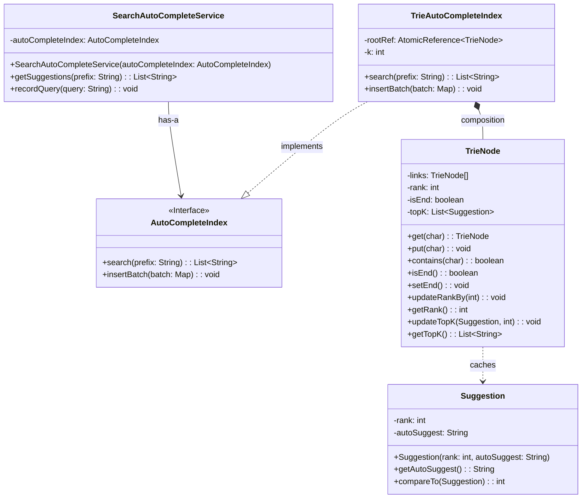
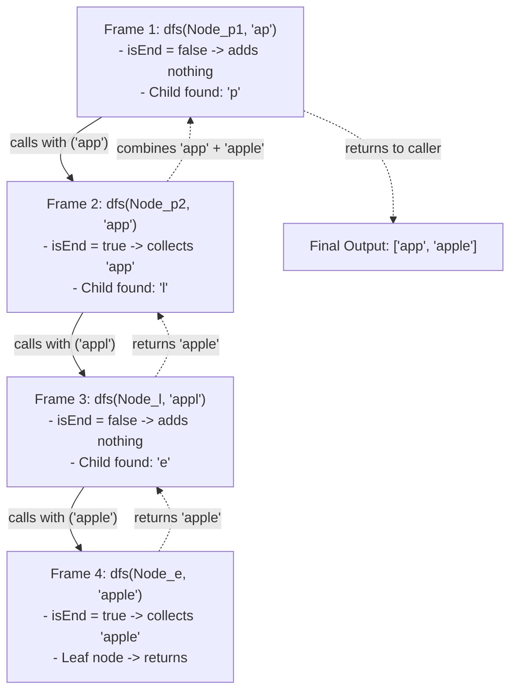
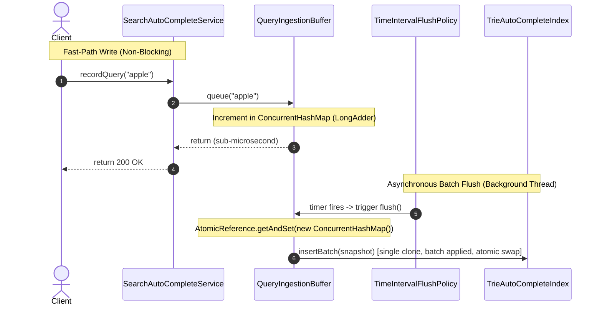
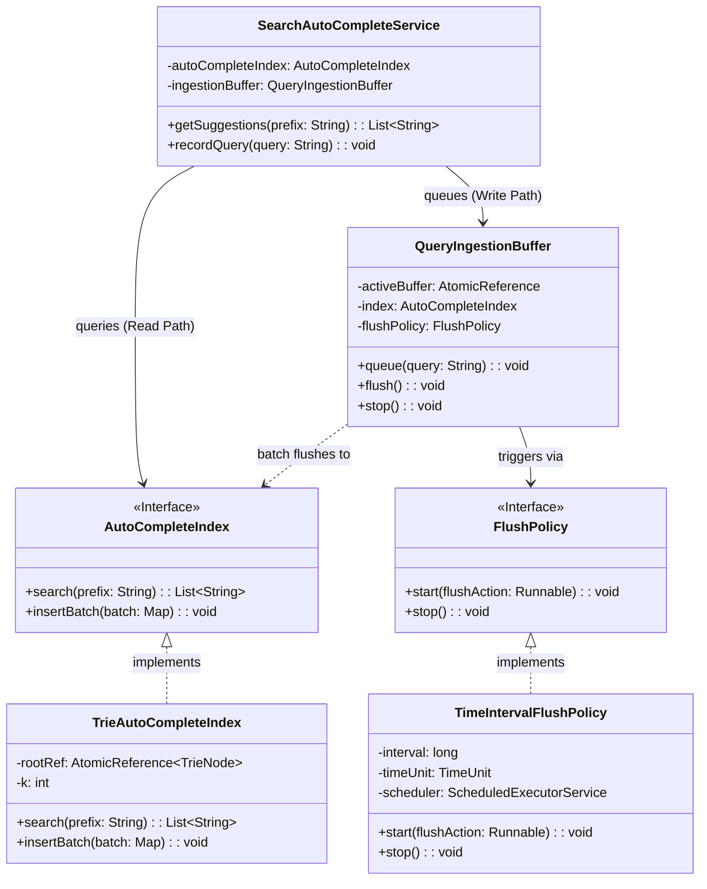
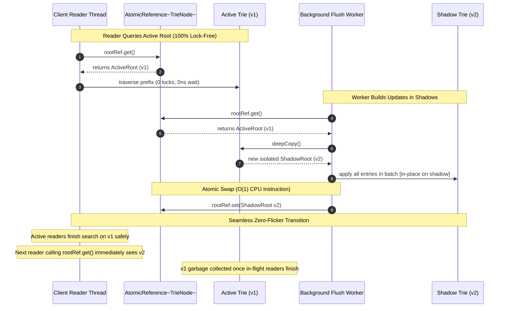
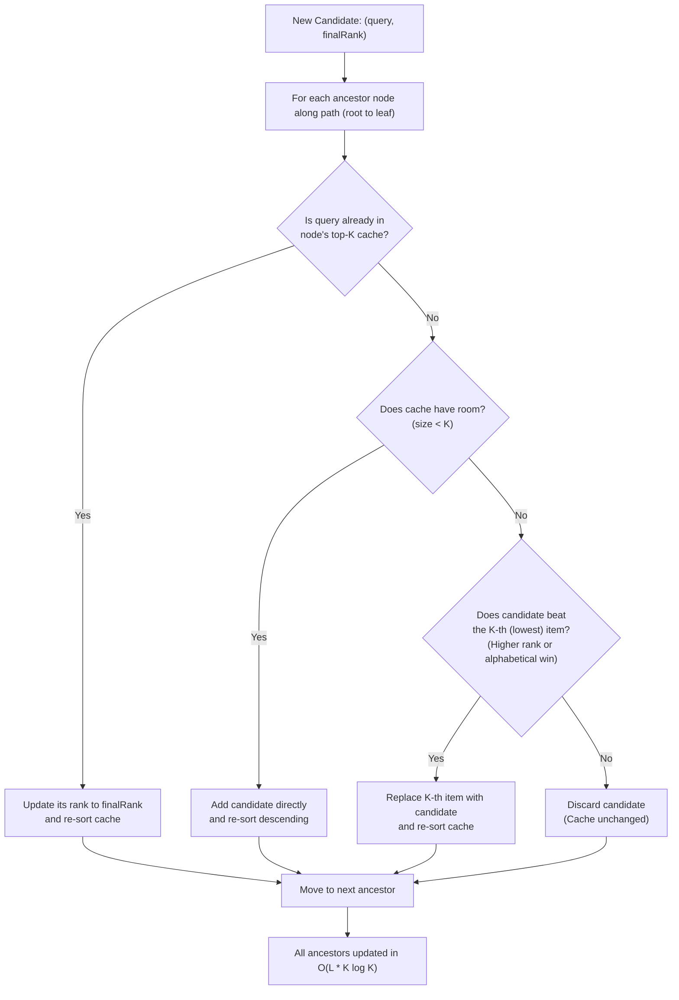

<!-- hub-metadata
type: lld
title: Search Autocomplete Engine
description: Low-Level Design for a highly scalable, real-time search autocomplete engine in Java.
tag: Low-Level Design
tagColor: #3b82f6
-->

# Search Autocomplete Engine — Low-Level Design

## 1. Problem Statement

When you type a query into a search bar on Google, Amazon, or your favorite app, suggestions appear almost instantaneously with every keystroke. 

Building a production-grade **Search Autocomplete (Typeahead) Engine** requires solving four fundamental engineering challenges:
1. **Ultra-Low Latency (< 10ms):** Every keystroke triggers an API request. Any delay or stutter degrades user experience.
2. **High Concurrency:** Thousands of users type at the exact same time (massive read volume), while committed searches continuously update popularity trends (concurrent writes).
3. **Deterministic Ranking:** The most popular queries must surface first. Ties must resolve predictably (alphabetically).
4. **Bounded Memory:** We cannot let millions of unique strings cause runaway memory usage on the JVM heap.

This document walks through the complete low-level design, concurrency model, and Java implementation of an in-memory Search Autocomplete Engine.

---

## 2. Product Requirements

* **PR-1 (Prefix Suggestions):** As a user types into a search input (web, mobile, or console), the engine suggests the top-$K$ most relevant completions matching that prefix, sorted by popularity.
* **PR-2 (Feedback Loop on Search):** When a user commits a search (presses `Enter` or taps `Search`), the engine records that query. Over time, frequently searched queries naturally climb into the top-$K$ suggestions.
  * *Important distinction:* Intermediate keystrokes are read-only lookups. Only committed searches trigger ingestion into the engine.

---

## 3. Functional Requirements

### FR-1: Core APIs

* **Retrieve Suggestions (Read Path):**
  ```java
  List<String> getSuggestions(String prefix);
  ```
  Returns an ordered list of up to top-$K$ completions matching the prefix.

  > **Design Decision: Why `List<String>` instead of `Optional<List<String>>`?**  
  > In Java, collections already have a standard representation for "no results": an empty list (`List.of()` or `Collections.emptyList()`). Using `Optional<List<String>>` creates an awkward dual-empty state (`Optional.empty()` vs `Optional.of(emptyList)`), forces unnecessary object allocation on every keystroke, and adds boilerplate `.orElse()` calls on the client. Our contract guarantees a non-null list so callers can safely iterate immediately.

* **Record Search (Write Path):**
  ```java
  void recordQuery(String query);
  ```
  Submits a completed user search to increase its popularity score.

---

### FR-2: Character Set & Input Constraints

* **Alphabet:** We support lowercase English letters (`a-z`) and a single space (`' '`) to allow multi-word phrases (alphabet size = 27). Numbers and special characters are excluded for the MVP.
* **Prefix Length Limits:**
  * **Minimum:** 1 character (suggestions appear from the first keystroke).
  * **Maximum:** 20 characters (caps Trie depth to prevent unbounded memory growth).
* **Graceful Degradation:** Invalid inputs (`null`, empty strings, or strings longer than 20 characters) cleanly return an empty list without throwing runtime exceptions.

---

### FR-3: Ranking & Tie-Breaking

* **Frequency-First:** Suggestions are ranked primarily by search count (highest frequency first).
* **Deterministic Tie-Breaking:** If two completions have the exact same count, ties break **alphabetically** (`"apple"` before `"apply"`).
* **Server-Configured $K$:** $K$ (e.g., 5) is configured at engine startup. Callers cannot request arbitrary $K$ values.

---

### FR-4: Lifecycle & Scope Boundaries

* **Cold Start:** The engine starts empty and builds frequencies organically, or loads an initial seed batch at startup.
* **Strict Prefix Matching:** Matches prefixes strictly from the start of words for the MVP, isolated behind an interface to allow fuzzy matching in the future.
* **Separation of Read and Write:** Read queries never mutate the data structure. Writes are queued and processed asynchronously in batches.

---

## 4. High-Level Architecture & Core Entities

Before looking at data structures, here is how the system components fit together:

```
[ Client / Search Bar ]
       │
       ▼
[ SearchAutoCompleteService ] ──(Write Path: recordQuery)──► [ QueryIngestionBuffer ]
       │                                                              │
       │ (Read Path: getSuggestions)                        (Periodic Batch Flush)
       ▼                                                              ▼
[ AutoCompleteIndex ] ◄────────────────────────────────── [ TimeIntervalFlushPolicy ]
       ▲
       │ (implements)
[ TrieAutoCompleteIndex ] ──(holds)──► [ TrieNode ] ──(caches)──► [ Suggestion ]
```

* **`SearchAutoCompleteService` (Gateway Facade):** The single entry point for all clients. Reads are routed straight to the index; writes are routed to the ingestion buffer.
* **`QueryIngestionBuffer` (Write Buffer):** Collects search queries in memory so we do not mutate the Trie on every individual search.
* **`FlushPolicy` (Scheduler):** Governs when the buffer drains its accumulated counts into the Trie (e.g., every 5 seconds).
* **`AutoCompleteIndex` (Interface):** The clean contract (`search`, `insertBatch`) shielding storage details from callers.
* **`TrieAutoCompleteIndex` (Engine Implementation):** The in-memory 27-way Trie managing the active and shadow trees with atomic pointer swapping.
* **`TrieNode` (Building Block):** Represents a single character. Holds child pointers (`links[27]`), word frequency (`rank`), and a precomputed `topK` cache.
* **`Suggestion` (Value Object):** A pair of `(query, rank)` that implements `Comparable` with frequency-first, alphabetical tie-breaking.

---

## 5. Step 1: The Baseline Design (MVP Trie + DFS)

The natural data structure for prefix lookup is a **Trie (Prefix Tree)**:
* Each node represents a single character.
* Common prefixes share the same path from the root (e.g., `"app"` and `"apple"` share `root -> 'a' -> 'p' -> 'p'`).



### 5.1 How Baseline Prefix Search Works (The Naive Approach)

In the initial naive implementation:
1. Walk down the Trie following the characters of the prefix.
2. From that prefix node, perform a **Depth-First Search (DFS)** across the entire subtree to find every completed word (`isEnd == true`).
3. Maintain a **Min-Heap** of size $K$ to retain only the top-$K$ highest-ranked completions.



* **Why duplicate suggestions can never occur:**
  1. Each word terminates at a unique node in the Trie.
  2. Recursive child calls only visit deeper branches with longer, distinct character sequences.
  3. Every node has exactly one unique path from the root.

---

### 5.2 The Three Scaling Bottlenecks

While the baseline Trie + DFS is logically correct, it breaks down in production:

1. **Write Contention:** If 10,000 users search for `"iphone"` within seconds, updating the Trie for each search creates massive lock contention.
2. **Concurrency Hazards:** Modifying the Trie in-place while readers traverse it can expose half-built nodes, cause `NullPointerException`, or show stale CPU caches.
3. **Read Latency on Short Prefixes:** For a single-letter prefix like `"a"`, DFS must traverse thousands of nodes and sort them on *every single keystroke*.

Let's address each bottleneck step-by-step.

---

## 6. Step 2: Asynchronous Batch Updates (The Ingestion Pipeline)

### The Core Insight: Eventual Consistency

Autocomplete is not a banking transaction. If 50,000 users search for `"iphone"` over an hour, it does not matter if the suggestions list updates 5 seconds later. 

By accepting a **5-second eventual consistency window**, we can decouple writes from the Trie entirely:
* **Writes never block:** Recording a query takes sub-microsecond time.
* **Spikes collapse into single updates:** 50,000 identical searches for `"iphone"` collapse into a single map entry before touching the Trie.

---

### The "Bucket Swap" Analogy 🪣

To understand how the buffer operates with zero lock contention:

1. **The Active Bucket:** Users continuously drop search queries into the currently active bucket (`ConcurrentHashMap<String, LongAdder>`).
2. **The Atomic Swap ($O(1)$):** Every 5 seconds, a background daemon thread swaps the active bucket with a fresh, empty bucket in a single CPU instruction (`activeBuffer.getAndSet()`).
3. **Offline Processing:** Incoming users immediately write to the new empty bucket with zero delay. Meanwhile, the background thread takes the swapped snapshot to its workbench, updates the Trie offline, and publishes the new tree. Zero locks, zero dropped writes.



---

### Architectural Design Decisions & Trade-Offs (ADR)

| Decision | Selected Choice | Rejected Alternative | Core Rationale |
| :--- | :--- | :--- | :--- |
| **Consistency Model** | **Eventual Consistency** | Immediate ACID Consistency | Autocomplete relies on aggregate search counts. Sub-microsecond non-blocking writes heavily outweigh instant consistency. |
| **Worker Thread Type** | **Daemon Thread (`setDaemon(true)`)** | Non-Daemon User Thread | Non-daemon threads prevent the JVM from shutting down cleanly. Daemon threads allow clean JVM termination when foreground work finishes. |
| **Ingestion Buffer** | **Combiner (`ConcurrentHashMap`)** | Raw Queue (`ConcurrentLinkedQueue`) | Raw queues store $N$ duplicate events, requiring $N$ separate Trie traversals. A map combiner collapses duplicates into counts in $O(1)$ space. |
| **Buffer Draining** | **Double Buffering (`AtomicReference.getAndSet`)** | `map.clear()` or locks | Calling `clear()` loses writes that arrive during iteration. Locking blocks writers. `getAndSet()` performs an atomic swap in $O(1)$ with zero locks. |
| **Counter Primitive** | **`LongAdder`** | `AtomicInteger` / `AtomicLong` | Under high concurrent write spikes, `AtomicInteger` causes CPU cache line bouncing from CAS retry loops. `LongAdder` stripes counts across thread-local cells. |
| **Flush Architecture** | **Strategy Pattern (`FlushPolicy`)** | Hardcoded Timer in Buffer | Decoupling the flush trigger allows swapping between time intervals, batch thresholds, or manual flushes in unit tests. |
| **Scheduler Cadence** | **`scheduleWithFixedDelay`** | `scheduleAtFixedRate` | `scheduleAtFixedRate` causes back-to-back catch-up bursts if a GC pause delays a run. `scheduleWithFixedDelay` guarantees a fixed breathing pause after each flush. |
| **Scheduler Safety** | **`try-catch(Throwable)` Shield** | Naked `Runnable` | In Java `ScheduledExecutorService`, any unhandled `RuntimeException` or `Error` permanently cancels all future runs. Catching `Throwable` guarantees scheduler survival. |
| **Trie Ingestion** | **Single-Pass Updates (`insert(query, count)`)** | Loop calling `insert(query)` $N$ times | Traversing a 20-character Trie 5,000 times for a query wastes CPU. Calling `insert(query, count)` traverses the branch once and increments rank by the count. |
| **Data Protection** | **Graceful Shutdown Hook** | Unguarded process termination | A JVM shutdown hook ensures that `buffer.stop()` drains and persists all remaining buffered queries before the application exits. |

---

### Architecture Class Diagram



---

## 7. Step 3: Lock-Free Reads via Double-Buffering (Snapshot Isolation)

### The Concurrency Challenge

While readers never conflict with one another (each reader traverses the tree independently), modifying the Trie while readers are traversing it introduces severe hazards:
1. **Unsafe Publication & `NullPointerException`:** Array links in `TrieNode[] links` are not volatile. Without memory barriers, instruction reordering can publish a child node's address before its own internal array is initialized, crashing readers with `NullPointerException`.
2. **Half-Built State Visibility:** During a multi-character insertion (e.g. `"application"`), a reader could traverse nodes where `isEnd` is still `false` or ranks are half-updated, returning corrupted completions.
3. **Stale CPU Caches:** Primitive rank updates on one CPU core's L1 cache remain invisible to reader threads on other cores without a memory barrier.

---

### Why Copy-On-Write Beats `ReentrantReadWriteLock`

* **`ReentrantReadWriteLock` (Rejected):** While read locks allow concurrent readers, whenever the background flush worker acquires the exclusive write lock, **all readers are paused**. In high-throughput autocomplete serving thousands of queries per second, this creates severe **tail latency (p99) spikes**.
* **Double-Buffered Trie with `AtomicReference<TrieNode>` (Selected):** Readers execute **100% lock-free** with zero synchronization, zero thread contention, and zero blocking. Readers simply read from `rootRef.get()`.

---

### The "Restaurant Menu" Analogy 📜

Think of double-buffering like a restaurant updating its daily specials:
* Customers (readers) are holding and reading Menu v1.
* In the kitchen, the chef (background worker) makes a fresh copy (Shadow Tree v2) and writes down all the new specials.
* When ready, the chef swaps the master clipboard by the door in a single motion (`rootRef.set(newRoot)`).
* Customers already looking at Menu v1 finish reading peacefully without interruption. Any new customer walking in immediately sees Menu v2.
* Nobody is ever told to pause reading, and nobody ever sees half-written specials!



---

### How `AtomicReference` Works at the CPU Level ⚡

1. **Volatile Memory Fence (No Cache Lag):** Modern CPU cores cache memory in local L1/L2 caches (~1ns). When the background worker calls `rootRef.set(newRoot)`, the CPU issues a **Store Barrier** (hardware memory fence). This ensures all node links in the shadow tree are flushed to cache-coherent memory *before* the root pointer is published.
2. **Nanosecond Reads:** When a reader thread calls `rootRef.get()`, the CPU executes a volatile load (~1-2 nanoseconds), guaranteeing it fetches the newest tree root without locking.
3. **Seamless Transition:** Readers currently traversing the old tree finish safely on their existing object references. Once old readers finish, the JVM Garbage Collector reclaims the retired tree.

---

## 8. Step 4: Sub-Microsecond Reads (Per-Node Top-K Prefix Caching)

### The Read Latency Bottleneck

Even with lock-free double-buffering, executing a DFS traversal on every keystroke takes too much CPU for short prefixes. For example, if millions of words start with `"a"`, typing `"a"` forces the engine to traverse thousands of branches and re-sort them with a Min-Heap.

By **pre-computing and storing the Top-$K$ completions directly inside each `TrieNode`**, the read hot path drops from $O(L + N \log K)$ down to strictly **$O(L)$** ($L \le 20$), eliminating DFS entirely.

---

### 8.1 Path Tracing: The Core Mental Model

When a user types `"app"`, what are they looking for? Any word that starts with `"app"`. 

If someone searches for `"apple"`, what are all the prefixes that could lead to `"apple"`?
* `""` (root)
* `"a"`
* `"ap"`
* `"app"`
* `"appl"`
* `"apple"`

Notice: **Every user typing any of those prefixes could potentially want `"apple"`!**

So why wait until search time to discover this? When inserting `"apple"`, we already walk through all of those nodes character-by-character:

$$\text{root} \longrightarrow \text{node}('a') \longrightarrow \text{node}('p') \longrightarrow \text{node}('p') \longrightarrow \text{node}('l') \longrightarrow \text{node}('e')$$

As we walk down, we record every visited node in a list: `[root, node_a, node_p1, node_p2, node_l, node_e]`.

Then, we visit every node in that list and say:
> *"Hey, `"apple"` with score 10 is a candidate completion for you. If you have room, or if score 10 beats one of your current top 5 suggestions, cache `"apple"` in your Top-5 list!"*

---

### 8.2 The 3-Case Cache Decision Flow

For each ancestor along the path, updating its cached Top-$K$ list follows 3 simple rules:



* **Case 1 (Already Cached):** If the query is already in the node's Top-$K$, its score increased. Update its rank and re-sort.
* **Case 2 (Room Available):** If the cache has fewer than $K$ items (`size < K`), add the candidate directly and re-sort.
* **Case 3 (Cache Full — Compete with Lowest):** Compare the candidate against the $K$-th (lowest) item:
  * If the candidate has a higher rank (or equal rank with an alphabetical win), evict the lowest item and insert the candidate.
  * Otherwise, the candidate does not qualify and is discarded for this node.

---

### 8.3 The Resulting Read Path: $O(L)$ Instant Return

With pre-computed caches, `search(prefix)` becomes a simple pointer walk followed by an instant list retrieval:

```java
@Override
public List<String> search(String prefix) {
    validateQuery(prefix);

    TrieNode node = rootRef.get();
    for (char k : prefix.toCharArray()) {
        if (!node.contains(k)) {
            return Collections.emptyList();
        }
        node = node.get(k);
    }

    // Instantaneous O(1) Return — Zero DFS, Zero MinHeap, Zero Locks!
    return node.getTopK();
}
```

* **Read Complexity:** $O(L)$ where $L \le 20$ (typically under 50 nanoseconds).
* **Heap Allocations on Read:** Zero. Returns the precomputed list directly.
* **Lock-Free Safety:** Because of Double-Buffering, readers only ever see fully sorted caches from the active tree.

---

### 8.4 Concrete Walkthrough Example

Let's trace how the cache looks when the following 5 queries are inserted into the Trie ($K = 5$):
1. `"app"` (Score: 20)
2. `"answer"` (Score: 15)
3. `"apple"` (Score: 10)
4. `"cat"` (Score: 8)
5. `"hello"` (Score: 5)

#### What Each Node Stores in Memory:

```
                                  [ ROOT ]
       topK: ["app" (20), "answer" (15), "apple" (10), "cat" (8), "hello" (5)]
                         /           |           \
                       /             |             \
                     'a'            'c'            'h'
                      │              │              │
```

* **The `'a'` Subtree:**
  * Node `['a']` $\longrightarrow$ `topK: ["app" (20), "answer" (15), "apple" (10)]`
  * Node `['a'] -> ['n'] -> ... -> ['r']` $\longrightarrow$ `topK: ["answer" (15)]`
  * Node `['a'] -> ['p']` $\longrightarrow$ `topK: ["app" (20), "apple" (10)]`
  * Node `['a'] -> ['p'] -> ['p']` $\longrightarrow$ `topK: ["app" (20), "apple" (10)]`
  * Node `['a'] -> ['p'] -> ['p'] -> ['l'] -> ['e']` $\longrightarrow$ `topK: ["apple" (10)]`
* **The `'c'` Subtree:**
  * Nodes `['c'] -> ['a'] -> ['t']` $\longrightarrow$ `topK: ["cat" (8)]`
* **The `'h'` Subtree:**
  * Nodes `['h'] -> ['e'] -> ['l'] -> ['l'] -> ['o']` $\longrightarrow$ `topK: ["hello" (5)]`

#### Keystroke Lookup Trace (Instant $O(L)$ Returns):

| User Keystroke | Where Engine Walks | Instant `node.getTopK()` Return | Notes |
| :--- | :--- | :--- | :--- |
| *(Empty bar)* | Sits at `[ROOT]` | `["app", "answer", "apple", "cat", "hello"]` | Global trending queries across engine |
| `"a"` | Walks to Node `['a']` | `["app", "answer", "apple"]` | `"cat"` and `"hello"` excluded automatically |
| `"ap"` | Walks to Node `['p']` | `["app", "apple"]` | `"answer"` excluded (diverged at `'n'`) |
| `"app"` | Walks to 2nd Node `['p']`| `["app", "apple"]` | Stops here. Instant return without DFS! |
| `"appl"`| Walks to Node `['l']` | `["apple"]` | `"app"` excluded (lacks `'l'`) |
| `"c"` | Walks to Node `['c']` | `["cat"]` | Instant single-branch return |
| `"z"` | Child missing | `[]` | Returns empty list instantly without errors |

---

## 9. Future Scope & Roadmap

The current architecture provides a robust foundation for future enhancements:

1. **[COMPLETED] Lock-Free Concurrent Reads:**
   * Double-buffered Trie via `AtomicReference<TrieNode>` with zero read lock contention.
2. **[COMPLETED] Asynchronous Batch Ingestion:**
   * Non-blocking `QueryIngestionBuffer` with atomic bucket swapping and fixed-delay flushing.
3. **[COMPLETED] Sub-Microsecond Per-Node Caching:**
   * Path tracing with $O(L)$ instant prefix lookups and zero DFS.
4. **P1 — Pluggable Ranking Strategies:**
   * Abstract `rank` into a score computed by pluggable strategies (e.g., time-decay recency, personalization, or machine learning models).
5. **P2 — Character Set Expansion & Memory Tuning:**
   * Expand from the 27-character alphabet to full alphanumeric and Unicode, evaluating Radix/Patricia Tries to optimize memory.
6. **P3 — Fuzzy Matching & Typo Tolerance:**
   * Introduce Levenshtein distance or BK-Trees behind the `AutoCompleteIndex` interface to tolerate typing mistakes.
