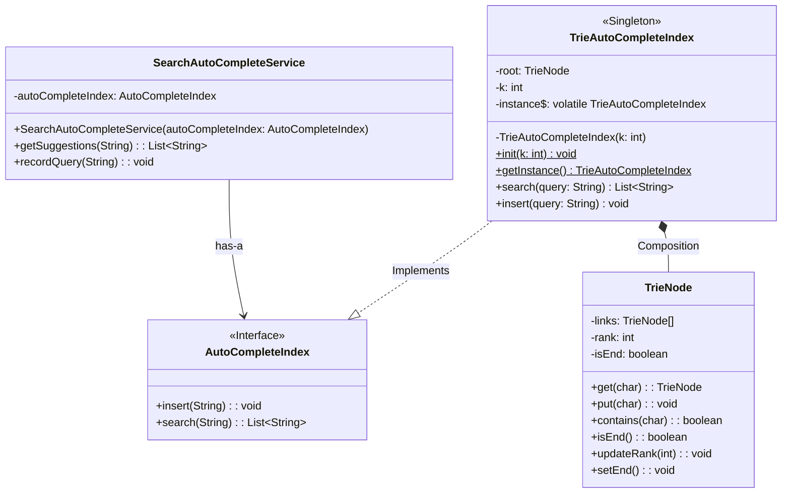
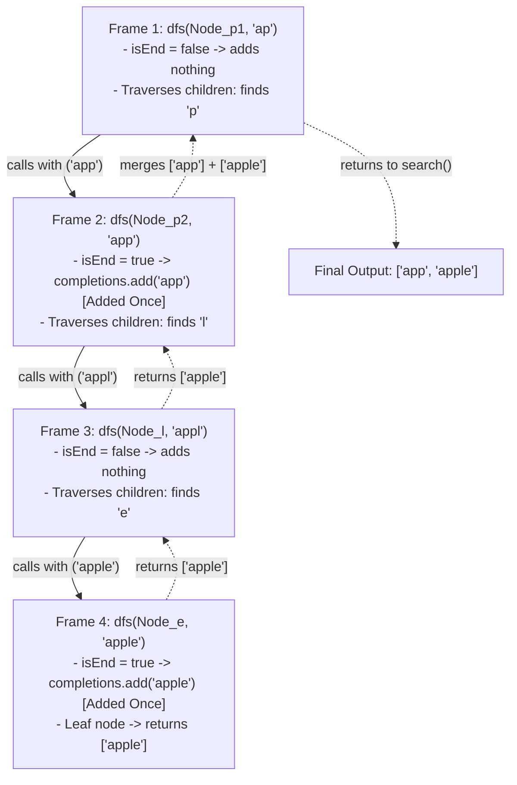

<!-- hub-metadata
type: lld
title: Search Autocomplete Engine
description: Low-Level Design for a highly scalable, real-time search autocomplete engine in Java.
tag: Low-Level Design
tagColor: #3b82f6
-->

# Search Autocomplete Engine — Low-Level Design

## Problem Statement

Design and implement a highly scalable, low-latency, in-memory **Search Autocomplete (Typeahead) Engine** in Java. The system must provide instant, relevant query suggestions as a user types into a search bar, adapting dynamically to user search habits while maintaining thread safety, high read throughput, and minimal memory overhead.

## Product Requirements

* **PR-1 (Prefix Suggestions):** As a user types into the search input on any client (web, mobile, console), the system suggests the top-$K$ most relevant completions matching the typed prefix based on historical search patterns.
* **PR-2 (Feedback Ingestion on Search):** When a user explicitly executes a search (e.g., presses `Enter` or taps `Search`), the system records that completed query. If its frequency or relevance qualifies, it will surface in future top-$K$ suggestions for matching prefixes.
  * *Clarification:* Intermediate keystrokes are read-only lookups; only committed searches trigger ingestion into the engine.

## Functional Requirements

### FR-1: Core Engine APIs
* **Prefix Suggestions Retrieval:**
  ```text
  getSuggestions(String prefix) -> List<String>
  ```
  Returns an ordered list of up to top-$K$ completions matching the given prefix.
  > **Design Decision: Why `List<String>` over `Optional<List<String>>`?**
  > Collections already have a first-class concept of "no results" (an empty list). Returning `Optional<List<String>>` introduces an awkward dual-empty state (`Optional.empty()` vs `Optional.of(emptyList)`), forces heap allocation on every high-throughput keystroke, and burdens client callers with `.orElse()` ceremony. We guarantee a non-null return contract (`List.of()` or `Collections.emptyList()`), allowing clients to safely iterate immediately.

* **Search Query Ingestion:**
  ```text
  recordQuery(String query) -> void
  ```
  Records a completed query submitted by the user, incrementing its frequency score so subsequent lookups reflect the updated popularity.

---

### FR-2: Character Set & Input Constraints
* **Alphabet & Character Space:** We strictly support lowercase English characters (`a-z`) and single space (`' '`) to allow multi-word phrases (effective alphabet size = 27). Numbers and special characters are excluded for the MVP.
* **Prefix Length Limits:**
  * **Minimum:** 1 character (suggestions appear right from the first keystroke).
  * **Maximum:** 20 characters (caps Trie depth to prevent unbounded memory growth).
  * Inputs violating these constraints (e.g., `null`, empty string, or strings $> 20$ chars) cleanly return an empty list without throwing runtime exceptions.

---

### FR-3: Ranking & Deterministic Ordering
* **Ranking Strategy (MVP):** Ranked primarily by search frequency (highest frequency surfaces first). The architecture should decouple the ranking logic so we can later plug in Recency-based or ML-based strategies.
* **Deterministic Tie-Breaking:** If two completions have the exact same frequency score, break the tie **lexicographically** (`"apple"` before `"apply"`).
* **Configurable $K$:** $K$ (e.g., 5 or 10) is injected at engine instantiation/server level. The client API does not allow callers to request arbitrary $K$ values.

---

### FR-4: System Lifecycle & Scope Boundaries
* **Cold Start:** The MVP initializes in an empty state and organically builds up query frequencies via `recordQuery`. (Pre-loading seed dictionaries is planned for future iterations).
* **Matching Strategy:** Strict prefix matching for the MVP, isolated behind an interface to allow fuzzy matching implementations in the future.
* **Concurrency Boundary:** The core algorithmic logic will first be specified synchronously; asynchronous event queuing and double buffering are captured under Non-Functional Requirements (NFRs).

---

## Models & Entities

### `SearchAutoCompleteService` 
* This is will be the class that talks to  the client (mobile/web/console/another class). It should have 2 main functionalties : 
(1) `getSuggestions()` (2) `recordQuery()`. 
* Get suggestions will take the string, call a Trie which would have been preloaded with different previous searches already. 
* This trie would be a singleton instance in the application process and will be responsible for managing the data structure. 
* The search auto-complete right now uses trie. We could in future use fuzzy as well so we should keep the trie as a contract for the service so that we could later swap out the trie with something else. 
* We don't want to update the frequencies immediately upon search of prefixes. This is due to the fact that, getSuggestions will be called on each character or couple of characters, but that doesn't mean that query is being used or that query was the intention of the user. They could simply delete some characters out of it as well. So, we will only record query as fired if `recordQuery(String)` is fired. 
* `recordQuery(String)` should be fired after any query is selected by the user and is intented for the search. 
* It should be such that, when the user let's say makes a completely new query then also it should be fired along with if an existing query is fired then also it should be fired. 

### `interface` AutoCompleteIndex
* Let's say tomorrow we want to replace the Trie with fuzzy search then we should be able to do it without a single line of code changes. To achieve that we create this interface so that we can later swap out Trie with something else. 

### `singletone` TrieAutoCompleteIndex
* This is the primary Trie data structure that will store the prefixes
* It will be a singleton class. Its responsibility would be to store the manage the prefixes

### TrieNode
* This class will contain the reference of other Nodes. 
* Basically for each alphabetical character and space it will have reference Nodes and their rank for now which will just be frequency.
* This is expose 3 APIs
  * `get(key: char): Node`
  * `put(key: char): Node`
  * `contains(key: char): boolean`


## 5. Low-Level Design : MVP



### 5.1 Trie Traversal & DFS Execution Trace (Zero-Duplicate Guarantee)

During prefix search, the engine traverses down to the prefix's ending node, then initiates a DFS traversal to collect all completions in that subtree.

Each node in the Trie represents a unique character prefix, ensuring that every completed word is visited and added **exactly once**:



* **Why duplicates can never occur:**
  1. `completions.add(autoSuggest)` only captures the word terminating at the **current** node.
  2. The recursive child calls only discover words that extend further down the branch (which have longer, distinct character sequences).
  3. Every Trie node has a single, unique path from the root.

---

## 6. Future Scope (Prioritized Roadmap)

While these items are deliberately deferred to keep the initial MVP clean and focused, the core architecture will be designed with enough durability and abstraction so they can be introduced without major refactoring.

The items are ordered strictly by implementation priority (**P1 > P2 > P3 > P4 > P5**):

1. **P1 — Concurrent Clients & Thread Safety:**
   * Transition from single-threaded execution to lock-free, concurrent multi-client serving (e.g., using `AtomicReference` double buffering or read-write locks) to guarantee thread safety and high read throughput.
2. **P2 — Pluggable Ranking Strategies (`rank` Abstraction):**
   * While the MVP computes `rank` purely via raw frequency, the design will treat this as a generic `rank` score. Future iterations will introduce the Strategy Pattern and a Context Object to dynamically swap between Recency-based decay, Personalization, and ML-based ranking.
3. **P3 — Asynchronous & Periodic Batch Updates:**
   * Decouple the write path using an in-memory Event Queue and background worker threads to periodically flush and recompute top-$K$ rankings in batches, avoiding hot-path latency hits.
4. **P4 — Character Set Expansion & Memory Optimization:**
   * Expand beyond the 27-character lowercase alphabet to full alphanumeric and Unicode support, evaluating memory trade-offs (e.g., migrating from fixed-size arrays to HashMaps or Radix/Patricia Tries) to manage heap growth.
5. **P5 — Alternative Search Algorithms (Fuzzy & Typo Tolerance):**
   * Keep the retrieval interface decoupled so alternative search matchers (such as fuzzy search using Levenshtein distance, BK-Trees, or n-grams) can be plugged in seamlessly.
