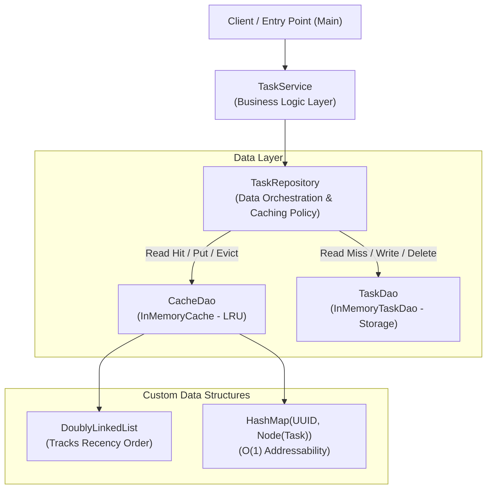
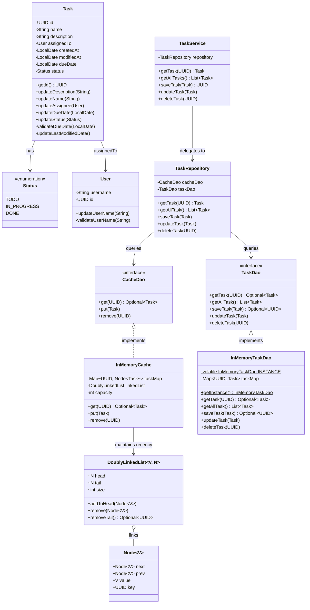
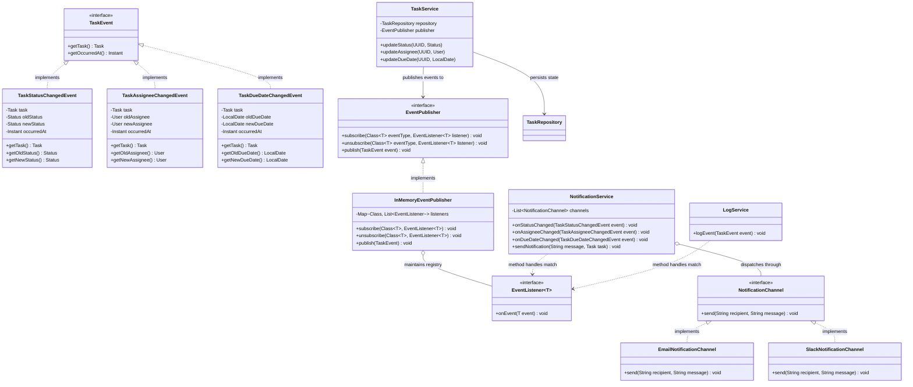
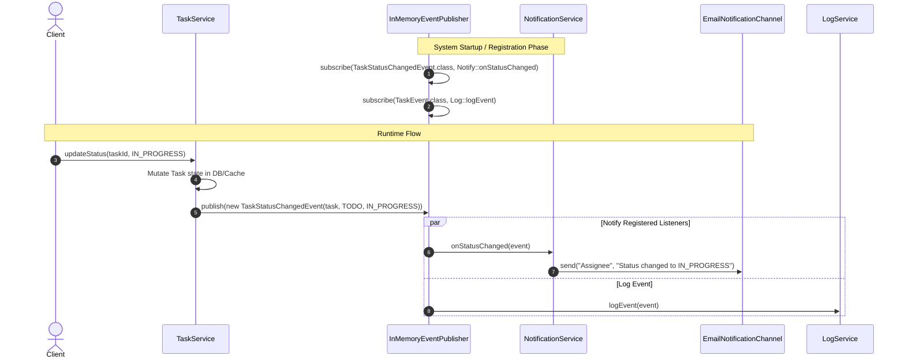
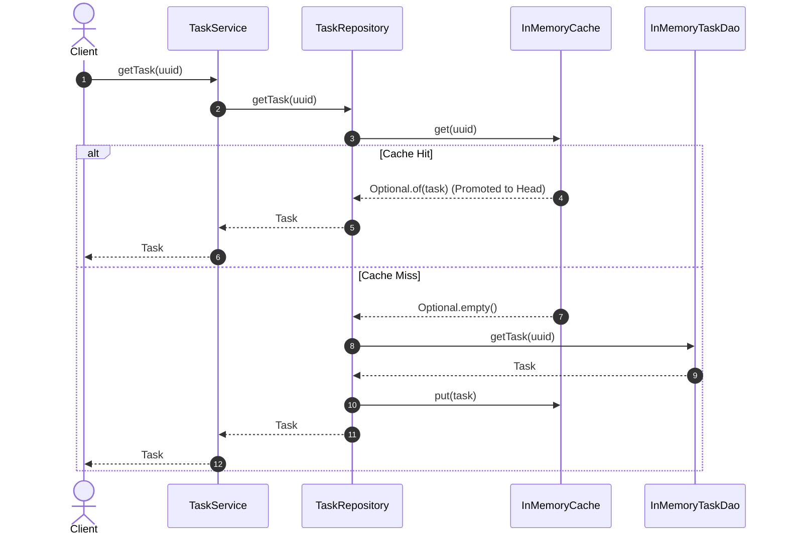
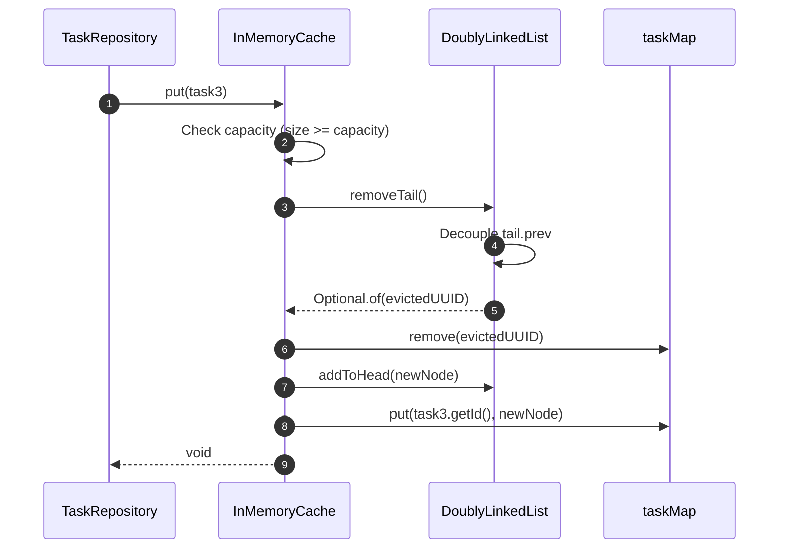

<!-- hub-metadata
type: blog
tag: System Design LLD
tagColor: #2563eb
title: Task Management System LLD
description: An in-depth Low-Level Design (LLD) of an enterprise Task Management System featuring custom LRU caching, the Repository pattern, and thread-safe DAO patterns.
-->

# Task Management System: Low-Level Design (LLD)


A modular, production-grade Low-Level Design (LLD) of an in-memory **Task Management System** built in pure Java. This project models core enterprise patterns for managing task lifecycles, state transitions, and assignments, reinforced with an integrated, custom **Least Recently Used (LRU) Cache** backed by a **Doubly Linked List** and **HashMap**.

---

## 📌 Table of Contents
- [What We Are Building](#-what-we-are-building)
- [System Architecture](#-system-architecture)
- [Class Blueprint & Domain Models](#-class-blueprint--domain-models)
- [Design Patterns Applied](#-design-patterns-applied)
  - [1. Repository Pattern](#1-repository-pattern)
  - [2. Data Access Object (DAO) Pattern](#2-data-access-object-dao-pattern)
  - [3. Singleton Pattern (Double-Checked Locking)](#3-singleton-pattern-double-checked-locking)
  - [4. Builder Pattern](#4-builder-pattern)
  - [5. Cache-Aside & Write-Through Caching](#5-cache-aside--write-through-caching)
  - [6. O(1) LRU Eviction via Doubly Linked List](#6-o1-lru-eviction-via-doubly-linked-list)
  - [7. Observer Pattern (Typed Domain Events)](#7-observer-pattern-typed-domain-events)
- [Notification Service & Event Architecture](#-notification-service--event-architecture)
- [Core Workflows & Sequence Diagrams](#-core-workflows--sequence-diagrams)
- [Complexity Analysis](#-complexity-analysis)
- [Project Structure](#-project-structure)
- [Running the Application](#-running-the-application)

---

## 🎯 What We Are Building

In enterprise software engineering, task and project tracking backends (such as Jira, Linear, or Asana) face several fundamental challenges:
1. **High Read-to-Write Ratio:** Tasks are viewed and inspected far more frequently than they are updated.
2. **Strict Domain Invariants:** Invalid dates, null assignees during transitions, and empty task payloads must be rejected at the domain boundary.
3. **Data Access Decoupling:** Business logic must not be tightly coupled to underlying storage engines (in-memory maps, SQL databases, or distributed caches like Redis).

This project demonstrates how to solve these challenges using a **multi-tiered, clean architecture**:
- **Rich Domain Entities** (`Task`, `User`, `Status`) that encapsulate business rules and date validations.
- **Service Layer** (`TaskService`) serving as the entry boundary for business operations.
- **Unified Repository Layer** (`TaskRepository`) that orchestrates reads and writes across both persistent storage and cache layers.
- **Custom In-Memory LRU Cache** (`InMemoryCache`) built from fundamental data structures (`DoublyLinkedList` and `HashMap`) supporting constant-time $O(1)$ access and eviction.
- **Persistent In-Memory DAO** (`InMemoryTaskDao`) implementing thread-safe singleton storage.

---

## 🏗 System Architecture

The project follows the **Layered Architecture** principles, enforcing a strict unidirectional dependency flow from caller to persistence:



### Layer Responsibilities
| Layer | Component | Responsibility |
|---|---|---|
| **Service Layer** | `TaskService` | Exposes task management use cases (create, update, delete, retrieve). Validates caller inputs. |
| **Repository Layer** | `TaskRepository` | Mediates between cache and database. Coordinates cache hits, cache misses, backfills, and cache invalidation. |
| **Cache Layer** | `CacheDao` / `InMemoryCache` | Fast access layer maintaining active hot records. Evicts least recently used items on capacity overflow. |
| **Persistence Layer** | `TaskDao` / `InMemoryTaskDao` | Authoritative source of truth for all tasks in the system. |
| **Data Structures** | `DoublyLinkedList`, `Node` | Custom generic doubly linked list utilizing sentinel head/tail nodes for constant-time node operations. |
| **Domain Layer** | `Task`, `User`, `Status` | Models domain entities, state lifecycle (`TODO`, `IN_PROGRESS`, `DONE`), and invariant validations. |

---

## 📐 Class Blueprint & Domain Models



---

## 💡 Design Patterns Applied

### 1. Repository Pattern
- **Problem:** When business services directly interact with both databases and caches, caching logic leaks throughout the service tier, producing code duplication and subtle bugs.
- **Solution:** `TaskRepository` acts as an in-memory collection-like interface. `TaskService` does not know whether a task came from a fast memory cache or an underlying database; the repository seamlessly orchestrates lookups, saves, and updates.

```java
// TaskService remains decoupled from cache mechanics:
public Task getTask(UUID uuid) {
    return repository.getTask(uuid);
}
```

---

### 2. Data Access Object (DAO) Pattern
- **Problem:** Directly exposing storage implementations tightly binds domain rules to technical storage choices.
- **Solution:** We define `TaskDao` and `CacheDao` interfaces. `InMemoryTaskDao` and `InMemoryCache` provide concrete implementations. If we decide to swap out `InMemoryTaskDao` for a relational SQL database via JDBC/Hibernate, or `InMemoryCache` for Redis, zero changes are required in `TaskRepository` or `TaskService`.

---

### 3. Singleton Pattern (Double-Checked Locking)
- **Problem:** Multiple concurrent instances of an in-memory database DAO would fragment stored records into isolated states.
- **Solution:** `InMemoryTaskDao` implements the **Thread-Safe Singleton Pattern** using a `volatile` instance reference and **Double-Checked Locking**. This avoids continuous synchronization bottlenecks while guaranteeing single-instance initialization.

```java
public class InMemoryTaskDao implements TaskDao {
    private static volatile InMemoryTaskDao INSTANCE;
    private final Map<UUID, Task> taskMap;

    private InMemoryTaskDao() {
        taskMap = new HashMap<>();
    }

    public static InMemoryTaskDao getInstance() {
        if (INSTANCE == null) {
            synchronized (InMemoryTaskDao.class) {
                if (INSTANCE == null) {
                    INSTANCE = new InMemoryTaskDao();
                }
            }
        }
        return INSTANCE;
    }
}
```

---

### 4. Builder Pattern
- **Problem:** Initializing a cache with multiple optional tuning parameters (initial capacity, eviction boundaries, load factors) via telescoping constructors is error-prone.
- **Solution:** `InMemoryCache.Builder` provides a readable, fluent configuration interface while enforcing validation invariants (e.g., verifying capacity $> 0$) prior to constructing the immutable cache instance.

```java
CacheDao cacheDao = new InMemoryCache.Builder()
        .capacity(2)
        .build();
```

---

### 5. Cache-Aside & Write-Through Caching
The repository employs a coordinated dual-datasource strategy:

#### Read (Cache-Aside with Lazy Loading):
1. Query `CacheDao`.
2. **Cache Hit:** Return item immediately. The underlying LRU cache promotes the item to the head of its recency list.
3. **Cache Miss:** Retrieve the item from `TaskDao` (database).
4. Store the fetched item into `CacheDao` for subsequent requests.
5. Return the item.

#### Write / Update (Write-Through):
1. Update `TaskDao`.
2. Simultaneously update/refresh `CacheDao` (`cacheDao.put(task)`), ensuring immediate read-your-own-writes consistency.

#### Delete (Cache Invalidation):
1. Remove from `CacheDao`.
2. Remove from `TaskDao`.

---

### 6. O(1) LRU Eviction via Doubly Linked List

The `InMemoryCache` achieves constant time **$O(1)$** lookup, insertion, update, and eviction by combining:
1. **`HashMap<UUID, Node<Task>>`**: Provides $O(1)$ random access directly to any node in the list.
2. **`DoublyLinkedList<Task, Node<Task>>`**: Maintains access order without requiring array shifts.
   - Uses **dummy sentinel nodes** (`head` and `tail`) to eliminate null pointer checks at list boundaries.
   - **On Access (`get`):** The accessed node is decoupled from its current position in $O(1)$ and spliced right after `head`.
   - **On Overflow (`put` when `size >= capacity`):** The least recently used node immediately before `tail` (`tail.prev`) is evicted from both the list and the hash map in $O(1)$.

```
[ Head Sentinel ] <---> [ Most Recent ] <---> ... <---> [ Least Recent ] <---> [ Tail Sentinel ]
                                                                 ^
                                                       (Evicted on Overflow)
```

---

### 7. Observer Pattern (Typed Domain Events)
- **Problem:** When a task's state changes (assignee, due date, status), secondary subsystems (email/Slack notifications, audit logging, analytics) must react. Hardcoding direct calls to these services inside `TaskService` tightly couples the domain logic and violates the Open-Closed Principle.
- **Solution:** `TaskService` acts as the event trigger, publishing strongly-typed domain events (`TaskStatusChangedEvent`, `TaskAssigneeChangedEvent`, `TaskDueDateChangedEvent`) to an `EventPublisher`. Observers (`NotificationService`, `LogService`) subscribe specifically to the event classes they care about with 100% compile-time type safety—eliminating runtime `instanceof` inspection.

---

## 🔔 Notification Service & Event Architecture

The notification system models an enterprise **Event-Driven Observer Pattern** designed around domain lifecycle state transitions:



### State Changes Triggering Notifications
1. **Assignee Change (`TaskAssigneeChangedEvent`):** Triggers alerts when a task is assigned, reassigned, or unassigned.
2. **Due Date Change (`TaskDueDateChangedEvent`):** Notifies stakeholders of deadline postponements or escalations.
3. **Status Change (`TaskStatusChangedEvent`):** Signals state movement across `TODO -> IN_PROGRESS -> DONE`.

### Multi-Channel Notification Dispatching
`NotificationService` operates as an observer that fans out to pluggable channels (Strategy Pattern):
- **Email Channel:** Dispatches transactional email updates to assigned users.
- **Slack Channel:** Posts updates directly to team channels or project webhooks.
- **In-App / SMS Channel:** Additional pluggable channels conforming to `NotificationChannel`.

### Event Dispatch & Notification Workflow


### Architectural Guarantees:
- **Compile-Time Type Safety:** Listeners subscribe to explicit generic types (`EventListener<T extends TaskEvent>`). No runtime `instanceof` downcasting or type checking required in observer handlers.
- **Open-Closed Extensibility:** Adding a new event type (e.g., `TaskPriorityChangedEvent`) or new observers (`AuditService`, `MetricsService`) requires zero code changes to existing classes.
- **Decoupled Delivery:** Business operations in `TaskService` do not know whether notifications are sent via Email, Slack, or logged.

---

## 🔄 Core Workflows & Sequence Diagrams

### 1. Task Retrieval (Cache Miss -> DB Fetch -> Cache Backfill)


### 2. LRU Eviction on Capacity Exceeded


---

## 📊 Complexity Analysis

| Operation | Time Complexity | Space Complexity | Description |
|---|---|---|---|
| `getTask(id)` (Cache Hit) | **$O(1)$** | $O(1)$ | Hash lookup + DLL pointer manipulation |
| `getTask(id)` (Cache Miss) | **$O(1)$** | $O(1)$ | DB hash lookup + Cache insertion |
| `saveTask(task)` | **$O(1)$** | $O(1)$ | Validation + DB insert + Cache insert |
| `updateTask(task)` | **$O(1)$** | $O(1)$ | DB replace + Cache promote/insert |
| `deleteTask(id)` | **$O(1)$** | $O(1)$ | DB remove + Cache node detachment |
| `getAllTasks()` | **$O(N)$** | $O(N)$ | Iterating over all active tasks in DB |

*Where $C$ is cache capacity and $N$ is total number of tasks in the database.*

---

## 📁 Project Structure

```
task-management-system/
├── build.gradle                                     # Gradle build script
├── settings.gradle                                  # Gradle project settings
├── gradlew / gradlew.bat                            # Gradle wrapper scripts
├── README.md                                        # Architecture & design documentation
└── src/
    └── main/
        └── java/
            └── com/
                └── jyotimoykashyap/
                    ├── Main.java                    # Interactive lifecycle & LRU demo
                    ├── models/
                    │   ├── Status.java              # Task status enum (TODO, IN_PROGRESS, DONE)
                    │   ├── User.java                # User domain model with validations
                    │   └── Task.java                # Task entity with lifecycle rules
                    ├── datastructures/
                    │   ├── Node.java                # Generic Doubly-Linked List Node
                    │   └── DoublyLinkedList.java    # Custom O(1) Doubly Linked List with Sentinels
                    ├── cache/
                    │   ├── CacheDao.java            # Cache contract interface
                    │   └── InMemoryCache.java       # LRU Cache implementation with Builder
                    ├── dao/
                    │   ├── TaskDao.java             # Task persistence contract interface
                    │   └── InMemoryTaskDao.java     # Singleton In-Memory Task Database
                    ├── repository/
                    │   └── TaskRepository.java      # Coordinates Cache & DAO access
                    └── service/
                        └── TaskService.java         # Public business logic service
```

---

## 🚀 Running the Application

### 1. Prerequisites
- **JDK 21** or higher installed.

### 2. Build the Project
```bash
./gradlew build
```

### 3. Run the Demonstration
The included [`Main.java`](./src/main/java/com/jyotimoykashyap/Main.java) configures a cache capacity of `2` to clearly showcase LRU eviction, cache hits, cache misses, updates, and removals:

```bash
# Compile and run via java directly:
./gradlew compileJava
java -cp build/classes/java/main com.jyotimoykashyap.Main
```

### Expected Output
```text
=== Starting Task Management System Demo ===

--- 1. Creating and Saving Tasks ---
Saved Task 1: cae294fa-9942-4566-9c5c-c6bce9cdf2d0
Saved Task 2: 480432c3-bb66-4b93-b55f-513c196a7a6a

--- 2. Fetching Task 1 (Cache Hit & LRU Promotion) ---
Successfully fetched Task 1: cae294fa-9942-4566-9c5c-c6bce9cdf2d0

--- 3. Saving Task 3 (Triggers LRU Eviction of Task 2) ---
Saved Task 3: fd288a3f-7540-4a08-963d-8ff2609ecf12

--- 4. Fetching Task 2 (Cache Miss -> DB Fetch) ---
Successfully fetched Task 2 from DB: 480432c3-bb66-4b93-b55f-513c196a7a6a

--- 5. Updating Task 1 ---
Updated Task 1 description successfully.

--- 6. Listing All Tasks ---
Total tasks in system: 3
 - Task ID: cae294fa-9942-4566-9c5c-c6bce9cdf2d0
 - Task ID: 480432c3-bb66-4b93-b55f-513c196a7a6a
 - Task ID: fd288a3f-7540-4a08-963d-8ff2609ecf12

--- 7. Deleting Task 3 ---
Deleted Task 3.
Verified: Task 3 no longer exists (Task not found)

=== All Tests Completed Successfully! ===
```

---

## 🔮 Concurrency & Future Roadmap
While the current database DAO leverages thread-safe Singleton instantiation and maps, under heavy multi-threaded workloads the following enhancements can be incorporated:
1. **Concurrent Data Structures:** Replacing raw `HashMap` with `ConcurrentHashMap` and wrapping doubly linked list operations in a `ReentrantReadWriteLock`.
2. **Pluggable Eviction Strategies:** Refactoring `InMemoryCache` to support pluggable policies (LFU, FIFO, Clock-Pro) via the Strategy Pattern (similar to [`cache-lld`](../cache-lld)).
3. **Event Notification (Observer Pattern):** Emitting domain events (`TaskAssignedEvent`, `TaskStatusChangedEvent`) to notify external services asynchronously.