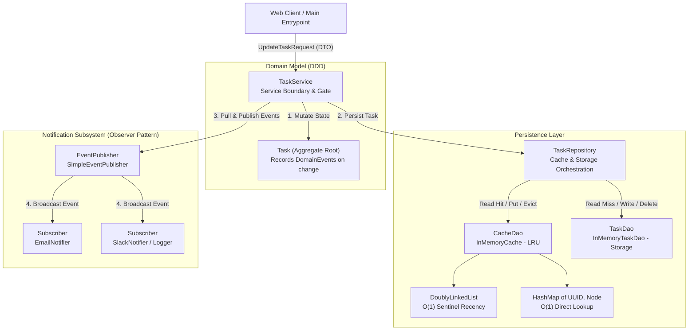
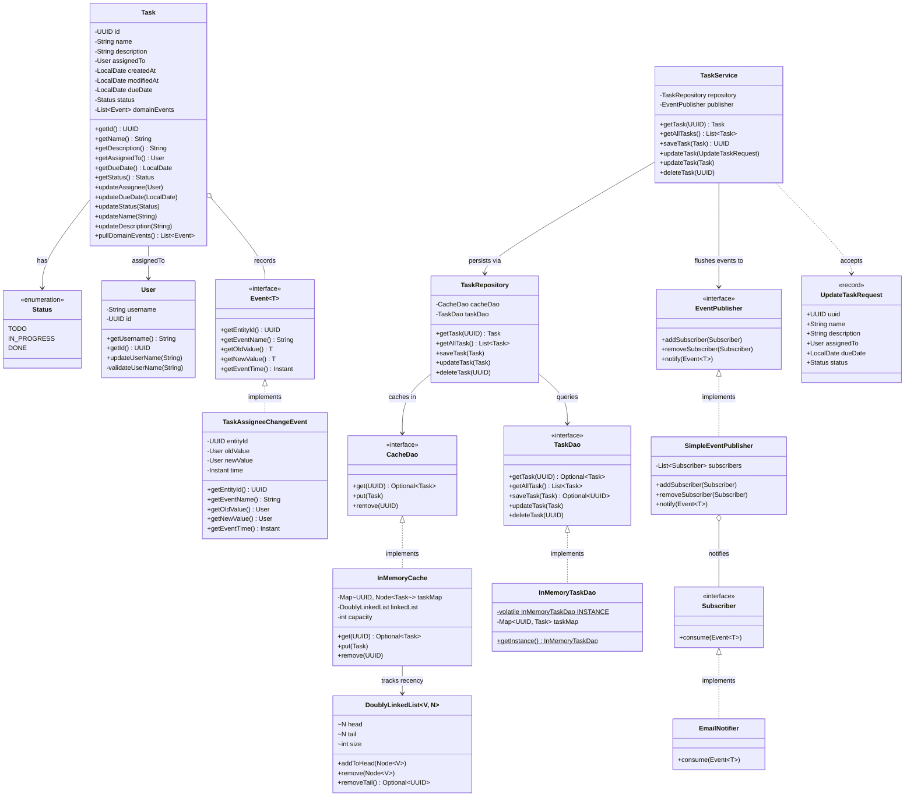
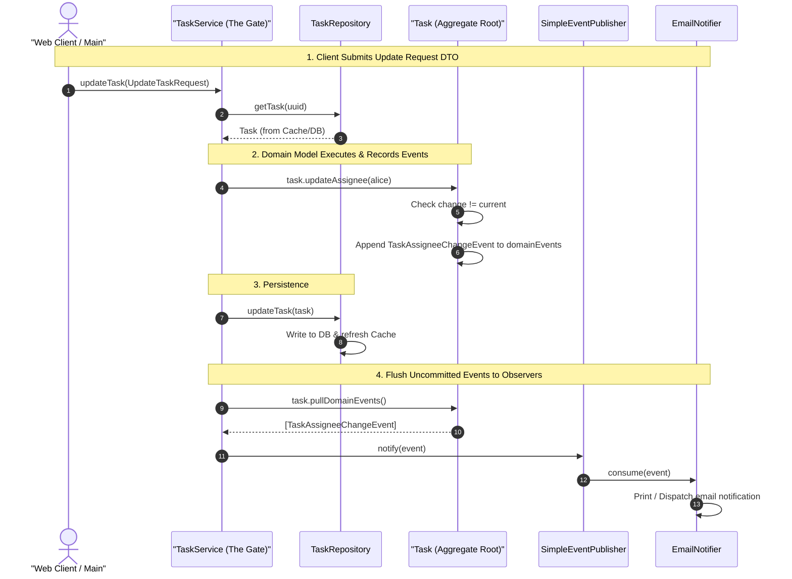
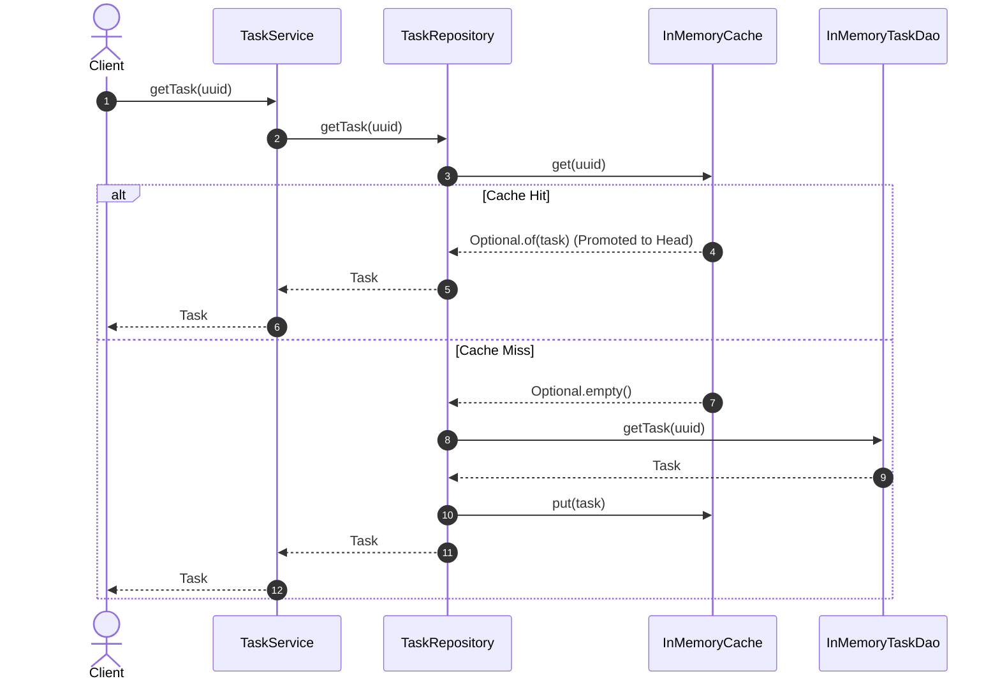
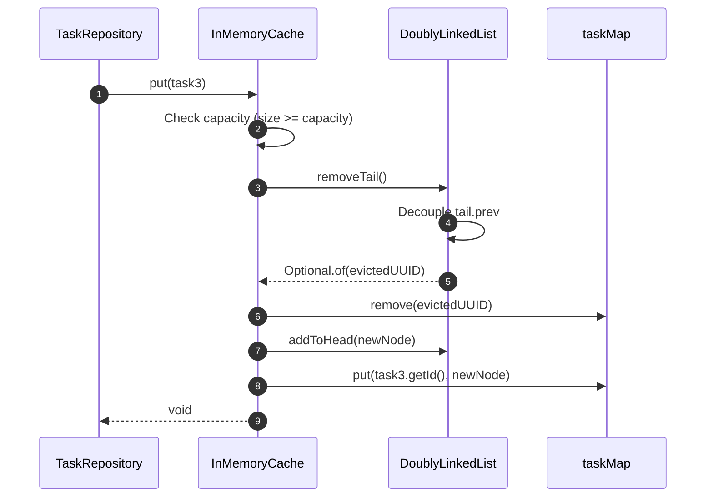

<!-- hub-metadata
type: blog
tag: System Design LLD
tagColor: #2563eb
title: Task Management System LLD
description: An in-depth Low-Level Design (LLD) of an enterprise Task Management System featuring custom LRU caching, the Repository pattern, and thread-safe DAO patterns.
-->

# Task Management System: Low-Level Design (LLD)


A modular, production-grade Low-Level Design (LLD) of an in-memory **Task Management System** built in pure Java. This project models core enterprise patterns for managing task lifecycles, state transitions, and assignments, reinforced with an integrated, custom **Least Recently Used (LRU) Cache** backed by a **Doubly Linked List** and **HashMap**, and a **Domain-Driven Design (DDD) Event-Driven Notification Subsystem** based on the **Observer Pattern**.

---

## 📌 Table of Contents
- [What We Are Building](#-what-we-are-building)
- [System Architecture](#-system-architecture)
- [Class Blueprint & Domain Models](#-class-blueprint--domain-models)
- [Design Patterns Applied](#-design-patterns-applied)
  - [1. Domain-Driven Design: Aggregate Root & Domain Events](#1-domain-driven-design-aggregate-root--domain-events)
  - [2. Observer Pattern: Generic Event Publisher & Subscribers](#2-observer-pattern-generic-event-publisher--subscribers)
  - [3. Data Transfer Object (DTO) Pattern: The Web Client Gate](#3-data-transfer-object-dto-pattern-the-web-client-gate)
  - [4. Repository Pattern](#4-repository-pattern)
  - [5. Data Access Object (DAO) Pattern](#5-data-access-object-dao-pattern)
  - [6. Singleton Pattern (Double-Checked Locking)](#6-singleton-pattern-double-checked-locking)
  - [7. Builder Pattern](#7-builder-pattern)
  - [8. Cache-Aside & Write-Through Caching](#8-cache-aside--write-through-caching)
  - [9. O(1) LRU Eviction via Doubly Linked List](#9-o1-lru-eviction-via-doubly-linked-list)
- [Notification Subsystem & Event Architecture](#-notification-subsystem--event-architecture)
- [Core Workflows & Sequence Diagrams](#-core-workflows--sequence-diagrams)
- [Complexity Analysis](#-complexity-analysis)
- [Project Structure](#-project-structure)
- [Running the Application](#-running-the-application)

---

## 🎯 What We Are Building

In enterprise software engineering, task and project tracking backends (such as Jira, Linear, or Asana) face several fundamental challenges:
1. **High Read-to-Write Ratio:** Tasks are viewed and inspected far more frequently than they are updated.
2. **Strict Domain Invariants:** Invalid dates, null assignees during transitions, and empty task payloads must be rejected at the domain boundary.
3. **Data Access Decoupling:** Business logic must not be tightly coupled to underlying storage engines (in-memory maps, SQL databases, or distributed caches like Redis).

This project demonstrates how to solve these challenges using a **multi-tiered, clean architecture**:
- **Rich Aggregate Root (`Task`):** Encapsulates business invariants and records domain events internally upon state transitions.
- **Service Layer Gate (`TaskService`):** Orchestrates persistence via `TaskRepository`, accepts single-request DTOs, and flushes domain events.
- **Data Transfer Objects (`UpdateTaskRequest`):** Prevents endpoint explosion by accepting composite updates from web clients atomically.
- **Generic Notification Engine (`Event<T>`, `EventPublisher`, `Subscriber`):** Fully decoupled Observer pattern framework ready for any entity (Tasks, Stories, Spikes).
- **Unified Repository Layer (`TaskRepository`):** Orchestrates reads and writes across both persistent storage and cache layers.
- **Custom In-Memory LRU Cache (`InMemoryCache`):** Built from fundamental data structures (`DoublyLinkedList` and `HashMap`) supporting constant-time $O(1)$ access and eviction.
- **Persistent In-Memory DAO (`InMemoryTaskDao`):** Implements thread-safe singleton storage with double-checked locking.

---

## 🏗 System Architecture

The project enforces clean unidirectional flow between DTO presentation, service orchestration, persistence, and event notification:



### Layer Responsibilities
| Layer | Component | Responsibility |
|---|---|---|
| **DTO Layer** | `UpdateTaskRequest` | Encapsulates optional fields submitted by client in a single atomic payload. |
| **Service Layer** | `TaskService` | Acts as the gate. Fetches aggregates, delegates domain operations, persists, and flushes events. |
| **Domain Layer** | `Task`, `User`, `Status` | Aggregate Root enforcing invariants and generating domain events on state change. |
| **Notification Layer** | `Event<T>`, `EventPublisher`, `Subscriber` | Generic, domain-agnostic pub-sub notification engine. |
| **Repository Layer** | `TaskRepository` | Mediates between cache and database (Cache-Aside, Write-Through). |
| **Cache Layer** | `CacheDao` / `InMemoryCache` | $O(1)$ LRU cache maintaining active hot records. |
| **Persistence Layer** | `TaskDao` / `InMemoryTaskDao` | Thread-safe in-memory authoritative storage. |
| **Data Structures** | `DoublyLinkedList`, `Node` | Custom generic doubly linked list utilizing sentinel head/tail nodes. |

---

## 📐 Class Blueprint & Domain Models



---

## 💡 Design Patterns Applied

### 1. Domain-Driven Design: Aggregate Root & Domain Events
- **Problem:** Service-layer diffing (`if (!existing.getAssignee().equals(incoming.getAssignee()))`) is error-prone, violates DRY, and clutters orchestration code with manual property comparisons.
- **Solution:** `Task` acts as an **Aggregate Root** (similar to Spring Data's `AbstractAggregateRoot`). When state-changing methods (`updateAssignee`, `updateStatus`, `updateDueDate`) are invoked, `Task` encapsulates its own business invariants and appends an immutable domain event to an internal buffer. `TaskService` simply pulls uncommitted events (`task.pullDomainEvents()`) and dispatches them after persisting.

```java
// Inside Task (Aggregate Root):
public void updateAssignee(User user) {
    if (Objects.equals(this.assignedTo, user)) return; // Guard against duplicate no-op
    User oldAssignee = this.assignedTo;
    this.assignedTo = user;
    this.domainEvents.add(new TaskAssigneeChangeEvent(this.id, oldAssignee, user));
    updateLastModifiedDate();
}
```

---

### 2. Observer Pattern: Generic Event Publisher & Subscribers
- **Problem:** Tying notifications directly to `Task` prevents reusing the notification infrastructure for other entities (e.g., `Story`, `Spike`, `Project`).
- **Solution:** The notification framework is completely generic and domain-agnostic:
  - `Event<T>` provides `getEntityId()`, `getEventName()`, `getOldValue()`, `getNewValue()`, and `getEventTime()`.
  - `EventPublisher` maintains a list of `Subscriber`s and broadcasts events.
  - `Subscriber` implementations (`EmailNotifier`) process any event without needing hardcoded task dependencies.

```java
// Generic Subscriber consumes any event safely:
public class EmailNotifier implements Subscriber {
    @Override
    public <T> void consume(Event<T> event) {
        String oldVal = event.getOldValue() == null ? "None" : event.getOldValue().toString();
        String newVal = event.getNewValue() == null ? "None" : event.getNewValue().toString();

        System.out.println("📧 [EMAIL NOTIFICATION] Event: " + event.getEventName()
                + " | Entity ID: " + event.getEntityId()
                + " | Old: " + oldVal
                + " -> New: " + newVal
                + " | At: " + event.getEventTime());
    }
}
```

---

### 3. Data Transfer Object (DTO) Pattern: The Web Client Gate
- **Problem:** Over HTTP/REST, a web client cannot mutate in-memory Java objects. Forcing individual endpoints for every single field (`PATCH /assignee`, `PATCH /status`) produces network chatty-ness and partial failure risks.
- **Solution:** `UpdateTaskRequest` is an immutable record that encapsulates all optional fields submitted in a single request. `TaskService` acts as the gate: it loads the aggregate, executes only the relevant domain mutations, saves once, and flushes all resulting events atomically.

```java
public void updateTask(UpdateTaskRequest request) {
    Task task = repository.getTask(request.uuid());

    if (request.name() != null) task.updateName(request.name());
    if (request.description() != null) task.updateDescription(request.description());
    if (request.assignedTo() != null) task.updateAssignee(request.assignedTo());
    if (request.dueDate() != null) task.updateDueDate(request.dueDate());
    if (request.status() != null) task.updateStatus(request.status());

    repository.updateTask(task);
    task.pullDomainEvents().forEach(publisher::notify);
}
```

---

### 4. Repository Pattern
- **Problem:** When business services directly interact with both databases and caches, caching logic leaks throughout the service tier, producing code duplication and subtle bugs.
- **Solution:** `TaskRepository` acts as an in-memory collection-like interface. `TaskService` does not know whether a task came from a fast memory cache or an underlying database; the repository seamlessly orchestrates lookups, saves, and updates.

---

### 5. Data Access Object (DAO) Pattern
- **Problem:** Directly exposing storage implementations tightly binds domain rules to technical storage choices.
- **Solution:** We define `TaskDao` and `CacheDao` interfaces. `InMemoryTaskDao` and `InMemoryCache` provide concrete implementations. If we decide to swap out `InMemoryTaskDao` for a relational SQL database via JDBC/Hibernate, or `InMemoryCache` for Redis, zero changes are required in `TaskRepository` or `TaskService`.

---

### 6. Singleton Pattern (Double-Checked Locking)
- **Problem:** Multiple concurrent instances of an in-memory database DAO would fragment stored records into isolated states.
- **Solution:** `InMemoryTaskDao` implements the **Thread-Safe Singleton Pattern** using a `volatile` instance reference and **Double-Checked Locking**. This avoids continuous synchronization bottlenecks while guaranteeing single-instance initialization.

```java
public class InMemoryTaskDao implements TaskDao {
    private static volatile InMemoryTaskDao INSTANCE;
    private final Map<UUID, Task> taskMap;

    private InMemoryTaskDao() {
        taskMap = new HashMap<>();
    }

    public static InMemoryTaskDao getInstance() {
        if (INSTANCE == null) {
            synchronized (InMemoryTaskDao.class) {
                if (INSTANCE == null) {
                    INSTANCE = new InMemoryTaskDao();
                }
            }
        }
        return INSTANCE;
    }
}
```

---

### 7. Builder Pattern
- **Problem:** Initializing a cache with multiple optional tuning parameters (initial capacity, eviction boundaries, load factors) via telescoping constructors is error-prone.
- **Solution:** `InMemoryCache.Builder` provides a readable, fluent configuration interface while enforcing validation invariants (e.g., verifying capacity $> 0$) prior to constructing the immutable cache instance.

```java
CacheDao cacheDao = new InMemoryCache.Builder()
        .capacity(2)
        .build();
```

---

### 8. Cache-Aside & Write-Through Caching
The repository employs a coordinated dual-datasource strategy:

#### Read (Cache-Aside with Lazy Loading):
1. Query `CacheDao`.
2. **Cache Hit:** Return item immediately. The underlying LRU cache promotes the item to the head of its recency list.
3. **Cache Miss:** Retrieve the item from `TaskDao` (database).
4. Store the fetched item into `CacheDao` for subsequent requests.
5. Return the item.

#### Write / Update (Write-Through):
1. Update `TaskDao`.
2. Simultaneously update/refresh `CacheDao` (`cacheDao.put(task)`), ensuring immediate read-your-own-writes consistency.

#### Delete (Cache Invalidation):
1. Remove from `CacheDao`.
2. Remove from `TaskDao`.

---

### 9. O(1) LRU Eviction via Doubly Linked List

The `InMemoryCache` achieves constant time **$O(1)$** lookup, insertion, update, and eviction by combining:
1. **`HashMap<UUID, Node<Task>>`**: Provides $O(1)$ random access directly to any node in the list.
2. **`DoublyLinkedList<Task, Node<Task>>`**: Maintains access order without requiring array shifts.
   - Uses **dummy sentinel nodes** (`head` and `tail`) to eliminate null pointer checks at list boundaries.
   - **On Access (`get`):** The accessed node is decoupled from its current position in $O(1)$ and spliced right after `head`.
   - **On Overflow (`put` when `size >= capacity`):** The least recently used node immediately before `tail` (`tail.prev`) is evicted from both the list and the hash map in $O(1)$.

```
[ Head Sentinel ] <---> [ Most Recent ] <---> ... <---> [ Least Recent ] <---> [ Tail Sentinel ]
                                                                 ^
                                                       (Evicted on Overflow)
```

---

## 🔔 Notification Subsystem & Event Architecture

The notification system models an enterprise **Event-Driven Observer Pattern** designed around domain lifecycle state transitions:

### State Changes Tracked
1. **Assignee Change (`TaskAssigneeChangeEvent`):** Emitted when a task is assigned, reassigned, or unassigned.
2. **Due Date Change:** Notifies stakeholders of deadline postponements or escalations.
3. **Status Change:** Signals state movement across `TODO -> IN_PROGRESS -> DONE`.

### Event Dispatch & Notification Workflow


### Architectural Guarantees:
- **Zero Service-Side Diffing:** The entity tracks what changed when it changed, capturing `oldValue` and `newValue` automatically.
- **Generic & Domain-Agnostic Engine:** `Event<T>`, `EventPublisher`, and `Subscriber` do not depend on `Task`. They work for any entity (e.g., Stories, Spikes).
- **Atomic Single-Request Updates:** Web clients submit one DTO payload; `TaskService` processes all mutations in one unit of work.

---

## 🔄 Core Workflows & Sequence Diagrams

### 1. Task Retrieval (Cache Miss -> DB Fetch -> Cache Backfill)


### 2. LRU Eviction on Capacity Exceeded


---

## 📊 Complexity Analysis

| Operation | Time Complexity | Space Complexity | Description |
|---|---|---|---|
| `getTask(id)` (Cache Hit) | **$O(1)$** | $O(1)$ | Hash lookup + DLL pointer manipulation |
| `getTask(id)` (Cache Miss) | **$O(1)$** | $O(1)$ | DB hash lookup + Cache insertion |
| `saveTask(task)` | **$O(1)$** | $O(1)$ | Validation + DB insert + Cache insert |
| `updateTask(task)` | **$O(1)$** | $O(1)$ | DB replace + Cache promote/insert |
| `deleteTask(id)` | **$O(1)$** | $O(1)$ | DB remove + Cache node detachment |
| `getAllTasks()` | **$O(N)$** | $O(N)$ | Iterating over all active tasks in DB |

*Where $C$ is cache capacity and $N$ is total number of tasks in the database.*

---

## 📁 Project Structure

```
task-management-system/
├── build.gradle                                     # Gradle build script
├── settings.gradle                                  # Gradle project settings
├── gradlew / gradlew.bat                            # Gradle wrapper scripts
├── README.md                                        # Architecture & design documentation
└── src/
    └── main/
        └── java/
            └── com/
                └── jyotimoykashyap/
                    ├── Main.java                    # Interactive lifecycle & notification demo
                    ├── models/
                    │   ├── Status.java              # Task status enum (TODO, IN_PROGRESS, DONE)
                    │   ├── User.java                # User domain model with validations & ID
                    │   └── Task.java                # Aggregate Root with domain event buffer
                    ├── dto/
                    │   └── UpdateTaskRequest.java   # Immutable DTO for atomic client updates
                    ├── datastructures/
                    │   ├── Node.java                # Generic Doubly-Linked List Node
                    │   └── DoublyLinkedList.java    # Custom O(1) Doubly Linked List with Sentinels
                    ├── cache/
                    │   ├── CacheDao.java            # Cache contract interface
                    │   └── InMemoryCache.java       # LRU Cache implementation with Builder
                    ├── dao/
                    │   ├── TaskDao.java             # Task persistence contract interface
                    │   └── InMemoryTaskDao.java     # Singleton In-Memory Task Database
                    ├── repository/
                    │   └── TaskRepository.java      # Coordinates Cache & DAO access
                    ├── service/
                    │   └── TaskService.java         # Public service gate & event dispatcher
                    └── notification/
                        ├── event/
                        │   ├── Event.java           # Generic event interface (entityId, eventName)
                        │   └── TaskAssigneeChangeEvent.java # Strongly-typed assignee change event
                        ├── publisher/
                        │   ├── EventPublisher.java  # Publisher contract
                        │   └── SimpleEventPublisher.java # Concrete broadcast publisher
                        └── subscriber/
                            ├── Subscriber.java      # Generic subscriber consumer contract
                            └── EmailNotifier.java   # Concrete email subscriber
```

---

## 🚀 Running the Application

### 1. Prerequisites
- **JDK 21** or higher installed.

### 2. Build the Project
```bash
./gradlew build
```

### 3. Run the Demonstration
The included [`Main.java`](./src/main/java/com/jyotimoykashyap/Main.java) configures a cache capacity of `2` to clearly showcase LRU eviction, cache hits, cache misses, updates, and email notifications:

```bash
# Compile and run via java directly:
./gradlew compileJava
java -cp build/classes/java/main com.jyotimoykashyap.Main
```

### Expected Output
```text
=== Starting Task Management System Demo ===

--- 1. Creating and Saving Tasks ---
Saved Task 1: 2d2d1937-d5e6-401c-b036-13083437adfa
Saved Task 2: 8ed4ffb2-c9b6-4054-b2e8-f7e7d4ff7a69

--- 2. Fetching Task 1 (Cache Hit & LRU Promotion) ---
Successfully fetched Task 1: 2d2d1937-d5e6-401c-b036-13083437adfa

--- 3. Saving Task 3 (Triggers LRU Eviction of Task 2) ---
Saved Task 3: 215231fb-db0d-494b-a836-2660ce6f4b4d

--- 4. Fetching Task 2 (Cache Miss -> DB Fetch) ---
Successfully fetched Task 2 from DB: 8ed4ffb2-c9b6-4054-b2e8-f7e7d4ff7a69

--- 5. Updating Task 1 (Assignee Change & Email Notification) ---
📧 [EMAIL NOTIFICATION] Event: TASK_ASSIGNEE_CHANGED | Entity ID: 2d2d1937-d5e6-401c-b036-13083437adfa | Old: None -> New: alice | At: 2026-09-10T18:17:48.802015Z
Updated Task 1 via UpdateTaskRequest successfully.

--- 6. Listing All Tasks ---
Total tasks in system: 3
 - Task ID: 2d2d1937-d5e6-401c-b036-13083437adfa
 - Task ID: 215231fb-db0d-494b-a836-2660ce6f4b4d
 - Task ID: 8ed4ffb2-c9b6-4054-b2e8-f7e7d4ff7a69

--- 7. Deleting Task 3 ---
Deleted Task 3.
Verified: Task 3 no longer exists (Task not found)

=== All Tests Completed Successfully! ===
```

---

## 🔮 Concurrency & Future Roadmap
While the current database DAO leverages thread-safe Singleton instantiation and maps, under heavy multi-threaded workloads the following enhancements can be incorporated:
1. **Concurrent Data Structures:** Replacing raw `HashMap` with `ConcurrentHashMap` and wrapping doubly linked list operations in a `ReentrantReadWriteLock`.
2. **Asynchronous Dispatching:** Backing `EventPublisher` with an `ExecutorService` (or virtual threads via Project Loom) to process subscriber delivery on background threads.
3. **Pluggable Eviction Strategies:** Refactoring `InMemoryCache` to support pluggable policies (LFU, FIFO, Clock-Pro) via the Strategy Pattern (similar to [`cache-lld`](../cache-lld)).